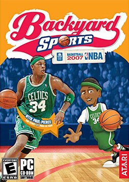

# Backyard Basketball

HE 100

Backyard Basketball is a series of basketball video games made for children
created by Humongous Entertainment. It is the fourth of five sub-series in the
Backyard Sports video game franchise. The first game was developed by Humongous
and published by Infogrames for Microsoft Windows and Mac in 2001. Additional
games have been released on a variety of consoles, each with different
characters and slightly altered gameplay mechanics.

As with the other Backyard Sports games, Backyard Basketball includes
professional players as playable characters. The first incarnation included
Kevin Garnett and Lisa Leslie.

## At a glance

|               |                                                                                                                                                                                                                                                                                                            |
| ------------- | ---------------------------------------------------------------------------------------------------------------------------------------------------------------------------------------------------------------------------------------------------------------------------------------------------------- |
| **Developer** | Humongous Entertainment (2001–2003)/SolWorks (Basketball 2004 for PlayStation 2)/Mistic Software (portable versions of Basketball 2004 and NBA Basketball 2007)/Game Brains (PS2 and Windows versions of NBA Basketball 2007)/Day 6 Sports Group (NBA Basketball 2015)/Mega Cat Studios (Basketball '01; … |
| **Publisher** | Infogrames/Atari (2001–2006)/Fingerprint Network (NBA Basketball 2015)/Playground Productions (2025)                                                                                                                                                                                                       |
| **Platforms** | Android, Game Boy Advance, iOS, Macintosh, Nintendo DS, PlayStation 2, Windows                                                                                                                                                                                                                             |
| **Genre**     | Sports                                                                                                                                                                                                                                                                                                     |

## How it runs here

**Humongous titles are forks of SCUMM v6**, versioned separately as HE 60
through HE 100. v6 itself runs, draws and saves here; the HE extensions on top
of it are not separately verified, and the exact game-to-HE-number mapping in
`docs/released-games.md` is explicitly approximate. Worth trying, not relied
upon.

## Where it sits in this project

`docs/released-games.md` lists this title under **HE 100**. That page is the
scope statement for the whole catalogue and says, per Engine family and per
Version, what has actually been run rather than what is implemented —
**Completable** (`CONTEXT.md`) is claimed for no title on it.

## Elsewhere

- [Wikipedia: Backyard Basketball](https://en.wikipedia.org/wiki/Backyard_Basketball)
- [`docs/released-games.md`](../../docs/released-games.md) — the full scope list
- [ScummVM](https://www.scummvm.org/) — the reference implementation this project checks itself against
