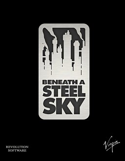

# Beneath a Steel Sky

Sky — Virtual Theatre v2

**Revolution Software, 1994.** Beneath a Steel Sky is a 1994 point-and-click
adventure game developed by British developer Revolution Software and published
by Virgin Interactive Entertainment for MS-DOS and Amiga home computers. It was
made available as freeware – and with the source code released – for PC
platforms in 2003. Set in a dystopian cyberpunk future, the player assumes the
role of Robert Foster, who was stranded in a wasteland known as "the Gap" as a
child and adopted by a group of local Aboriginals, gradually adjusting to his
life in the wilderness. After many years, armed security officers arrive,
killing the locals and taking Robert back to Union City. He escapes and soon
uncovers the corruption which lies at the heart of society.

Originally titled Underworld, the game was a collaboration between game
director Charles Cecil and comic book artist Dave Gibbons, and cost £40,000 to
make. Cecil was a fan of Gibbons's work and approached with the idea of a video
game. The game has a serious tone but features humour-filled dialogue, which
came as a result of Cecil's and writer Dave Cummins's goal to find a middle
ground between the earnestness of Sierra's and the slapstick comedy of
LucasArts's adventure games. It was built using Revolution's Virtual Theatre
engine, first used in Revolution's previous and debut release, 1992's Lure of
the Temptress.

It received positive reviews at the time of its release and is retrospectively
viewed as a cult classic and Revolution's greatest game besides Broken Sword:
The Shadow of the Templars. A remastered edition was released for iOS in 2009
as Beneath a Steel Sky Remastered, which also received a positive reception
from the gaming press. A sequel was greenlit during the Broken Sword: The
Serpent's Curse 2012 Kickstarter campaign, and was announced in March 2019.
Entitled Beyond a Steel Sky, it was released on Apple Arcade in June 2020, on
Steam in July 2020, and on GOG.com in March 2021.

## At a glance

|                |                                                                           |
| -------------- | ------------------------------------------------------------------------- |
| **Developer**  | Revolution Software                                                       |
| **Publisher**  | Virgin, Konami                                                            |
| **Designer**   | Charles Cecil, Tony Warriner, Daniel Marchant, Dave Cummins, Dave Gibbons |
| **Programmer** | David Sykes, Tony Warriner, James Long                                    |
| **Writer**     | Dave Cummins                                                              |
| **Composer**   | Dave Cummins                                                              |
| **Engine**     | Virtual Theatre                                                           |
| **Platforms**  | MS-DOS, Amiga, Amiga CD32, iOS, Windows                                   |
| **Released**   | MS-DOS & Amiga/UK, March 4, 1994, NA, 1994/iOS/October 7, 2009            |
| **Genre**      | Adventure                                                                 |
| **Modes**      | Single-player                                                             |

## How it runs here

**Nothing runs yet.** Sky is a fourth Engine family here — decided, designed
and not built (ADRs 0023–0025). No interpreter, no resource reader, no
object-table extractor, no editor surface; the game is still refused by name in
`src/engine/resource/engineSignatures.ts`, on `sky.dsk`.

The freeware **floppy** release carries neither an executable nor `sky.cpt`, so
it cannot supply Compacts and is refused; the free-data claim rests on the
**CD** release (ADR 0024, amended). Bytecode starts as Disassembly (ADR 0025).

## Where it sits in this project

`docs/released-games.md` lists this title under **Sky — Virtual Theatre v2**.
That page is the scope statement for the whole catalogue and says, per Engine
family and per Version, what has actually been run rather than what is
implemented — **Completable** (`CONTEXT.md`) is claimed for no title on it.

## Elsewhere

- [Wikipedia: Beneath a Steel Sky](https://en.wikipedia.org/wiki/Beneath_a_Steel_Sky)
- [`docs/released-games.md`](../../docs/released-games.md) — the full scope list
- [ScummVM](https://www.scummvm.org/) — the reference implementation this project checks itself against
