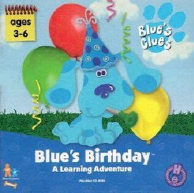

# Blue's Clues: Blue's Birthday Adventure

HE 99

**Humongous Entertainment, 1998.** Blue's Birthday Adventure is an educational
video game for children from the ages of 3–6 years of age. The game is based on
the pre-school television program Blue's Clues, specifically the episode
"Blue's Birthday". It was developed and published by Humongous Entertainment.
The game is about how Steve tries to find three clues to figure out what Blue
wants to have for her birthday.

_This title has no article of its own. The text above is transcribed from
**Blue's Birthday Adventure**, which covers it, and the link under
**Elsewhere** goes there rather than to a page about this game alone._

## At a glance

|               |                         |
| ------------- | ----------------------- |
| **Developer** | Humongous Entertainment |
| **Publisher** | Humongous Entertainment |
| **Series**    | Blue's Clues            |
| **Engine**    | SCUMM                   |
| **Platforms** | Mac OS, Windows         |
| **Released**  | NA, September 1, 1998   |
| **Genre**     | Educational             |
| **Modes**     | Single-player           |

## How it runs here

**Humongous titles are forks of SCUMM v6**, versioned separately as HE 60
through HE 100. v6 itself runs, draws and saves here; the HE extensions on top
of it are not separately verified, and the exact game-to-HE-number mapping in
`docs/released-games.md` is explicitly approximate. Worth trying, not relied
upon.

## Where it sits in this project

`docs/released-games.md` lists this title under **HE 99**. That page is the
scope statement for the whole catalogue and says, per Engine family and per
Version, what has actually been run rather than what is implemented —
**Completable** (`CONTEXT.md`) is claimed for no title on it.

## Elsewhere

- [Wikipedia: Blue's Birthday Adventure](https://en.wikipedia.org/wiki/Blue%27s_Birthday_Adventure)
- [`docs/released-games.md`](../../docs/released-games.md) — the full scope list
- [ScummVM](https://www.scummvm.org/) — the reference implementation this project checks itself against
