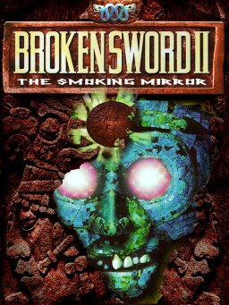

# Broken Sword II: The Smoking Mirror

Sword2 — three Releases: demo, cd, psx



**Revolution Software, 1997.** Broken Sword II: The Smoking Mirror is a
point-and-click adventure game developed by Revolution Software for Windows and
PlayStation. It was first released in 1997 and reissued as a remastered version
for Windows, OS X and iOS in 2010 and for Android in 2012. It is the second
game in the Broken Sword series and the first to step away from the Knights
Templar story. The player again controls George Stobbart, an American who
witnesses the abduction of his girlfriend Nicole Collard.

The tone is serious and mixes in humour, with visuals animated in the style of
classic animated films. It was the fourth and last game built on Revolution's
Virtual Theatre engine.

It fared less well with critics than its predecessor, drawing mixed reviews
largely for not living up to it, but sold well — 750,000 copies by August 2000 —
and the remaster was received far more warmly.

## At a glance

|               |                                                                         |
| ------------- | ----------------------------------------------------------------------- |
| **Developer** | Revolution Software                                                     |
| **Publisher** | Virgin Interactive; Sony Computer Entertainment and Crave (PlayStation) |
| **Director**  | Charles Cecil                                                           |
| **Producers** | Steve Ince, Michael Merren                                              |
| **Writers**   | Charles Cecil, Dave Cummins, Jonathan Howard, Steve Ince                |
| **Composer**  | Barrington Pheloung                                                     |
| **Engine**    | Virtual Theatre                                                         |
| **Platforms** | Windows, PlayStation; remastered for OS X, iOS and Android              |
| **Released**  | 14 October 1997 (NA), 17 October 1997 (EU)                              |
| **Genre**     | Point-and-click adventure                                               |
| **Modes**     | Single-player                                                           |

## How it runs here

**It runs, draws, edits — and the demo plays through.** This is the eighth
Engine family in the project (ADR 0036), and a separate one from the first Broken Sword rather than a later
version of it: the two share no bytecode, no resource layout and no renderer.

The three index files are read, the script variables come out of the game's own
global variable file rather than a table this project carries, sessions are
walked as run lists, the bytecode runs across all three script levels, the
router walks megas over the walk grids a session has added, the renderer draws
backgrounds, mask layers, four parallax depths and scaled sprites, effects and
recorded speech play, the line being spoken is drawn from the game's own font,
characters hold a conversation with one another, the player picks an answer off
the chooser bar, cutscenes play, and saves are written and restored.

**Spoken lines are on screen, and this page used to say the opposite.**
`Sword2Text` is this family's own font reader and its own text sprite, written
here rather than borrowed — Sword1's `SwordText` is Sword1's, and ADR 0036 is
right that almost nothing crosses between the two — so `fnISpeak` draws the
line it is handed instead of logging it.

Both ends of a conversation run, which took one more opcode than it looked
like. `fnSpeechProcess` is the addressee's half: a character posts a command to
another through seven globals — `SPEECH_ID`, `INS_COMMAND` and `INS1`–`INS5` —
and the addressee's own script copies that mailbox into its `ob_speech`
structure, performs the command through the ordinary opcode for it, and writes
`ob_speech.wait_state` back. That last write is what the asker reads, through
the target's own script 5, to learn whether it may speak. `fnStartConversation`,
`fnEndConversation`, `fnWeWait`, `fnTheyDoWeWait`, `fnTheyDo` and
`fnAddSequenceText` were implemented first and made the demo _worse_ — two
subtitles instead of four — because with `fnSpeechProcess` still a stub nothing
ever wrote `wait_state`, so every character in the game was permanently busy
and George waited on Sacco forever. The probe now says `text: font 341, 4 lines
built, 1 on screen` and photographs Sacco's reply, "I don't know. The dog went
berserk for no apparent reason.", wrapped over two centred lines above him.

**The conversation the player steers works now, and this page used to name it
as the gap.** `fnAddSubject` (12), `fnChoose` (14), `fnAddMenuObject` (23) and
`fnRemoveChooser` (112) were names in a table with no module behind them.
`Sword2Menu` is that module: it holds both bars — the chooser along the bottom,
which is the part a player notices, and the inventory along the top — and the
renderer draws them over the picture after the text, the way the original's
`processMenu` runs after `buildDisplay`. `IN_SUBJECT` is the subject count and
lives in the game's own globals, so the scripts and the module read the same
number; greying an icon is a different _image_ rather than a palette trick,
because an icon resource is two 35x30 pictures, greyed then coloured; and
`fnChoose` packs the player's answer into its return value, `IR_CONT |
(response << 3)`, which is the one place the bytecode's `CP_JUMP_ON_RETURNED`
is used. A click on the chooser is no longer also a click on the floor behind
it: the engine now honours "if the mouse is not visible, do nothing", which is
the guard the original relies on when `fnChoose` switches the human off.

The measurement behind that is a disassembly rather than a playthrough, and the
distinction is the honest part. Across the demo's 905 game objects the scripts
call `fnAddSubject` 567 times, `fnChoose` 57, `fnAddMenuObject` 66 and
`fnRemoveChooser` 9 — object 349's speech script adds subjects at bytes 332, 360
and 388 and chooses at 729 — but **no playthrough of this demo reaches one**:
the only named thing the probe can click ends in a session change and a
cutscene. So the tests drive the four opcodes directly, which is the only way to
measure something this install does not itself reach.

**The inventory opens now.** The bottom bar's _contents_ were always built —
`menu_master`'s own script fills them through `fnAddMenuObject`, so this project
never has to guess what George is carrying — but nothing could put the pointer
into menu mode, so pushing it to the bottom of the screen did nothing at all.
`Sword2Pointer` is the missing half: `Mouse::mouseEngine`'s `MOUSE_normal`,
`MOUSE_menu` and `MOUSE_drag`, run every cycle the human is available rather
than only on a cycle with a click, because two of the three are entered by the
pointer _moving_ rather than by a button. An icon can be picked up, examined
through `menu_master`, combined with a second or put back down, and
`fnSetObjectHeld` — opcode 93, previously unimplemented — locks the mode while a
script is holding something for the player, exactly as `_mouseModeLocked` does.
On this demo the bar opens with eight objects.

Two pieces of it were missing when this page was first written, and both are
here now. `MOUSE_system_menu` is the fourth mode: pushing the pointer to the top
of the screen opens the panel, and its save and restore icons reach this shell's
save menu and its ten slots, while options, quit and restart are drawn and
greyed because the page around the game is where those three live. And the
object being dragged is **drawn**: its `luggage_resource` names a `MOUSE_FILE`,
which is neither of the two compressions the rest of the game's graphics use and
so has a decoder of its own, and the frame is stamped onto the display by its
own hotspot — the original composes it into the cursor sprite, and this family's
pointer is the browser's own, so there is no sprite to compose with. On this
demo, pocket 0 holds icon 60, its luggage 149 decodes to 35x30, and it stays
drawn while the pointer carries it up into the room.

`fnAddSequenceText` is the other half-thing: it records the subtitle lines for a
Smacker film and nothing draws them over one. On this install that costs
nothing, because the guard belongs to the engine and not to
this project — ScummVM's `fnAddSequenceText` wraps the same
`if (!readVar(DEMO))` around it — so all eight calls the demo's scripts
reach are a legitimate no-op rather than something missing, which is why the
engine's status line no longer names the opcode. Off the demo the lines are
recorded and not drawn, and the engine keeps naming what it could not do on
that status line, so the list here can go stale and the program cannot.

**There is a character on screen to control, and this page never noticed there
was not.** `fnSetValue` is the one opcode that hands the player mega its
megaset resource, and it wrote eight bytes short of the field —
`ObjectMega::setMegasetRes` is `_addr + 48` and the write landed on `cur_dir`
at 40. So the demo's start script set George's _direction_ to a resource id and
left his megaset at zero, and every layer below that behaved correctly on the
zero it was given: `fnStandAt` copied it into the graphic's `anim_resource` the
way `Router::standAt` does, and `Sword2Screen.frame()` returned null on
`if (!animResource)` the way it should. The game ran, walked, scrolled and
answered clicks with nobody in it.

Nothing this project measures caught that, and it is worth saying why: a probe
reads positions and pixel counts, and a missing character has a position. The
proof is a photograph — `/home/agent/reports/sword2-player-visible.png` has
George standing on the timber by the dock gates, and
`sword2-player-after-walk.png` has him down by the barge with the room scrolled
under him.

**The demo's own opening film plays, and it was being refused on a typo.** The
folder holds `Enddemo.smk` and `demo.smdk`; the scripts ask for `eye`, `demo`
and `intro`. The second name is the odd one, and it is not a format — the file
is 289,700 bytes beginning `SMK2`, and the folder's own `files.txt`, a
directory listing captured with the download, lists exactly that size and
21/08/1997 09:31 under the name **`demo.smk`**. `game.exe` holds one filename
format string, `%s.smk`, and ScummVM's `makeMoviePlayer` tries `.smk`, `.dxa`
and `.mp2`, so neither interpreter would find it either: the extension was
changed after Revolution shipped it.

`findSequenceFiles` therefore returns candidates rather than a name, best
first — `<name>.smk` in a video folder, then `<name>.smk` anywhere, then any
file with that stem — and `openSequence` reads the Smacker signature and
answers null for anything else. **What decides is the file's own first four
bytes, not its extension.** A `demo.txt` beside the film costs one rejected
read. Measured: cutscenes the scripts asked for and this project could not play
went from `eye, demo, intro` to `eye, intro`, both of which are retail films
this release genuinely does not ship. The sixty-frame title card is
photographed at `/home/agent/reports/sword2-demo-title-film.png`, and because
the film now runs the probe presses Escape once where it pressed nothing —
interactive at frame 81 where it was 63.

**It walks, and the room scrolls under it.** `npm run probe` reaches an
interactive state on session 11 with 14 pointer targets — at frame 84 in one
run, 114 and 131 in others, a sample rather than a constant, because the
clusters load asynchronously and the engine's `random` is `Math.random` — a
hover-then-click on the floor walks the player 750,500 -> 479,311, and a click
on a named object walks them to it and takes them through to the next session.

This page used to say the opposite — that a floor click left the player where
they were and the router refused the point — and the router was right each
time. Three engine defects sat between the click and it, and all three are
fixed and measured:

- The cycle's mouse list was sorted by priority _descending_. In this family 0
  is the highest priority and 9 the lowest, and the floor is always 9 and
  always covers the whole room, so descending handed the floor every click and
  nothing else in the game could be touched.
- `fnInitFloorMouse` wrote the floor's rectangle once, from whatever the room
  was at the moment it ran. Clusters arrive asynchronously here, so that is the
  640x480 fallback rather than the 960x597 room, and the player's own start
  position at 750,500 was outside their own floor.
- Nothing chased the camera. A room wider than the display never scrolled, so
  a third of the demo's first screen could not be reached at all, and
  `fnSetScrollCoordinate` — which says where on the display to keep the
  player's feet — was setting the scroll offset instead.

**The status line no longer reports a resource that is late by one cycle.**
This engine's status block used to carry `run list 20: Resource 20 is in
Docks.clu, which is not resident yet` for the whole of a 3,536-frame session.
The message was recorded once, at frame 0, and the state it described lasted a
single cycle: `Docks.clu` had been asked for and had not finished, and
`satisfyWanted()` drains it before the next fetch. `Sword2Logic.faults` is a
list nothing clears, so one early frame left a permanent entry describing
something that was untrue for the other 3,535. `Sword2Screen.newScreen` had the
same shape, and there the retry was already written — it sets `pendingScreen`
and comes back — so only the note was wrong.

Both call sites now ask `Sword2Resources.willBecomeResident(id)`, which is true
when the id is in range, its cluster index is not the `0xffff` hole, that
cluster has a file behind it, its bytes are not loaded yet and it is not a
streamed cluster that is never made resident. A resource that will **never**
arrive is still reported exactly as before, with `describeMissingResource`
naming which case it is — a cluster this folder does not hold still says so.
What is left on the demo's status block is two genuine notes: music 69 and 70
are not plain WAVE, so they are not played.

**Its objects decompile and re-emit byte-identically**, so the editor offers
screens, **actors**, objects, their scripts, the globals, text, palettes,
animations and **run lists** — that last surface has no SCUMM analogue and is the most direct
edit this family has, because a session _is_ a run list — and exports them back
out as a playable install. An export with no edits in it is byte-identical to
the game it came from: `npm run reexport:sword -- /path/to/game` diffs every
file it wrote against the file it read, and against the demo all five present
clusters come back identical, 1,623 resources rewritten and 212 copied. After a
script edit and a repainted screen the result boots through `openGame` to the
room the original boots to, with the new pixel in it.

**A replaced recording does not leave the editor**, and that is the one place
Broken Sword II is now behind Broken Sword rather than level with it. Sword 1's
export rebuilds `SPEECH/COWS.MAD` around a replaced line, writes a replaced tune
as the `.WAV` file it is, and substitutes a replaced effect's cluster resource.
Sword II's export does none of that, and the reason is this demo rather than the
family: `resource.inf` names fourteen clusters and **not one of them is a speech
or music cluster** — which is exactly what the boot line above reports, and why
music 69 and 70 are not plain WAVE. There is no container here to rebuild and
nothing to diff a rebuild against, so the Audio section lists what the scripts
ask for and plays what the folder holds, and an export carries none of it. A
retail copy ships `SPEECH1.CLU`/`SPEECH2.CLU` and a music cluster, and the work
is the same shape as Sword 1's — read the cluster's own index, rebuild it around
the replaced entry — but writing it against a container nobody here can open
would be a guess, and a guess that booted would still be a guess.

**Screens and animations leave the editor now**, and this page used to say they
did not: all three of the family's compression schemes encode, and the exporter
rewrites each edited screen and animation in place, offsets and CDT entries
included. A palette travels with the screen rather than on its own, because it
is not a resource — it is the 1,024-byte block a screen's multi-screen header
points at. A run list is written back into the payload it already has, and one
too long for its resource is refused by name, because there is no index entry to
grow. The limit left on a picture is this project's own budget rather than the
format: a screen or an animation too big to import is named and copied through
untouched.

**A character is found by what its code does, because nothing else says.**
Sword II keeps no type word an editor can reach: an object is a character when
its locals hold an `ObjectMega`, at an offset only that object's own code
knows. So the **Actors** section reads the bytecode — `fnWalk`, `fnStandAt`,
`fnMegaTableAnim` and thirteen neighbours take a pointer to an `ObjectMega` and
can be pointed at nothing else — and lists the objects that call one, George
first, with the opcodes that put them there shown as the evidence. That is the
game's own code rather than a cast list typed in here (ADR 0029), and the
section says plainly that a mega driven entirely by another object's script is
not in it.

The art on an object is found the same way, out of the `// params:` blocks:
an argument the table calls a resource id, _pushed as a literal_, and matching
an animation this project holds. A resource pulled from a variable at run time
is deliberately not followed, and the pane says so — reading a variable's
number as a resource id would put some other character's walk cycle on this
object's page, which is worse than showing nothing.

**A character's megaset is the one case those blocks hide, and it is the case
the player is made of.** This page previously said George's megaset was
"assembled by `fnSetValue` from a number the script computes", so his page
named the opcodes and offered no frame. That was wrong. `fnSetValue` writes one
field and one only — `ObjectMega::megaset_res` — and `Router::standAt` copies
that straight into the graphic's `anim_resource`, so the number it writes _is_
the resource the renderer draws the character from. Measured on the demo: all
52 `fnSetValue` calls push a literal, and every value names an animation the
project holds. George's four are `GeoMega`, `GeoMegaB`, `NicMegaB` and
`NicMegaC` — 1,730 frames that were sitting in the project, reachable only by
typing a raw resource number into the Animations list.

Revolution's own comment calls that parameter "value to set it to", which is
why the resource rule walked past it: `opcodeParams.ts` is a faithful
transcription of those comments and not the place to put an interpretation of
them, so the knowledge sits in `sword2/actors.ts` with the two lines of engine
code it rests on. A mega whose megaset is set for it by another object's
script still names nothing, and the pane still says so.

One more thing is worth saying plainly rather than leaving to be discovered: a
cluster is identified by its line in `resource.inf` rather than by where its
file sits, because
`resource.tab` addresses it by that line number — the demo declares fourteen
clusters and ships five, and the nine it does not ship are reported by name.

**Play runs the export.** The editor's Play button builds the install this
project would export and runs that, with the rebuilt clusters in front of the
folder the author re-supplied rather than copied into it — so the music, the
speech and the films are still read from the folder by range. `npm run
reexport:sword` boots the same edited export three ways, through `openGame` over
a real directory and through the preview overlay, and all three reach the room
the unedited game reaches.

**The demo plays through, and that Release is `Completable`.** Not the retail
game — the **demo**. `npm run play:sword -- /path/to/sword2`:

```
Steps: 33, of which 0 did not do what the route says.
Screens, in order: 11 → 12 → 14 → 12 → 14 → 13 → 14 → 12 → 14 → 12 → 11
The demo reached its ending.
```

The demo's own puzzle chain, in order: over the fence off the quay; ask at the
window; up the steps into the yard; the hook off the wall; the hook on the
bottle; the bottle up the chimney, twice inside its own window, for the cloth;
the trapdoor into the cellar; the dog biscuits; back to the yard; the biscuits
on the platform; wait while the dog comes down and eats them; the hook to haul
the platform out of its reach; wait for it to give up. With the yard clear,
**save** (37,136 bytes of world, run list 14 at 218,313), walk 192 pixels away,
**restore** to the same place with all eleven objects still in the rucksack,
and finish from the restored state: down to the alley, over the fence the dog
was guarding. `Enddemo.smk` plays, 110 frames at 640×480, and the scripts call
`fnPlayCredits` — which is where this demo stops. There is no screen after it.

**The retail game is not claimed.** The Smoking Mirror is not freeware, and
this folder is the demo: nine of its fourteen clusters are absent, and its
`resource.inf` names no speech or music cluster at all, which no retail index
omits. That last absence is also why the speech and music write path stays
**written and unverified** rather than measured — `npm run reexport:sword`
prints `containers 0`, because there is no container here to rebuild. The
family still rests on a synthetic fixture for CI — Tier 1 on
`docs/processes/verifying-version-support.md`'s scale — with
`npm run sweep:sword -- /path/to/game` as the Tier 2 route for somebody who
owns the data.

**What the editor does and does not do, next to SCUMM's.**
[`docs/editor-parity.md`](../../docs/editor-parity.md) is the three-way table —
the SCUMM surface, Broken Sword's and this one — thirty-four rows with every No
named and explained. This page used to say that **nothing on a screen can be
dragged**, on the grounds that an object's position lives in an `ObjectMega` at
an offset only its own code knows. Measured, that was an argument for reading
that code rather than against dragging: the object writes its `ObjectMouse`
rectangle as four constants and pushes the offset itself, as the literal operand
of its own `fnRegisterMouse`. **268 of the demo's 973 objects drag** on the
screen canvas, by pointer or from the keyboard, and the other 705 are named
underneath with the reason — 577 register no mouse area, 96 compute a
coordinate, 24 register more than one structure, 4 write theirs two ways, 4 let
`fnRegisterFrame` overwrite the rectangle from the drawn sprite. §7a carries the
per-screen counts. What stays a No is the **walk-to point moving with the box**:
Sword II's nearest equivalent, `fnSetStandbyCoords`, writes the router's global
standby words rather than a field of that rectangle, so it is drawn and left
alone (§8a). The one No left is adding or deleting records, which is a missing
tool rather than a format limit, and the page says so.

**A brush** was a third of those until this branch. The picture panel — the same
widget Broken Sword's surface uses, widened rather than forked — paints one
pixel at a time, by pointer or from the keyboard, and writes the frame back
through the encoder Import already uses. It reaches **10,895 of 10,895**
animation frames across 509 animations and **12 of 12** screen layers over 6
screens. The colours on offer are the frame's own: an RLE16 frame is given the
sixteen its own resource carries and no others.

**An animation plays back at the speed the game plays it**, which that list used
to include as well. A Sword II animation header carries its own frame count and
`Sword2Logic.doAnimate` steps through it one frame a game cycle —
`SWORD2_TICKS_PER_STEP` sixtieths of a second, twelve a second — so the only
thing the editor has to find is the object whose code plays it, and which way
round. **185 of the demo's 509 animations** have one it can name: `fnAnim` or
`fnReverseAnim` with a literal resource id, or a speech script's `INS_anim`
handed to `fnTheyDo`/`fnTheyDoWeWait`. The other 324 say so where the button
would be. The largest reason is `fnMegaTableAnim`, which is 595 of the demo's
play calls and picks an animation out of a table by the mega's direction while
the game runs: that choice is a run-time fact, and this editor will not make it
and then loop the frames at a speed it invented. §18a has the counts.

**Walk grids are carried and editable**, which that list used to include. This
family has no floor table: a run list called "Run list for 11" belongs to the
screen called "Screen 11", and the objects it holds push a grid id into
`fnAddWalkGrid`. All four of the demo's grids resolve that way — `grid11` to
screen 22, `grid12` to 33, `grid14` to 303, `walkgrid128` to 2950 — 36 bars and
12 nodes in 1,120 bytes, drawn over the screen, editable by pointer or keyboard,
and re-encoded **4 of 4** byte-identically by `npm run sweep:sword`.

The Actors list is measured too: 653 of the demo's 973 objects call a mega
opcode and so are characters, 163 of them name an animation this project holds,
and 142 of those draw at least one frame. The 21 that do not are refused by
name on their own panes — 7 whose animation resource will not walk, and 14
whose resource holds no frames at all — rather than left as an empty box.
George is object 8 and his first animation is 36: 456 frames at 48×142,
exportable and importable from his own pane.

## Where it sits in this project

`docs/released-games.md` lists this title under **Sword2**. That page is the
scope statement for the whole catalogue and says, per Engine family and per
Release, what has actually been run rather than what is implemented.

As with the first game, Wikipedia's infobox names the engine **Virtual
Theatre** — the name Revolution used for all four of their adventures.
`CONTEXT.md` keeps that as the word for a _lineage_ and never as a family name,
and this game is the clearest reason why: it shares the marketing name with
Broken Sword and not one byte of format with it.

## Elsewhere

- [Wikipedia: Broken Sword II: The Smoking Mirror](https://en.wikipedia.org/wiki/Broken_Sword_II:_The_Smoking_Mirror)
- [`docs/released-games.md`](../../docs/released-games.md) — the full scope list
- [`docs/editor-parity.md`](../../docs/editor-parity.md) — the editor, row by row against SCUMM's
- [ScummVM](https://www.scummvm.org/) — the reference implementation this project checks itself against
