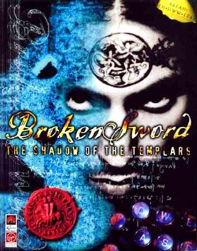

# Broken Sword: The Shadow of the Templars

Sword1 — three Releases: demo, cd, psx



**Revolution Software, 1996.** Broken Sword: The Shadow of the Templars —
released in North America as Circle of Blood — is a point-and-click adventure
game developed by Revolution Software and published by Virgin Interactive. It
is the first game in the Broken Sword series, and was co-written and directed
by Charles Cecil. The player controls George Stobbart, an American tourist in
Paris, voiced by Rolf Saxon, who becomes caught up in a conspiracy involving a
cult and a hidden treasure, following it across Europe and the Middle East.
Cecil's research into the Knights Templar shaped a deliberately serious story,
leavened with humour and with visuals in the style of animated films.

The backgrounds were drawn in pencil by Eoghan Cahill and Neil Breen and then
coloured digitally; Tony Warriner and David Sykes were the designer-programmers
and Barrington Pheloung wrote the score. It ran on Revolution's Virtual Theatre
engine, previously used for Lure of the Temptress and Beneath a Steel Sky.

Critics praised its story, its puzzles, its voice acting and its music, and
sales passed Revolution's own expectations — around a million units by 2001. It
has appeared at the top of several "best adventure game" lists and has been
named as an influence by later developers. After the Windows, Mac OS and
PlayStation releases of 1996–1998 it reached the Game Boy Advance, then Palm OS
and Windows Mobile in 2006; a Director's Cut followed between 2009 and 2012,
and a remake, Reforged, in September 2024.

## At a glance

|               |                                                                       |
| ------------- | --------------------------------------------------------------------- |
| **Developer** | Revolution Software; Astraware (Palm OS)                              |
| **Publisher** | Virgin Interactive; Sony Computer Entertainment and THQ (PlayStation) |
| **Director**  | Charles Cecil                                                         |
| **Producers** | Charles Cecil, Chris Dudas, Steve Ince, Michael Merren                |
| **Writers**   | Charles Cecil, Dave Cummins, Jonathan Howard                          |
| **Composer**  | Barrington Pheloung                                                   |
| **Engine**    | Virtual Theatre                                                       |
| **Platforms** | Windows, Mac OS, PlayStation, Palm OS, Windows Mobile                 |
| **Released**  | 14 October 1996 (EU), 6 November 1996 (NA)                            |
| **Genre**     | Point-and-click adventure                                             |
| **Modes**     | Single-player                                                         |

## How it runs here

**It runs, draws, edits — and the demo plays through.** This is the seventh
Engine family in the project (ADR 0036). The cluster index is read, the objects are opened, the logic engine
walks all 150 sections each cycle and runs their bytecode, the router finds
walks through the walk grids with both of Revolution's animators, the renderer
draws backgrounds, mask layers, parallax and scaled sprites, subtitles are
rendered from the game's own font, effects, music and recorded speech play,
both menu bars work, cutscenes play, and saves are written and restored.

That paragraph is measured. `npm run probe -- /path/to/game` reaches an
interactive state on the demo — screen 1, 12 pointer targets, a router holding
47 bars and 36 nodes — and a hover-then-click on the floor walks George 110
pixels across the street. The frame it photographs is 82% non-black in 212
colours: the bombed Cafe de la Chandelle Verte with George standing in it.

**The opening is a film, and Escape gets out of it.** This page used to say the
probe reached that state "with nothing pressed", and the number it reached it
at was around 2,400 frames — a real two-thirds of a minute before anything
could be clicked, which is long enough to look like the program having hung.
Measuring rather than guessing said where the frames went: 1,909 of them were
`intro.smk` playing out at 12 frames a second, which is the game working. What
was missing was the key. The engine already honoured Escape; nothing in this
project ever pressed it, so nobody had noticed that the probe sat through the
whole film like a polite audience.

| measured on the demo            | before | after |
| ------------------------------- | ------ | ----- |
| loading frames                  | 357    | 354   |
| the opening film                | 1,909  | 1     |
| frames before the pointer works | 98     | 98    |
| **frames to interactive**       | 2,365  | 454   |
| **wall clock to interactive**   | 197.1s | 37.8s |
| Escape presses it took          | 0      | 1     |

The frame it arrives on is a sample rather than a constant — 382, 408 and 454
across runs — because the engine's `random` is `Math.random` and the clusters
load asynchronously. The status note under a playing film now ends "press
Escape to skip it", so the key is on the surface rather than in this file.

The draw buffer is re-laid from the background every frame, the way
`Screen::draw` does it; laying it once when the room is entered instead left
every sprite ever drawn on the screen, and buried both the picture and the
subtitles underneath them.

**Its scripts decompile and re-emit byte-identically**, so the editor offers
screens, **actors**, objects, decompiled scripts, text in every language the
release ships, palettes, sound and pictures — and exports the scripts,
compacts, text, palettes and pictures back out as a playable install. An export with no edits in
it is byte-identical to the game it came from, which is what makes a diff of an
exported install the author's changes and nothing else.

**A painted background leaves the editor now**, and this page used to say it
could not. The format was never the reason it did not: every sprite compression
already re-encoded to the bytes the game shipped, and the exporter simply never
called any of it. Which shape a picture takes on the way out is measured rather
than chosen — a background carries no resource header and goes in whole, a
parallax layer's own header overlaps the generic one exactly and goes in whole,
and a sprite goes in behind its header with its two lengths recomputed, because
a re-encoded frame may change size.

That is measured rather than asserted. `npm run reexport:sword --
/path/to/game` re-exports an install through the editor's own path and diffs
every file it wrote against the file it read: against the demo, all **eight**
come back identical — `swordres.rif`, six clusters and the 43.9 MB speech
container, 1,000 resources rewritten and 484 copied — and after a script edit, a
picture edit and three replaced recordings the result boots through `openGame`
to the room the original boots to with the painted pixel in it. It
had never been run against a game before, and finding five faults it could not
have had against a fixture is the reason it exists.

One limit is the format's own and stays named rather than closed: **HIF**,
which no PC release uses and which has no encoder here. A **mask layer** was
listed beside it and no longer belongs there — `Sword1ProjectGrid` carries the
placing grid the blocks are missing, so the editor composes the room-sized
picture the grid describes and takes an imported one apart the same way, and all
fifteen of the demo's masks come back as the bytes Revolution shipped. The
**room table** no longer stands beside it. It was listed as editable and not
writable back because it "was Revolution's interpreter knowledge, and there is
no file to write it to" — and the first clause is right while the second was an
assumption nobody had gone looking to check. **The interpreter is in the
install**: `SWORD.EXE` is in the folder with the clusters, beside
`WINSWORD.EXE` and `RUNSWORD.EXE`. `SWORD.EXE` holds a 100-screen room table at
`0x84578`, 94 of whose screens are word for word the table this project had
built in, and 52 start positions written as four `mov` instructions each into
the object at `0x7f24`. `WINSWORD.EXE` holds the same two at `0x24ed4` and
`0x4288d4`, with 45 placements rather than 52. `RUNSWORD.EXE` holds neither.
So both surfaces are **editable and written back**, into the executable they
were read out of; the export carries all three files and `npm run
reexport:sword` shows 11 of 11 identical with nothing edited, and exactly two
bytes changed at `0x4ba10` when one start position is moved from x 481 to 545.

**Sound leaves the editor now too**, and this page used to say it could not. The
speech RLE has an **encoder**, and the sweep counts it: 799 of the demo's 808
lines re-encode to the bytes Revolution shipped, and the other nine are ties —
they decode to the same samples, and the container disagrees with itself about
how to write a lone final sample (64 lines as a literal of one, three as a
repeat of one), so no single rule returns all 808. The route out is now built,
and it is three routes rather than one, because Broken Sword keeps its
recordings in three unrelated places. Speech is a payload inside
`SPEECH/COWS.MAD` or `SPEECH*.CLU`, so the container is **rebuilt** around a
replaced line: the index is patched, every other payload is copied byte for
byte, and the gaps and tail come through untouched. A tune is not a resource at
all — `MUSIC/1M2.WAV` beside the install, addressed by name — so it is written
as a file. An effect is an ordinary cluster resource beginning `RIFF` with no
Sword1 header, like a palette, so it is substituted whole and its cluster
relaid. `npm run reexport:sword` replaces one of each and reads all three back
out of the **installed** folder: speech screen 0 line 1 goes 104,534 → 22,098
bytes and comes back as the 11,027 samples that were written, worst sample
difference 0, the other 807 lines untouched; tune 1 goes 846,792 → 11,070 bytes;
effect 2 (`0x06000012` in `PARIS1.CLU`) goes 31,144 → 5,556 bytes.

One container layout is refused rather than guessed at. Where two lines share a
byte offset and state two different lengths — one a prefix of the other — a
rebuilt container would have to give both a single length, so the rebuild throws
and names both lines instead of silently changing one. The demo has no such
pair: its 808 entries sit at 808 distinct offsets with no gaps and no tail, which
is why an unedited rebuild is byte-identical.

**Every picture a player sees is editable from where it is used.** A screen's
background carries an Export and an Import under the drawn screen rather than
only in the Pictures list; an object's `o_resource` art is on the object; and
an **Actors** section lists every compact whose `o_type` is `MEGA` or `PLAYER`,
George first, with his screen, position, facing and both sprite words on the
pane. That is derived from `o_type` rather than from a list written here — the
game has no cast table, and a cast typed into this project would be a table
this project invented (ADR 0029).

**A character is drawn from `o_walk_resource`, not from `o_resource`.** This
page said otherwise, and the section it described showed no picture for any
character in the demo — George included. `o_resource` is run-time state: both
`Logic::fnStand` and `Logic::logicArAnimate` open by assigning
`o_resource = o_walk_resource`, so a project nothing has run has 0 in it, and
all five of the demo's megas ship that way. `o_walk_resource` is the sprite a
mega stands and walks in — `fnMegaSet` writes it from a parameter its own
signature calls `spr` — and it is set in the shipped compact. George's is
`0x4060000`: 346 frames at 83×151, exportable and importable from his own
pane. Two of the demo's five megas are drawable that way, and that is a
property of the demo rather than of the game. The other three name
`0x8010000`, `0x8020000` and `0xc010000`; the demo's own `swordres.rif` gives
each of them a real slot — paris3 at 2549910 for 230339 bytes, paris3 at
2989932 for 275420, syria at 2056440 for 337427 — in two clusters the folder
does not ship, because `swordres.rif` declares all fourteen clusters of a
two-disc game whichever disc it was read from. A retail install has PARIS3.CLU
and SYRIA.CLU and draws all five. So each of those three panes now **names the
cluster**: which one the resource lives in, that the index names it and this
install does not ship it, and that a retail install has it. The other kind of
absence — a resource in a cluster this install _does_ have, which the
importer's picture budget passed over — gets a different sentence saying so,
because an author can do something about that one. Where both words are set and
differ, the pane offers the two as a radio group with `o_walk_resource` first.

`o_mega_resource` is named and not drawn, and the earlier reason given for
that was wrong too. It is not a table of animation resources: `setupWalkData`
reads a walk-frame count, a turn-frame count and an x/y step per direction out
of it, and there is no resource id anywhere in it to draw.

Where a format cannot be written the sentence sits beside the dead button and
names the format: HIF, or "this object's o_resource is 0, so the interpreter
has not been told what to draw it from". Neither of those refusals is a
footnote.

A **mask layer** used to be on that list and is not now. A mask is 16x8 blocks
in storage order and a separate Grid resource says where each block goes, so
carrying the blocks alone left nothing that could be drawn. The importer
carries the grid too — the demo's fifteen grids are 140.7 KB against a 24 MB
picture budget — and every screen's mask layers appear under the screen that
uses them, composed into a room-sized picture, exportable and importable. Two
cells can name one block, because the game stores a repeated block once;
importing pixels that give those places different contents is refused by
block number rather than half-written. The engine read those grids twenty
bytes too far in until this branch: ScummVM's `_layerGrid[cnt] += 14` steps a
`uint16 *` that already points at byte 0 of the resource, so the cells begin at
28 rather than at `sizeof(Header) + 28`, and 9.7% of the demo's mask pixels
were landing ten blocks — 160 pixels — from where they belong.

A cluster the index declares and the folder does not hold is carried through
unchanged rather than refused. `swordres.rif` names all fourteen clusters of a
two-disc game whichever disc it was read from, so refusing was refusing every
install there is; an _edit_ that lands in an absent cluster is still refused,
by name, because there would be nowhere to write it.

**Play runs the export.** The editor's Play button builds the install this
project would export and runs that, with the rebuilt clusters in front of the
folder the author re-supplied rather than copied into it — so the music, the
speech and the films are still read from the folder by range. `npm run
reexport:sword` boots the same edited export three ways, through `openGame` over
a real directory and through the preview overlay, and all three reach the room
the unedited game reaches.

**The demo plays through, and that Release is `Completable`.** Not the retail
game — the **demo**, and the difference is the whole of the claim.
`npm run play:sword -- /path/to/sword1` drives the engine's own input along a
fixed route and reports every step:

```
Steps: 19, of which 0 did not do what the route says.
Screens, in order: 1 → 3 → 1 → 4 → 1 → 2 → 6 → 7
The demo reached its ending.
```

Watch the intro; into the café; talk the conversation out; take the newspaper
the barman leaves; out through the café door; the newspaper to the workman; his
toolbox open while he reads it — **save** (40,393 bytes of world, screen 4 at
353,408, carrying 18 and 27), walk away so a restore has something to undo,
**restore** to the same place with the same rucksack, and finish from there:
back down the street, the towel on the drainpipe, down into the alley, open the
manhole, into the chamber the demo ends in. `SMACKSHI/ENDDEMO.SMK` plays, 300
frames at 640×400, and the scripts ask to quit. The save and the restore are
part of the bar and not decoration: `CONTEXT.md` says "played from its first
screen to its last, **saving and resuming along the way**".

"A demo has no last screen" was the reason this line used to give, and it was
wrong on the facts — the demo ships `ENDDEMO.SMK`, and a Release's last screen
is the last screen _that Release has_.

**The retail game is not claimed and cannot be here.** Broken Sword is not
freeware, and this folder is the demo: six of the fourteen clusters
`swordres.rif` names. George's journey past the sewer is in the other eight,
and so are three of the demo's five megas (`0x8010000`, `0x8020000`,
`0xc010000` — PARIS3 and SYRIA). A retail install would draw all five; nobody
here has one. That is a fact about this folder rather than a gap in the engine,
so it is stated and not worked around. The family still rests on a synthetic
fixture for CI — `docs/processes/verifying-version-support.md` calls that Tier
1 — with `npm run sweep:sword -- /path/to/game` as the Tier 2 route for
somebody who owns the data.

**What the editor does and does not do, next to SCUMM's.**
[`docs/editor-parity.md`](../../docs/editor-parity.md) is the three-way table —
the SCUMM surface, this one and Broken Sword II's — thirty-four rows with every
No named and explained. The one this family answers No to is adding or deleting
records: a section's own offset table addresses every compact after the one that
grew.

**An animation plays back at the speed the game plays it**, which that list used
to include on the grounds that a Sword sprite carries no frame rate. It does
not, and it never needed to: `fnAnim(cdt, spr)` names a second resource, the
`cdt` table, whose third column is the frame order, and `SwordLogic`'s animation
driver walks one entry of it a game cycle — `SWORD1_TICKS_PER_STEP` sixtieths of
a second, twelve frames a second. Both numbers are read out of the engine. So
the tables the demo's scripts name as constants are imported (frame column
only), and **145 of the demo's 438 sprites** have a player the editor can name
and a Play button beside them; `fnAnim(cdt, 0)` offers all eight of a direction
set, because which one runs depends on the mega's heading at the time. A sprite
nothing names says so where the button would be, rather than looping at a speed
this editor picked. §18a of the parity page has the counts and the refusals.

**A brush** was another of those Nos until this branch, and it was a missing
_tool_ rather than a missing format. The picture panel paints one pixel at a
time now — pointer drag, right-drag to erase, Alt-click to pick a colour up, and
the same job from the keyboard with the arrows, Enter, Delete and P — and writes
the frame back through the encoder Import already uses, once per stroke. It
reaches **7,143 of 7,143** frames across 468 pictures: 7,113 sprite frames, 15
mask layers, 13 backgrounds and 2 parallax layers. Whole-frame replacement is
still beside it, and `reexport:sword` still proves a painted pixel survives an
export.

**Walk grids are carried and editable**, which is what that list used to say No
to. A compact whose `o_type` is `FLOOR` names its grid in `o_resource`, and the
demo's nine grids — 204 bars and 109 nodes in 5,656 bytes, named by 21 floors
across 21 screens — are drawn over the screen, movable by pointer or keyboard,
and written back: `npm run sweep:sword` re-encodes **9 of 9** byte-identically
from the bars and nodes the project holds. A bar can be deleted; a node cannot,
because the router addresses nodes by index, and the surface says so.

## Where it sits in this project

`docs/released-games.md` lists this title under **Sword1**. That page is the
scope statement for the whole catalogue and says, per Engine family and per
Release, what has actually been run rather than what is implemented.

One point of vocabulary is worth knowing, because the box and the encyclopedia
both say otherwise. Wikipedia's infobox names this game's engine **Virtual
Theatre**, the same name Revolution used for Lure of the Temptress and Beneath a
Steel Sky. `CONTEXT.md` keeps Virtual Theatre as the word for a _lineage_ and
never as a family name, precisely because of this: the four games under that
name share no bytecode, no resource layout and no renderer, so they are four
Engine families here (ADRs 0023, 0026 and 0036). Revolution's marketing name is
not wrong; it is just not the thing a family is.

## Elsewhere

- [Wikipedia: Broken Sword: The Shadow of the Templars](https://en.wikipedia.org/wiki/Broken_Sword:_The_Shadow_of_the_Templars)
- [`docs/released-games.md`](../../docs/released-games.md) — the full scope list
- [`docs/editor-parity.md`](../../docs/editor-parity.md) — the editor, row by row against SCUMM's
- [ScummVM](https://www.scummvm.org/) — the reference implementation this project checks itself against
