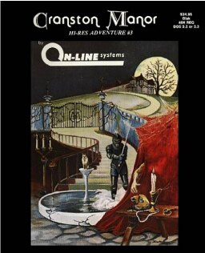

# Cranston Manor

Hi-Res Adventure — pre-AGI

**On-Line Systems, 1981.** Cranston Manor is a graphic adventure published for
the Apple II by On-Line Systems in 1981 and is Hi-Res Adventure #3. The player
must invade a mansion that was occupied by a millionaire and steal the sixteen
treasures that are inside of it. The game allows players to switch between
graphics-based and text-based gameplay.

Cranston Manor is based on Larry Ledden's text adventure The Cranston Manor
Adventure. The graphical version was programmed by Ledden, Ken Williams, and
Harold DeWitz.

## At a glance

|               |                                                                                                        |
| ------------- | ------------------------------------------------------------------------------------------------------ |
| **Developer** | On-Line Systems                                                                                        |
| **Publisher** | On-Line Systems                                                                                        |
| **Designer**  | Larry Ledden, Harold DeWitz, Ken Williams                                                              |
| **Series**    | Hi-Res Adventures                                                                                      |
| **Engine**    | ADL                                                                                                    |
| **Platforms** | Apple II, FM-7, PC-88, PC-98                                                                           |
| **Released**  | title = July 1981, / Apple II, / NA, July 1981, / FM-7, / JP, 1983, / PC-88, PC-98, / JP, October 1983 |
| **Genre**     | Graphic adventure                                                                                      |
| **Modes**     | Single-player                                                                                          |

## How it runs here

**Not implemented, and not planned.** Hi-Res Adventure predates AGI: Sierra's
first adventures ran before there was a reusable interpreter worth naming, so
there is no Engine family here for them to belong to. Listed in
`docs/released-games.md` for the lineage, not as a target.

## Where it sits in this project

`docs/released-games.md` lists this title under **Hi-Res Adventure — pre-AGI**.
That page is the scope statement for the whole catalogue and says, per Engine
family and per Version, what has actually been run rather than what is
implemented — **Completable** (`CONTEXT.md`) is claimed for no title on it.

## Elsewhere

- [Wikipedia: Cranston Manor](https://en.wikipedia.org/wiki/Cranston_Manor)
- [`docs/released-games.md`](../../docs/released-games.md) — the full scope list
- [ScummVM](https://www.scummvm.org/) — the reference implementation this project checks itself against
