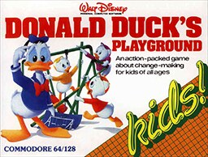

# Donald Duck's Playground

AGI v1 — out of scope

**Sierra On-Line, 1984.** Donald Duck's Playground is an educational video game
published by Sierra On-Line in 1984. The player takes the role of Donald Duck,
whose job is to earn money so that he can buy playground items for his nephews.
To do this, Donald can get himself a job in any of four different workplaces.
Each job shift lasts from one to eight minutes, as the player chooses, during
which time Donald must earn as much as possible.

Donald Duck's Playground was originally written for the Commodore 64 and
subsequently ported to Sierra's AGI interpreter for the Apple II, PC
compatibles, Amiga, and Atari ST. A version for the TRS-80 Color Computer
followed as well.

## At a glance

|               |                                                                                  |
| ------------- | -------------------------------------------------------------------------------- |
| **Developer** | Sierra On-Line                                                                   |
| **Publisher** | Sierra On-Line, U.S. Gold                                                        |
| **Designer**  | Al Lowe                                                                          |
| **Engine**    | Adventure Game Interpreter (Amiga, ST, IBM PC, PCjr)                             |
| **Platforms** | Amiga, Atari ST, Apple II, Commodore 64, IBM PCjr, IBM PC, TRS-80 Color Computer |
| **Released**  | 1984: C64, 1986: Amiga, Apple II, Atari ST, IBM PC, PCjr, 1987: TRS-80 CoCo      |
| **Genre**     | Educational                                                                      |
| **Modes**     | Single-player                                                                    |

## How it runs here

**Out of scope.** AGI v1 games are DOS self-booting floppies and Apple II disks
— sectors where Sierra put them rather than a filesystem, so reading one is a
disk-format problem (`.out-of-scope/agi-booter-and-apple-ii.md`). Every title
in scope has a DOS release with a `LOGDIR`.

## Where it sits in this project

`docs/released-games.md` lists this title under **AGI v1 — out of scope**. That
page is the scope statement for the whole catalogue and says, per Engine family
and per Version, what has actually been run rather than what is implemented —
**Completable** (`CONTEXT.md`) is claimed for no title on it.

## Elsewhere

- [Wikipedia: Donald Duck's Playground](https://en.wikipedia.org/wiki/Donald_Duck%27s_Playground)
- [`docs/released-games.md`](../../docs/released-games.md) — the full scope list
- [ScummVM](https://www.scummvm.org/) — the reference implementation this project checks itself against
