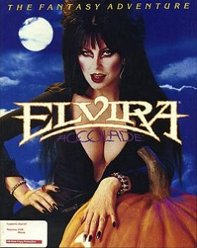

# Elvira: Mistress of the Dark

AGOS Elvira1

**Horror Soft, 1990.** Elvira: Mistress of the Dark is a horror
adventure/role-playing video game developed by Horror Soft and released by
Accolade in 1990 for the Amiga, Atari ST, Commodore 64 and MS-DOS computers. It
was Horror Soft's second published game after 1989's Personal Nightmare and
stars the actress Cassandra Peterson as her character Elvira.

In Mistress of the Dark, Elvira is held captive by dark forces in the castle of
her ancestor, Lady Emelda. The player's character is to enter the castle to
rescue Elvira and prevent the imminent return of the long-dead evil sorceress.
The well-received game was followed by Elvira II: The Jaws of Cerberus in 1991
and the spiritual successor Waxworks in 1992.

## At a glance

|               |                                                                   |
| ------------- | ----------------------------------------------------------------- |
| **Developer** | Horror Soft                                                       |
| **Publisher** | Accolade                                                          |
| **Designer**  | Alan Bridgman, Keith Wadhamsa, Michael Woodroffe, Simon Woodroffe |
| **Artist**    | Paul Drummond, Michael Landreth, Philip Nixon                     |
| **Composer**  | Dave Hasler                                                       |
| **Engine**    | AberMUD (modified)                                                |
| **Platforms** | Amiga, Atari ST, Commodore 64, MS-DOS                             |
| **Released**  | March 1990                                                        |
| **Genre**     | Adventure, role-playing                                           |
| **Modes**     | Single-player                                                     |

## How it runs here

**No AGOS game reaches a screen.** The readers do: `GAMEPC` end to end — the
item tree, the pooled strings and every Subroutine — the resource archive's
offset table, the Version probe, opcode and argument tables for all seven
Versions generated from ScummVM rather than transcribed, a disassembler,
byte-identical re-emission, saves, and an interpreter that runs the opcodes
common to every Version and reports the rest by name (ADRs 0027–0030).

**The renderer is what is missing.** Cel decoding exists as three tested
decoders and nothing composites them, so `render` paints an empty band layout
and the status line says why. Sound and the three interfaces are absent too.
None of it has been tested against a real game.

## Where it sits in this project

`docs/released-games.md` lists this title under **AGOS Elvira1**. That page is
the scope statement for the whole catalogue and says, per Engine family and per
Version, what has actually been run rather than what is implemented —
**Completable** (`CONTEXT.md`) is claimed for no title on it.

## Elsewhere

- [Wikipedia: Elvira: Mistress of the Dark (video game)](<https://en.wikipedia.org/wiki/Elvira:_Mistress_of_the_Dark_(video_game)>)
- [`docs/released-games.md`](../../docs/released-games.md) — the full scope list
- [ScummVM](https://www.scummvm.org/) — the reference implementation this project checks itself against
