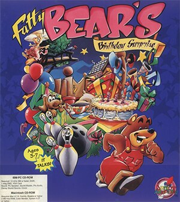

# Fatty Bear's Birthday Surprise

SCUMM v6 / HE 61

**Humongous Entertainment, 1993.** Fatty Bear's Birthday Surprise is an
adventure video game developed by Humongous Entertainment and published in 1993
for 3DO, MS-DOS, and Classic Mac OS. A Windows version followed in 1995. Fatty
Bear's Birthday Surprise is the second game by Humongous Entertainment,
following Putt-Putt Joins the Parade. It is the only Fatty Bear adventure,
although the character was also used in the minigame compilations Fatty Bear's
Fun Pack and the crossover spin-off Putt-Putt & Fatty Bear's Activity Pack. In
July 2013, Tommo bought the Fatty Bear license for the Atari bankruptcy
proceedings.

## At a glance

|               |                                                            |
| ------------- | ---------------------------------------------------------- |
| **Developer** | Humongous Entertainment                                    |
| **Publisher** | Humongous Entertainment                                    |
| **Designer**  | Laurie Bauman/Annie Fox/Ron Gilbert/Shelley Day            |
| **Writer**    | Laurie Bauman, Annie Fox                                   |
| **Composer**  | Tom McMail                                                 |
| **Engine**    | SCUMM                                                      |
| **Released**  | 1993: 3DO, MS-DOS, Mac, 1995: Windows, Oct 23, 2014: Linux |
| **Genre**     | Adventure                                                  |
| **Modes**     | Single-player                                              |

## How it runs here

**SCUMM v6 runs, draws and saves.** Day of the Tentacle plays. v6 is where the
script engine became a stack machine, so a v6 fault usually looks different
from a v5 one; check the log before assuming the data.

## Where it sits in this project

`docs/released-games.md` lists this title under **SCUMM v6 / HE 61**. That page
is the scope statement for the whole catalogue and says, per Engine family and
per Version, what has actually been run rather than what is implemented —
**Completable** (`CONTEXT.md`) is claimed for no title on it.

## Elsewhere

- [Wikipedia: Fatty Bear's Birthday Surprise](https://en.wikipedia.org/wiki/Fatty_Bear%27s_Birthday_Surprise)
- [`docs/released-games.md`](../../docs/released-games.md) — the full scope list
- [ScummVM](https://www.scummvm.org/) — the reference implementation this project checks itself against
