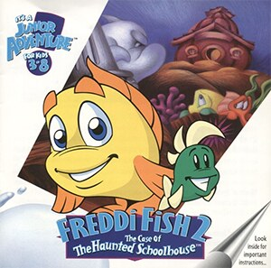

# Freddi Fish 2: The Case of the Haunted Schoolhouse

HE 90

**Humongous Entertainment, 1996.** Freddi Fish 2: The Case of the Haunted
Schoolhouse is a 1996 video game and the second installment in the Freddi Fish
series, developed and published by Humongous Entertainment. It was followed by
Freddi Fish 3: The Case of the Stolen Conch Shell in 1998.

The game was re-released on iOS under the title Freddi Fish Haunted Schoolhouse
Mystery and on Android with a shortened title Freddi Fish: Haunted Schoolhouse
in 2014. It was also released on the Nintendo Switch and PlayStation 4 in May 2024.

## At a glance

|               |                                                                                                                                                                     |
| ------------- | ------------------------------------------------------------------------------------------------------------------------------------------------------------------- |
| **Developer** | Humongous Entertainment                                                                                                                                             |
| **Publisher** | Humongous Entertainment                                                                                                                                             |
| **Designer**  | Mark Peyser, Tami Borowick                                                                                                                                          |
| **Producer**  | Ron Gilbert                                                                                                                                                         |
| **Composer**  | Tom McGurk                                                                                                                                                          |
| **Series**    | Freddi Fish                                                                                                                                                         |
| **Engine**    | SCUMM                                                                                                                                                               |
| **Platforms** | Macintosh, Windows, DVD player, Linux, Android, iOS, Nintendo Switch, PlayStation 4                                                                                 |
| **Released**  | title=August 29, 1996/Macintosh, Windows, August 29, 1996, DVD player, 2005, Linux, January 5, 2014, Android, September 8, 2014, Switch, PlayStation 4, May 2, 2024 |
| **Genre**     | Adventure                                                                                                                                                           |
| **Modes**     | Single-player                                                                                                                                                       |

## How it runs here

**Humongous titles are forks of SCUMM v6**, versioned separately as HE 60
through HE 100. v6 itself runs, draws and saves here; the HE extensions on top
of it are not separately verified, and the exact game-to-HE-number mapping in
`docs/released-games.md` is explicitly approximate. Worth trying, not relied
upon.

## Where it sits in this project

`docs/released-games.md` lists this title under **HE 90**. That page is the
scope statement for the whole catalogue and says, per Engine family and per
Version, what has actually been run rather than what is implemented —
**Completable** (`CONTEXT.md`) is claimed for no title on it.

## Elsewhere

- [Wikipedia: Freddi Fish 2: The Case of the Haunted Schoolhouse](https://en.wikipedia.org/wiki/Freddi_Fish_2:_The_Case_of_the_Haunted_Schoolhouse)
- [`docs/released-games.md`](../../docs/released-games.md) — the full scope list
- [ScummVM](https://www.scummvm.org/) — the reference implementation this project checks itself against
