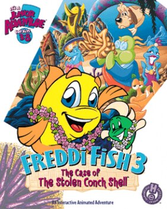

# Freddi Fish 3: The Case of the Stolen Conch Shell

HE 98

**Humongous Entertainment, 1998.** Freddi Fish 3: The Case of the Stolen Conch
Shell is a 1998 video game and the third installment in the Freddi Fish series,
developed and published by Humongous Entertainment. The game was followed by
Freddi Fish 4: The Case of the Hogfish Rustlers of Briny Gulch in 1999.

An iOS version was released with a shortened title Freddi Fish & the Stolen
Shell and also released with a "Lite" demo version that featured subtitles and
text boxes in the gameplay. It was considered one of Atari's capital projects
available on its website and on the App Store. A Nintendo Switch version, along
with Putt-Putt Travels Through Time, was released in January 2022, followed by
the PlayStation 4 version on the PlayStation Store in November.

## At a glance

|               |                                                                                                                                                                                     |
| ------------- | ----------------------------------------------------------------------------------------------------------------------------------------------------------------------------------- |
| **Developer** | Humongous Entertainment                                                                                                                                                             |
| **Publisher** | Humongous Entertainment                                                                                                                                                             |
| **Designer**  | Edward Pun/Tami Caryl Borowick                                                                                                                                                      |
| **Artist**    | John Michaud (animator)                                                                                                                                                             |
| **Writer**    | Fred Kron                                                                                                                                                                           |
| **Composer**  | Thomas McGurk                                                                                                                                                                       |
| **Series**    | Freddi Fish                                                                                                                                                                         |
| **Engine**    | SCUMM                                                                                                                                                                               |
| **Platforms** | Macintosh, Windows, Linux, Android, iOS, Nintendo Switch, PlayStation 4                                                                                                             |
| **Released**  | title=March 1, 1998/Macintosh, Windows, March 1, 1998, iOS, January 12, 2012, Android, April 3, 2014, Linux, May 15, 2014, Switch, January 3, 2022, PlayStation 4, November 2, 2022 |
| **Genre**     | Adventure                                                                                                                                                                           |
| **Modes**     | Single-player                                                                                                                                                                       |

## How it runs here

**Humongous titles are forks of SCUMM v6**, versioned separately as HE 60
through HE 100. v6 itself runs, draws and saves here; the HE extensions on top
of it are not separately verified, and the exact game-to-HE-number mapping in
`docs/released-games.md` is explicitly approximate. Worth trying, not relied
upon.

## Where it sits in this project

`docs/released-games.md` lists this title under **HE 98**. That page is the
scope statement for the whole catalogue and says, per Engine family and per
Version, what has actually been run rather than what is implemented —
**Completable** (`CONTEXT.md`) is claimed for no title on it.

## Elsewhere

- [Wikipedia: Freddi Fish 3: The Case of the Stolen Conch Shell](https://en.wikipedia.org/wiki/Freddi_Fish_3:_The_Case_of_the_Stolen_Conch_Shell)
- [`docs/released-games.md`](../../docs/released-games.md) — the full scope list
- [ScummVM](https://www.scummvm.org/) — the reference implementation this project checks itself against
