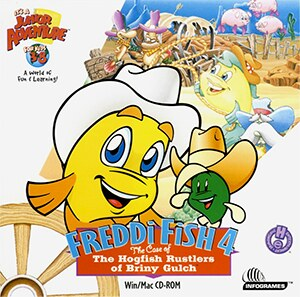

# Freddi Fish 4: The Case of the Hogfish Rustlers of Briny Gulch

HE 99

**Humongous Entertainment, 1999.** Freddi Fish 4: The Case of the Hogfish
Rustlers of Briny Gulch is a 1999 video game and the fourth installment in the
Freddi Fish series. It was developed and published by Humongous Entertainment.
The game was ported to the Nintendo Switch and PlayStation 4 consoles on
December 21, 2023. A sequel, Freddi Fish 5: The Case of the Creature of Coral
Cove, was released in 2001.

## At a glance

|               |                                                                                                                                              |
| ------------- | -------------------------------------------------------------------------------------------------------------------------------------------- |
| **Developer** | Humongous Entertainment                                                                                                                      |
| **Publisher** | Humongous Entertainment                                                                                                                      |
| **Designer**  | Lisa Wick, Brad Carlton                                                                                                                      |
| **Artist**    | John Michaud (animator)                                                                                                                      |
| **Writer**    | Dave Grossman                                                                                                                                |
| **Composer**  | Thomas McGurk                                                                                                                                |
| **Series**    | Freddi Fish                                                                                                                                  |
| **Engine**    | SCUMM                                                                                                                                        |
| **Platforms** | Macintosh, Windows, Linux, iOS, Nintendo Switch, PlayStation 4                                                                               |
| **Released**  | title=March 30, 1999/Macintosh, Windows, March 30, 1999, Linux, May 29, 2014, iOS, August 13, 2015, Switch, PlayStation 4, December 21, 2023 |
| **Genre**     | Adventure                                                                                                                                    |
| **Modes**     | Single-player                                                                                                                                |

## How it runs here

**Humongous titles are forks of SCUMM v6**, versioned separately as HE 60
through HE 100. v6 itself runs, draws and saves here; the HE extensions on top
of it are not separately verified, and the exact game-to-HE-number mapping in
`docs/released-games.md` is explicitly approximate. Worth trying, not relied
upon.

## Where it sits in this project

`docs/released-games.md` lists this title under **HE 99**. That page is the
scope statement for the whole catalogue and says, per Engine family and per
Version, what has actually been run rather than what is implemented —
**Completable** (`CONTEXT.md`) is claimed for no title on it.

## Elsewhere

- [Wikipedia: Freddi Fish 4: The Case of the Hogfish Rustlers of Briny Gulch](https://en.wikipedia.org/wiki/Freddi_Fish_4:_The_Case_of_the_Hogfish_Rustlers_of_Briny_Gulch)
- [`docs/released-games.md`](../../docs/released-games.md) — the full scope list
- [ScummVM](https://www.scummvm.org/) — the reference implementation this project checks itself against
