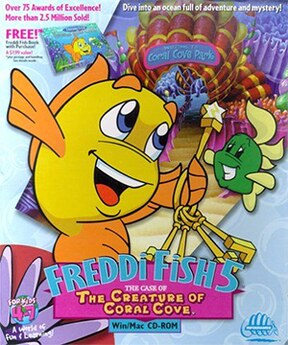

# Freddi Fish 5: The Case of the Creature of Coral Cove

HE 100

**Humongous Entertainment, 2001.** Freddi Fish 5: The Case of the Creature of
Coral Cove is a 2001 video game and the fifth and final installment in the
Freddi Fish series of adventure games. It was developed by Humongous
Entertainment and published by Infogrames.

## At a glance

|               |                                                                                                                                      |
| ------------- | ------------------------------------------------------------------------------------------------------------------------------------ |
| **Developer** | Humongous Entertainment                                                                                                              |
| **Publisher** | Infogrames                                                                                                                           |
| **Designer**  | Brad Carlton                                                                                                                         |
| **Producer**  | Tanya Erwin, Rachel Frost                                                                                                            |
| **Artist**    | John Michaud (animator)                                                                                                              |
| **Writer**    | Julia Hill                                                                                                                           |
| **Composer**  | Nathan Rosenberg                                                                                                                     |
| **Series**    | Freddi Fish                                                                                                                          |
| **Engine**    | SCUMM                                                                                                                                |
| **Platforms** | Macintosh, Windows, Linux, iOS, Nintendo Switch, PlayStation 4                                                                       |
| **Released**  | title=June 19, 2001/Macintosh, Windows, June 19, 2001, Linux, June 6, 2014, iOS, August 13, 2015, Switch, PlayStation 4, May 2, 2024 |
| **Genre**     | Adventure                                                                                                                            |
| **Modes**     | Single-player                                                                                                                        |

## How it runs here

**Humongous titles are forks of SCUMM v6**, versioned separately as HE 60
through HE 100. v6 itself runs, draws and saves here; the HE extensions on top
of it are not separately verified, and the exact game-to-HE-number mapping in
`docs/released-games.md` is explicitly approximate. Worth trying, not relied
upon.

## Where it sits in this project

`docs/released-games.md` lists this title under **HE 100**. That page is the
scope statement for the whole catalogue and says, per Engine family and per
Version, what has actually been run rather than what is implemented —
**Completable** (`CONTEXT.md`) is claimed for no title on it.

## Elsewhere

- [Wikipedia: Freddi Fish 5: The Case of the Creature of Coral Cove](https://en.wikipedia.org/wiki/Freddi_Fish_5:_The_Case_of_the_Creature_of_Coral_Cove)
- [`docs/released-games.md`](../../docs/released-games.md) — the full scope list
- [ScummVM](https://www.scummvm.org/) — the reference implementation this project checks itself against
