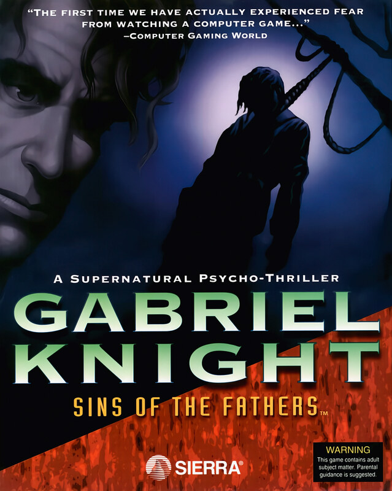

# Gabriel Knight: Sins of the Fathers

Sierra SCI1.1

**Sierra On-Line, 1993.** Gabriel Knight: Sins of the Fathers is a 1993
point-and-click adventure game, created by Jane Jensen, developed and published
by Sierra On-Line, and released for MS-DOS, Macintosh, and Windows on December
17, 1993. The game's story, featuring the voices of Tim Curry, Leah Remini, and
Mark Hamill in the CD-ROM version, focuses on Gabriel Knight, a struggling
novelist whose decision to use a spate of recent murders around New Orleans as
material for a new novel leads him into a world of voodoo magic and the truth
about his family's past as supernatural fighters.

Although the game was not a commercial success, it received favourable reviews
from critics for its story and voice cast, along with its graphical
presentation. The game later spawned a series, with a sequel, The Beast Within:
A Gabriel Knight Mystery, released in 1995; the game also received a novel
adaptation by Jensen, published in 1997.

A remake of the game to mark its 20th anniversary, Gabriel Knight: Sins of the
Fathers 20th Anniversary Edition, was released in 2014 for Windows, Mac, iPad,
and Android, featuring a remastering of the graphics and music, along with a
new voice cast and minor changes to the arrangement of story events.

## At a glance

|                |                            |
| -------------- | -------------------------- |
| **Developer**  | Sierra On-Line             |
| **Publisher**  | Sierra On-Line             |
| **Designer**   | Jane Jensen                |
| **Programmer** | Tom DeSalvo                |
| **Composer**   | Robert Holmes              |
| **Series**     | Gabriel Knight             |
| **Engine**     | SCI2                       |
| **Platforms**  | MS-DOS, Macintosh, Windows |
| **Released**   | NA, December 17, 1993      |
| **Genre**      | Point-and-click adventure  |
| **Modes**      | Single-player              |

## How it runs here

**A retail SCI game plays here now, and it is not this one.** King's Quest VII
boots, plays its Sierra logo, animates its title, takes a name, accepts a
chapter and reaches **the desert that is its first room**, drawn in the game's
own art with Rosella standing in it; 88 of its 108 rooms draw when entered by
number (`npm run rooms:sci -- <install> --fresh`). It is still not
`CONTEXT.md`'s **Completable** — no puzzle has been solved there and nothing
past that first room has been reached — and neither this title nor any other
SCI release has been played through here.

**Editing is further along than playing, and it is the whole family's, not one
game's.** A SCI install opens as a project: its Script resources as a class
graph with every method decompiled to instructions and every property word
named, its rooms drawn as places with the things on them draggable, its walk
polygons read out of the code that builds them, its Views stepped frame by
frame, its fonts and cursors edited pixel by pixel, and an unedited export that
is byte-identical to the install it came from.
[`docs/editor-parity.md`](../../docs/editor-parity.md) is the row-by-row
account against the SCUMM editor, including what is still a No and why.

Version identification is a measurement rather than a claim — over the 25
freely distributed Sierra demos this project can point at, every one identifies
its Version from its own bytes, 16 by probe and 9 narrowed only to a bucket,
and a bucket-only copy is refused for editing (ADR 0013).

**This title has not been run here.** Nothing above was measured against its
bytes: it is listed for the lineage, and nothing on this page is a claim that it
plays.

## Where it sits in this project

`docs/released-games.md` lists this title under **Sierra SCI1.1 — not supported
here**. That page is the scope statement for the whole catalogue and says, per
Engine family and per Version, what has actually been run rather than what is
implemented — **Completable** (`CONTEXT.md`) is claimed for no title on it.

## Elsewhere

- [Wikipedia: Gabriel Knight: Sins of the Fathers](https://en.wikipedia.org/wiki/Gabriel_Knight:_Sins_of_the_Fathers)
- [`docs/released-games.md`](../../docs/released-games.md) — the full scope list
- [ScummVM](https://www.scummvm.org/) — the reference implementation this project checks itself against
