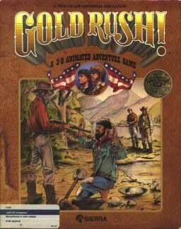

# Gold Rush!

AGI v3

**Sierra On-Line, 1988.** Gold Rush! (later retitled California: Gold Rush!) is
a graphic adventure video game designed by Doug and Ken MacNeill and released
by Sierra On-Line in 1988.

Gold Rush! was among the last games Sierra produced with the AGI interface and
one of the most complex. The Software Farm, run by the original developers,
owns and publishes the game rights.

## At a glance

|                |                                                    |
| -------------- | -------------------------------------------------- |
| **Developer**  | Sierra On-Line                                     |
| **Publisher**  | Sierra On-Line, The Software Farm, Sunlight Games  |
| **Designer**   | Ken MacNeill, Doug MacNeill                        |
| **Programmer** | Ken MacNeill                                       |
| **Artist**     | Robert Eric Heitman, Doug MacNeill                 |
| **Composer**   | Anita Scott                                        |
| **Engine**     | AGI                                                |
| **Platforms**  | Amiga, Apple IIGS, Atari ST, MS-DOS, Apple II, Mac |
| **Released**   | 1988                                               |
| **Genre**      | Adventure                                          |
| **Modes**      | Single-player                                      |

## How it runs here

**AGI v3 is supported**, including its combined `<GAMEID>DIR` index and its
LZW-compressed volumes. Packaging only: v2 and v3 share an instruction encoding
outright, so one Logic interpreter covers every Target between them (ADR 0012).

**No AGI game has been played through here.** The claim rests on the synthetic
fixture in `tests/fixtureAgi.ts`. A copy carrying `AGIDATA.OVL` has its
interpreter version read rather than assumed; one that does not plays on a
documented default and is refused for editing (ADR 0013).

## Where it sits in this project

`docs/released-games.md` lists this title under **AGI v3**. That page is the
scope statement for the whole catalogue and says, per Engine family and per
Version, what has actually been run rather than what is implemented —
**Completable** (`CONTEXT.md`) is claimed for no title on it.

## Elsewhere

- [Wikipedia: Gold Rush!](https://en.wikipedia.org/wiki/Gold_Rush!)
- [`docs/released-games.md`](../../docs/released-games.md) — the full scope list
- [ScummVM](https://www.scummvm.org/) — the reference implementation this project checks itself against
