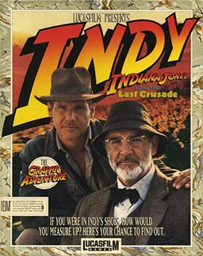

# Indiana Jones and the Last Crusade: The Graphic Adventure

SCUMM v3

**Lucasfilm Games, 1989.** Indiana Jones and the Last Crusade: The Graphic
Adventure is a graphic adventure game, released in 1989 by Lucasfilm Games,
coinciding with the release of the film of the same name. It was the third game
to use the SCUMM engine.

## At a glance

|               |                                                                                                                                                                                    |
| ------------- | ---------------------------------------------------------------------------------------------------------------------------------------------------------------------------------- |
| **Developer** | Lucasfilm Games                                                                                                                                                                    |
| **Publisher** | Lucasfilm Games                                                                                                                                                                    |
| **Designer**  | Ron Gilbert, Noah Falstein, David Fox                                                                                                                                              |
| **Artist**    | Steve Purcell, Martin Cameron, James A. Dollar, Mike Ebert, James McLeod                                                                                                           |
| **Composer**  | Eric Hammond, FM Towns:, Dave Warhol, James Leiterman                                                                                                                              |
| **Engine**    | SCUMM                                                                                                                                                                              |
| **Platforms** | MS-DOS, Amiga, Atari ST, Mac, FM Towns, CDTV                                                                                                                                       |
| **Released**  | July 1989: MS-DOS, Amiga, Atari ST, 1990: Mac, FM Towns [https://web.archive.org/web/20060428061222/http://www.lucasarts.com/20th/history_1.htm], 1992: CDTV, July 08, 2009: Steam |
| **Genre**     | Graphic adventure                                                                                                                                                                  |
| **Modes**     | Single-player                                                                                                                                                                      |

## How it runs here

**SCUMM v3 runs, and no game has been played through on it.** The claim rests
on a synthetic fixture rather than on shipped data — see
`docs/processes/verifying-version-support.md`. Treat a stall as this
interpreter's, and check the log.

## Where it sits in this project

`docs/released-games.md` lists this title under **SCUMM v3**. That page is the
scope statement for the whole catalogue and says, per Engine family and per
Version, what has actually been run rather than what is implemented —
**Completable** (`CONTEXT.md`) is claimed for no title on it.

## Elsewhere

- [Wikipedia: Indiana Jones and the Last Crusade: The Graphic Adventure](https://en.wikipedia.org/wiki/Indiana_Jones_and_the_Last_Crusade:_The_Graphic_Adventure)
- [`docs/released-games.md`](../../docs/released-games.md) — the full scope list
- [ScummVM](https://www.scummvm.org/) — the reference implementation this project checks itself against
