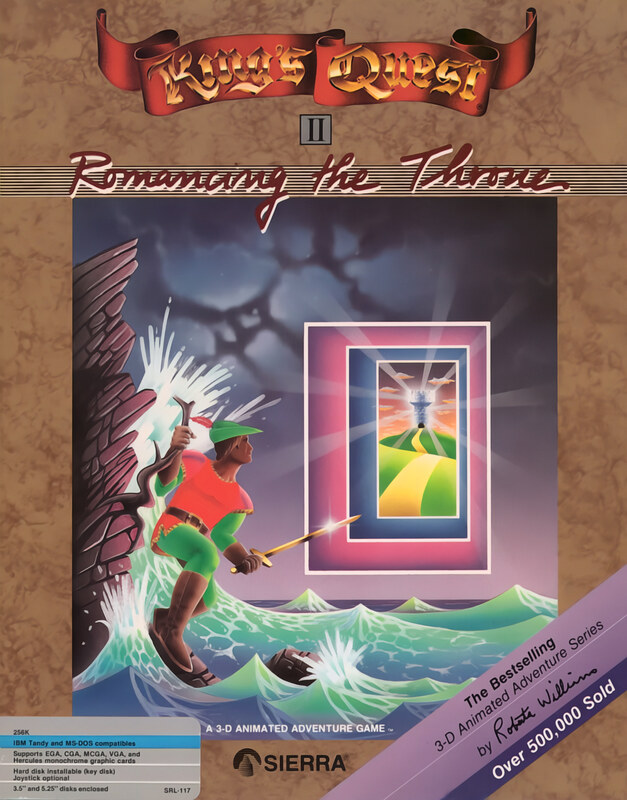

# King's Quest II: Romancing the Throne

AGI v2

**Sierra On-Line, 1985.** King's Quest II: Romancing the Throne is an adventure
game developed by Sierra On-Line and published originally for home computers in
1985 as the second entry in the King's Quest series. The game follows the young
King Graham as he journeys through the pseudo-medieval fairy tale-inspired
fantasy realm of Kolyma, on a quest to find three keys to an enchanted isle and
rescue the fair maiden Valanice from the tower in which she is imprisoned. It
is presented as an interconnected set of locations, or flip-screens, with a
pseudo-3D art style. The player interacts with locations and items using text
commands, and must avoid numerous hazards and obstacles in their quest.

King's Quest II was developed by Sierra as a continuation of King's Quest I
(1984), reusing and enhancing its game engine, the Adventure Game Interpreter.
The game was designed by Sierra co-founder Roberta Williams as a blend of
common fairy tales and fantasy tropes, with Graham's quest to rescue a maiden
setting up a family of characters that could be used in following games.
Several developers of the game, including Scott Murphy, Mark Crowe, and
composer Al Lowe, went on to develop future games for Sierra.

The first three King's Quest games collectively sold over 500,000 copies by 1987. Critics praised the advances in gameplay over the first game, as well as
the quality and variety of graphical animations. The game has been included in
several compilation releases, and an unofficial remake was released in 2002 for
modern systems. The King's Quest series, which includes a further six games by
Sierra, has been termed its flagship series.

_This title has no article of its own. The text above is transcribed from
**King's Quest II**, which covers it, and the link under **Elsewhere** goes
there rather than to a page about this game alone._

## At a glance

|               |                                                                                 |
| ------------- | ------------------------------------------------------------------------------- |
| **Developer** | Sierra On-Line                                                                  |
| **Publisher** | Sierra On-Line                                                                  |
| **Designer**  | Roberta Williams                                                                |
| **Artist**    | Doug MacNeill/Mark Crowe                                                        |
| **Composer**  | Al Lowe                                                                         |
| **Series**    | King's Quest                                                                    |
| **Engine**    | Adventure Game Interpreter                                                      |
| **Platforms** | IBM PC compatible, Macintosh, Apple II, Apple IIGS, Amiga, Atari ST, Tandy 1000 |
| **Released**  | May 1985                                                                        |
| **Genre**     | Adventure                                                                       |
| **Modes**     | Single-player                                                                   |

## How it runs here

**AGI v2 is supported.** The resource layer, the vector Picture renderer with
both buffers and the priority bands, View cels, the Logic interpreter with all
183 action and 20 test commands, `WORDS.TOK` and the parser, `OBJECT` and
inventory, four-voice sound and saves all run.

**No AGI game has been played through here.** Everything above is tested
against the synthetic fixture in `tests/fixtureAgi.ts`, so this game is worth
trying rather than relied upon.

How the bytecode decodes depends on the build of Sierra's interpreter a copy
shipped against, not on the AGI major version. A copy carrying `AGIDATA.OVL` is
read rather than assumed; one that does not still plays, on a documented
default with the fallback logged, and is refused for editing (ADR 0013).

## Where it sits in this project

`docs/released-games.md` lists this title under **AGI v2**. That page is the
scope statement for the whole catalogue and says, per Engine family and per
Version, what has actually been run rather than what is implemented —
**Completable** (`CONTEXT.md`) is claimed for no title on it.

## Elsewhere

- [Wikipedia: King's Quest II](https://en.wikipedia.org/wiki/King%27s_Quest_II)
- [`docs/released-games.md`](../../docs/released-games.md) — the full scope list
- [ScummVM](https://www.scummvm.org/) — the reference implementation this project checks itself against
