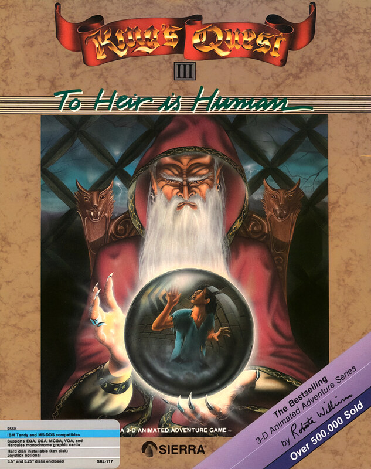

# King's Quest III: To Heir Is Human

AGI v2

**Sierra On-Line, 1986.** King's Quest III: To Heir is Human is an adventure
game developed by Sierra On-Line and published originally for home computers in
1986 as the third entry in the King's Quest series. The game follows Gwydion,
slave to the wizard Manannan, as he journeys through the pseudo-medieval fairy
tale-inspired fantasy realm of Llewdor, on a quest to free himself and find his
family. It is presented as an interconnected set of locations, or flip-screens,
with a pseudo-3D art style. The player interacts with locations and items using
text commands, and must avoid numerous hazards and obstacles in their quest.

King's Quest III was developed by Sierra using an expanded version of the game
engine that was originally developed for King's Quest I (1984), the Adventure
Game Interpreter. It was designed by Sierra co-founder Roberta Williams as a
blend of common fairy tales and fantasy tropes, with a more complex and mature
story than its predecessors made possible by the increased capabilities of home
computers. Several developers of the game, including artist Mark Crowe and
programmer Al Lowe, would go on to develop future games for Sierra.

King's Quest III sold 250,000 copies by February 1993, and the first three
King's Quest games collectively sold over 500,000 copies by 1987. Critics
praised the advances in gameplay over the first two games, as well as the
quality and variety of graphical animation, though some found elements of the
game unfairly difficult. The game has been included in several compilation
releases, and unofficial remakes were released in 2006 and 2011 for modern
systems. The King's Quest series, which includes a further five games by
Sierra, has been termed its flagship series.

_This title has no article of its own. The text above is transcribed from
**King's Quest III**, which covers it, and the link under **Elsewhere** goes
there rather than to a page about this game alone._

## At a glance

|                |                                                                            |
| -------------- | -------------------------------------------------------------------------- |
| **Developer**  | Sierra On-Line                                                             |
| **Publisher**  | Sierra On-Line                                                             |
| **Designer**   | Roberta Williams                                                           |
| **Programmer** | Al Lowe, Bob Heitman, Bob Kernaghan                                        |
| **Artist**     | Doug MacNeill, Mark Crowe                                                  |
| **Writer**     | Roberta Williams, Annette Childs                                           |
| **Composer**   | Margaret Lowe                                                              |
| **Series**     | King's Quest                                                               |
| **Engine**     | Adventure Game Interpreter                                                 |
| **Platforms**  | MS-DOS, Apple II, Apple IIGS, Amiga, Atari ST, Mac, Tandy Color Computer 3 |
| **Released**   | November 1986                                                              |
| **Genre**      | Adventure                                                                  |
| **Modes**      | Single-player                                                              |

## How it runs here

**AGI v2 is supported.** The resource layer, the vector Picture renderer with
both buffers and the priority bands, View cels, the Logic interpreter with all
183 action and 20 test commands, `WORDS.TOK` and the parser, `OBJECT` and
inventory, four-voice sound and saves all run.

**No AGI game has been played through here.** Everything above is tested
against the synthetic fixture in `tests/fixtureAgi.ts`, so this game is worth
trying rather than relied upon.

**What this title has actually reached**, which is more than the fixture can
say. A copy shipping no `AGIDATA.OVL` boots, runs its title, and one keypress
takes it to room 7 — the entrance hall of Manannan's house, looked at through
`npm run shot:agi` and correct: the staircase, the portrait, Gwydion, the score
line and the typed input line. It reports **Unimplemented: none**. Its five-menu
bar — Sierra, File, Action, Special, Speed — is built and openable with Escape,
which matters here more than in most AGI games: File is the only route to Save,
Restore, Restart and Quit, because those entries' keys belong to the menu rather
than to a `set.key`.

`npm run sweep:agi` decompiles all 125 Logics — 20,883 instructions, 2,069
top-level statements — with **nothing Unrecovered**: every one re-emits to the
bytes it arrived as.

How the bytecode decodes depends on the build of Sierra's interpreter a copy
shipped against, not on the AGI major version. A copy carrying `AGIDATA.OVL` is
read rather than assumed; a copy without one is now **probed** — every Logic is
decoded under each table AGI could be using and the ones the game's own jumps
contradict are ruled out. For this title that rules out the pre-2.089 table and
leaves 2.089 and 2.917, which differ only in `quit`'s arity; the refusal names
both, so declaring one is a choice between two rather than a guess at six. A
copy the probe settles to a single table is editable without declaring
anything. Otherwise it still plays, on a documented
default with the fallback logged, and is refused for editing (ADR 0013).

## Where it sits in this project

`docs/released-games.md` lists this title under **AGI v2**. That page is the
scope statement for the whole catalogue and says, per Engine family and per
Version, what has actually been run rather than what is implemented —
**Completable** (`CONTEXT.md`) is claimed for no title on it.

## Elsewhere

- [Wikipedia: King's Quest III](https://en.wikipedia.org/wiki/King%27s_Quest_III)
- [`docs/released-games.md`](../../docs/released-games.md) — the full scope list
- [ScummVM](https://www.scummvm.org/) — the reference implementation this project checks itself against
