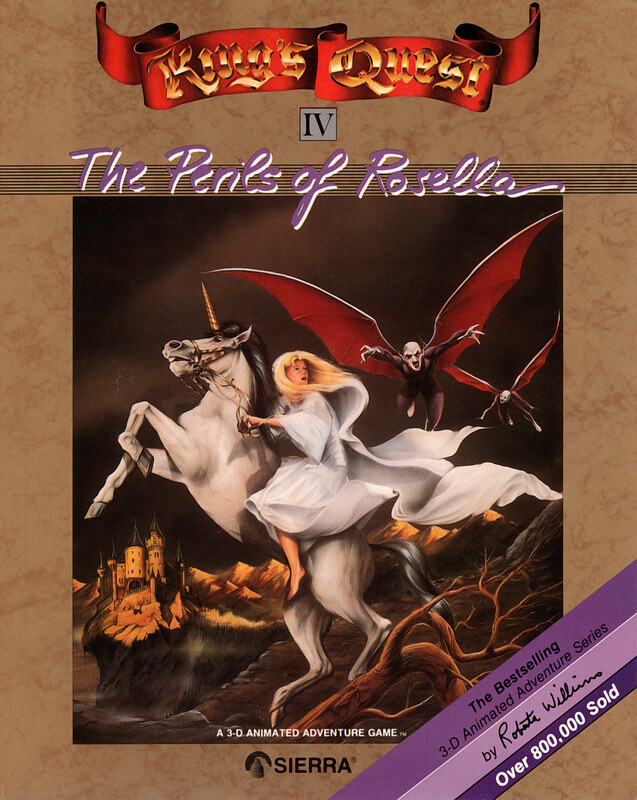

# King's Quest IV: The Perils of Rosella

AGI v3

**Sierra On-Line, 1988.** King's Quest IV: The Perils of Rosella is an
adventure game developed by Sierra On-Line and published originally for PCs and
home computers in 1988 as the fourth entry in the King's Quest series. The game
follows Rosella, princess of Daventry, as she journeys through the
pseudo-medieval fairy tale-inspired fantasy realm of Tamir, on a quest to find
a magic fruit that can heal her father King Graham. It is presented as an
interconnected set of locations, or flip-screens, with a pseudo-3D art style.
The player interacts with locations and items using text commands, and must
avoid numerous hazards and obstacles in their quest.

King's Quest IV was developed by Sierra using two game engines: an expanded
version of the engine that was originally developed for King's Quest I (1984),
the Adventure Game Interpreter, and a new engine that was capable of better
animation and sound but could not run on older computers, the Sierra Creative
Interpreter. It was designed by Sierra co-founder Roberta Williams as a blend
of common fairy tales and fantasy tropes, and she believed that having a woman
protagonist would attract female players without having an impact on the male
playerbase. She added a strict in-game time limit to give players a sense of
urgency in completing the quest. To showcase the sound capabilities of the new
engine, Sierra hired composer William Goldstein to write 40 minutes of music
for the game.

The game sold 100,000 copies in its first two weeks, and 800,000 copies within
a year, a large increase over the sales of the previous three games. Critics
praised the advances in graphics and animation over prior adventure games,
though opinions were mixed on the gameplay, with some reviewers praising them
while others found some puzzles to be obtuse or tedious. The game won "Best
Adventure or Fantasy/Role-Playing Program" at the 1989 Software Publishers
Association awards, and Rosella has been considered one of the first "major
female protagonists" in a video game. It has been included in several
compilation releases, and unofficial remakes were released in 2021 and 2025 for
modern systems. The King's Quest series, which includes a further four games by
Sierra, has been termed its flagship series.

_This title has no article of its own. The text above is transcribed from
**King's Quest IV**, which covers it, and the link under **Elsewhere** goes
there rather than to a page about this game alone._

## At a glance

|               |                                                         |
| ------------- | ------------------------------------------------------- |
| **Developer** | Sierra On-Line                                          |
| **Publisher** | Sierra On-Line                                          |
| **Designer**  | Roberta Williams                                        |
| **Writer**    | Roberta Williams                                        |
| **Composer**  | William Goldstein                                       |
| **Series**    | King's Quest                                            |
| **Engine**    | Sierra Creative Interpreter, Adventure Game Interpreter |
| **Platforms** | MS-DOS, Amiga, Apple II, Apple IIGS, Atari ST           |
| **Released**  | September 1988                                          |
| **Genre**     | Adventure                                               |
| **Modes**     | Single-player                                           |

## How it runs here

This game shipped twice, so which release you have decides which engine reads
it. **A `RESOURCE.MAP` beside `RESOURCE.001` and up is the SCI0 release; a
`KQ4DIR` beside `KQ4VOL.0` is the AGI v3 one.** Nothing has to be chosen — the
files decide, and the log says which answered.

**AGI v3 is supported**, including its combined `<GAMEID>DIR` index and its
LZW-compressed volumes. Packaging only: v2 and v3 share an instruction encoding
outright, so one Logic interpreter covers every Target between them (ADR 0012).

**No AGI game has been played through here.** The claim rests on the synthetic
fixture in `tests/fixtureAgi.ts`. A copy carrying `AGIDATA.OVL` has its
interpreter version read rather than assumed; one that does not plays on a
documented default and is refused for editing (ADR 0013).

**The SCI0 release plays its opening.** Version 1.000.111 — SCI 0.000.274, the first build of that engine
that ever shipped — identifies itself from its own resources as SCI0 early,
loads its 190 Script resources, sends `play` to the game object and reaches
its two heralds. `npm run sweep:sci` reports nothing at all over those scripts:
no unknown opcodes, no blocks overrun, no Kernel numbers past the Version's
table, no unresolved Selectors, nothing Unrecovered.

On a keypress at each screen — which is what the real game asks for — it walks
the Sierra logo, its King's Quest IV title banner and into **Picture 201, its
opening throne room, with five cast members on it and Graham and Rosella
recognisable**, 82% of the framebuffer painted and the main loop turning.

**Its first screen is the copy protection, and it is a real dialog now.** The
game asks a question out of the printed manual, in a window it sizes around the
text, with a field to type the answer into — and all of that was invisible
until the window, the port, `Format` and `EditControl` existed. A wrong answer
gets Sierra's own refusal, laid out and readable; a right one goes on into the
game.

**Nobody has played it to an end here**, so it is not `Completable` and this
page does not claim it is. What has been looked at is the opening: the question,
the answer, the logos, the throne room.

## Where it sits in this project

`docs/released-games.md` lists this title under both **AGI v3** and **SCI0** —
it is the one title in the catalogue that appears twice, because Sierra shipped
it twice. That page is the scope statement for the whole catalogue and says,
per Engine family and per Version, what has actually been run rather than what
is implemented — **Completable** (`CONTEXT.md`) is claimed for no title on it.

## Elsewhere

- [Wikipedia: King's Quest IV](https://en.wikipedia.org/wiki/King%27s_Quest_IV)
- [`docs/released-games.md`](../../docs/released-games.md) — the full scope list
- [ScummVM](https://www.scummvm.org/) — the reference implementation this project checks itself against
