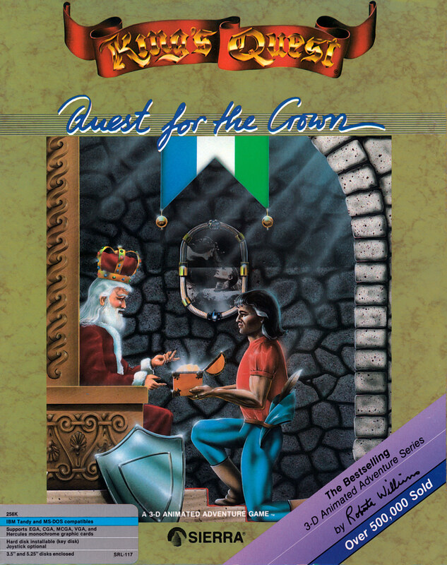

# King's Quest: Quest for the Crown

AGI v2 — the DOS re-release

**Sierra On-Line, 1984.** King's Quest: Quest for the Crown, originally
released as King's Quest, is an adventure game developed by Sierra On-Line and
published originally for the IBM PCjr in 1984 as the first entry in the King's
Quest series. It was released for several other home computer systems between
1984 and 1989, as well as the Master System console. The game follows the young
knight Sir Graham as he journeys through the pseudo-medieval fairy
tale-inspired fantasy realm of Daventry, on a quest to recover three magical
items and become the next king. It is presented as an interconnected set of
locations, or flip-screens, with a pseudo-3D art style. The player interacts
with locations and items using text commands, and must avoid numerous hazards
and obstacles in their quest.

King's Quest was developed by Sierra after it was approached by IBM to make a
game similar to Sierra's Wizard and the Princess (1980) that would showcase the
computing power of the upcoming PCjr with animation and complex graphics. It
was designed by Sierra co-founder Roberta Williams as a blend of common fairy
tales, and was completed over the course of 18 months by Williams and a team of
6 programmers and artists, who had to develop new techniques for making
graphical adventure games with visual depth. A reusable game engine was
developed for the game, the Adventure Game Interpreter, which was reused for
later Sierra games.

The game was a bestseller, with over 100,000 copies sold by 1986. Critics
applauded the advances in graphical gameplay, as adventure games previously
were text-based or had static images, though some found the game slow-paced and
very difficult. An official remake was released in 1990 with updated graphics,
and an unofficial remake was released in 2001 for modern systems. King's Quest
has been credited with saving Sierra from the financial effects of the video
game crash of 1983, and has been considered the start of the graphic adventure
genre. The series it started, which includes a further seven games by Sierra,
has been termed its flagship series. King's Quest has been named as one of the
most important computer games of all time, and in 2020 was inducted into the
World Video Game Hall of Fame.

_This title has no article of its own. The text above is transcribed from
**King's Quest I**, which covers it, and the link under **Elsewhere** goes
there rather than to a page about this game alone._

## At a glance

|               |                                                                                                                     |
| ------------- | ------------------------------------------------------------------------------------------------------------------- |
| **Developer** | Sierra On-Line                                                                                                      |
| **Publisher** | IBM, Sierra On-Line                                                                                                 |
| **Designer**  | Roberta Williams                                                                                                    |
| **Writer**    | Roberta Williams                                                                                                    |
| **Composer**  | Ken Allen (1990 remake)                                                                                             |
| **Series**    | King's Quest                                                                                                        |
| **Engine**    | Adventure Game Interpreter (original), Sierra Creative Interpreter (remake)                                         |
| **Platforms** | title=IBM PCjr, / Tandy 1000, / Apple II, / Apple IIGS, / Atari ST, / Amiga, / Macintosh, / MS-DOS, / Master System |
| **Released**  | May 1984, 1990 (remake)                                                                                             |
| **Genre**     | Adventure                                                                                                           |
| **Modes**     | Single-player                                                                                                       |

## How it runs here

**AGI v2 is supported.** The resource layer, the vector Picture renderer with
both buffers and the priority bands, View cels, the Logic interpreter with all
183 action and 20 test commands, `WORDS.TOK` and the parser, `OBJECT` and
inventory, four-voice sound and saves all run.

**No AGI game has been played through here.** Everything above is tested
against the synthetic fixture in `tests/fixtureAgi.ts`, so this game is worth
trying rather than relied upon.

How the bytecode decodes depends on the build of Sierra's interpreter a copy
shipped against, not on the AGI major version. A copy carrying `AGIDATA.OVL` is
read rather than assumed; one that does not still plays, on a documented
default with the fallback logged, and is refused for editing (ADR 0013).

## Where it sits in this project

`docs/released-games.md` lists this title under **AGI v2 — the DOS
re-release**. That page is the scope statement for the whole catalogue and
says, per Engine family and per Version, what has actually been run rather than
what is implemented — **Completable** (`CONTEXT.md`) is claimed for no title on
it.

## Elsewhere

- [Wikipedia: King's Quest I](https://en.wikipedia.org/wiki/King%27s_Quest_I)
- [`docs/released-games.md`](../../docs/released-games.md) — the full scope list
- [ScummVM](https://www.scummvm.org/) — the reference implementation this project checks itself against
