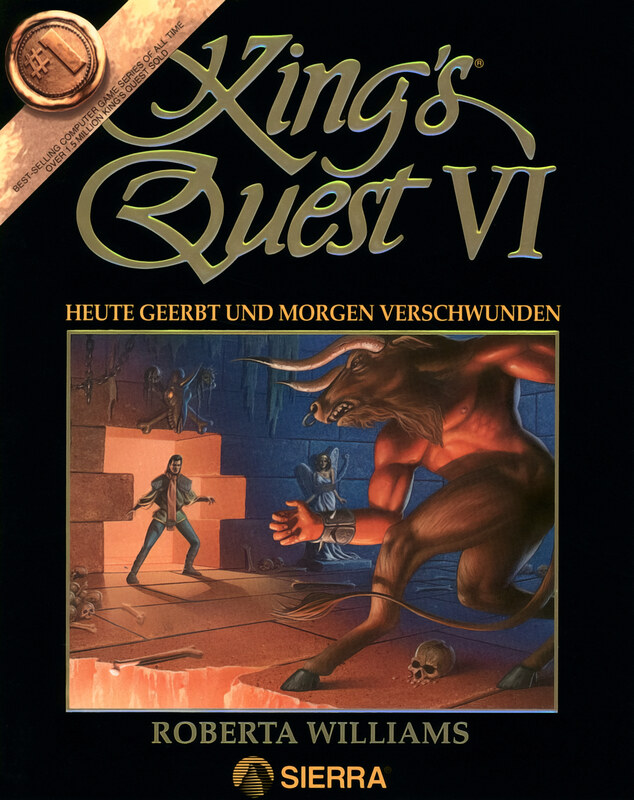

# King's Quest VI: Heir Today, Gone Tomorrow

Sierra SCI1.1

King's Quest VI: Heir Today, Gone Tomorrow is a point-and-click adventure game,
released in 1992 as the sixth installment in the King's Quest series produced
by Sierra On-Line. The game was written by Roberta Williams and Jane Jensen.
King's Quest VI is widely recognized as the high point in the series for its
landmark 3D graphic introduction movie, created by Kronos Digital
Entertainment, and its professional voice acting. Actor Robby Benson provided
the voice for Prince Alexander, the game's protagonist. King's Quest VI was
programmed in Sierra's Creative Interpreter and was the last King's Quest game
to be released on floppy disk. A CD-ROM version of the game was released in
1993, including more character voices, a slightly different opening movie and
more detailed artwork and animation.

The name of this sequel is a pun on the common phrase "here today, gone
tomorrow". This pun is related to the abrupt departure of Prince Alexander
after the events of King's Quest V, where he was just rescued by King Graham
along with Princess Cassima, who asked Alexander to come visit her at the end
of that game.

_This title has no article of its own. The text above is transcribed from
**King's Quest VI**, which covers it, and the link under **Elsewhere** goes
there rather than to a page about this game alone._

## At a glance

|                |                                                   |
| -------------- | ------------------------------------------------- |
| **Developer**  | Sierra On-Line, Revolution Software (Amiga)       |
| **Publisher**  | Sierra On-Line                                    |
| **Designer**   | Jane Jensen, Roberta Williams                     |
| **Director**   | Jane Jensen, William D. Skirvin, Roberta Williams |
| **Producer**   | Robert W. Lindsley, William D. Skirvin            |
| **Programmer** | Robert W. Lindsley                                |
| **Artist**     | Michael Hutchison, John Shroades                  |
| **Writer**     | Jane Jensen, Roberta Williams                     |
| **Composer**   | Chris Braymen                                     |
| **Series**     | King's Quest                                      |
| **Engine**     | SCI1.1 (DOS, Mac, Win), Virtual Theatre (Amiga)   |
| **Platforms**  | MS-DOS, Windows, Classic Mac OS, Amiga            |
| **Released**   | October 13, 1992 (DOS), 1993 (Win, Amiga)         |
| **Genre**      | Adventure game                                    |
| **Modes**      | Single-player                                     |

## How it runs here

**A retail SCI game plays here now, and it is not this one.** King's Quest VII
boots, plays its Sierra logo, animates its title, takes a name, accepts a
chapter and reaches **the desert that is its first room**, drawn in the game's
own art with Rosella standing in it; 88 of its 108 rooms draw when entered by
number (`npm run rooms:sci -- <install> --fresh`). It is still not
`CONTEXT.md`'s **Completable** — no puzzle has been solved there and nothing
past that first room has been reached — and neither this title nor any other
SCI release has been played through here.

**Editing is further along than playing, and it is the whole family's, not one
game's.** A SCI install opens as a project: its Script resources as a class
graph with every method decompiled to instructions and every property word
named, its rooms drawn as places with the things on them draggable, its walk
polygons read out of the code that builds them, its Views stepped frame by
frame, its fonts and cursors edited pixel by pixel, and an unedited export that
is byte-identical to the install it came from.
[`docs/editor-parity.md`](../../docs/editor-parity.md) is the row-by-row
account against the SCUMM editor, including what is still a No and why.

Version identification is a measurement rather than a claim — over the 25
freely distributed Sierra demos this project can point at, every one identifies
its Version from its own bytes, 16 by probe and 9 narrowed only to a bucket,
and a bucket-only copy is refused for editing (ADR 0013).

**This title has not been run here.** Nothing above was measured against its
bytes: it is listed for the lineage, and nothing on this page is a claim that it
plays.

## Where it sits in this project

`docs/released-games.md` lists this title under **Sierra SCI1.1 — not supported
here**. That page is the scope statement for the whole catalogue and says, per
Engine family and per Version, what has actually been run rather than what is
implemented — **Completable** (`CONTEXT.md`) is claimed for no title on it.

## Elsewhere

- [Wikipedia: King's Quest VI](https://en.wikipedia.org/wiki/King%27s_Quest_VI)
- [`docs/released-games.md`](../../docs/released-games.md) — the full scope list
- [ScummVM](https://www.scummvm.org/) — the reference implementation this project checks itself against
