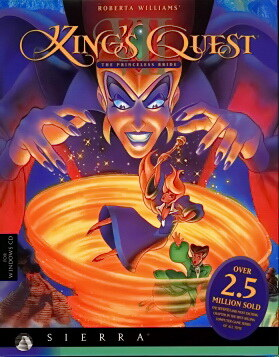

# King's Quest VII: The Princeless Bride

Sierra SCI2.1



**Sierra On-Line, 1994.** King's Quest VII: The Princeless Bride is a graphic
adventure game developed and published by Sierra On-Line for the MS-DOS,
Microsoft Windows and Macintosh computers in 1994. It features high-resolution
graphics in a style reminiscent of Disney and Don Bluth animated films and is
the first King's Quest game with multiple protagonists: Queen Valanice and
Princess Rosella, who are both spirited away to the realm of Eldritch, and
Rosella is transformed into a troll. They must find a way to return Rosella to
normal and find her true love, defeat a powerful evil force threatening this
realm, and return to the kingdom of Daventry.

King's Quest VII is the first game in the series to divide the story into
chapters. Some puzzles have multiple solutions, and there are two possible
endings. Critical reactions to the game were generally positive.

_This title has no article of its own. The text above is transcribed from
**King's Quest VII**, which covers it, and the link under **Elsewhere** goes
there rather than to a page about this game alone._

## At a glance

|                |                                               |
| -------------- | --------------------------------------------- |
| **Developer**  | Sierra On-Line                                |
| **Publisher**  | Sierra On-Line                                |
| **Designer**   | Lorelei Shannon, Roberta Williams             |
| **Director**   | Roberta Williams, Lorelei Shannon, Andy Hoyos |
| **Producer**   | Mark Seibert, Craig Alexander                 |
| **Programmer** | Oliver Brelsford, Tom DeSalvo, Henry Yu       |
| **Artist**     | Andy Hoyos, Marc Hudgins                      |
| **Writer**     | Lorelei Shannon                               |
| **Composer**   | Neal Grandstaff, Dan Kehler, Jay D. Usher     |
| **Series**     | King's Quest                                  |
| **Engine**     | SCI2                                          |
| **Platforms**  | MS-DOS, Windows, Macintosh                    |
| **Released**   | November 22, 1994                             |
| **Genre**      | Adventure game                                |
| **Modes**      | Single-player                                 |

## How it runs here

**It boots, and clicks take it through six screens and into the game's first
room, drawn in its own art with Rosella standing in it.** That is the whole
claim. It is not `CONTEXT.md`'s **Completable** — nobody has played it through
here, no puzzle has been solved, and nothing past the first room has been
reached.

| Cycle | Room | Screen                                                                          | What moved it on                                  |
| ----- | ---- | ------------------------------------------------------------------------------- | ------------------------------------------------- |
| 65    | 15   | the Sierra logo                                                                 | its own sound cue, or a click anywhere            |
| 80    | 30   | the main menu: "Watch Intro", "Start New Game", "Quit", centred over the clouds | a click on "Start New Game", dispatching `doVerb` |
| 200   | 20   | **"Name Your Game"** — a 473×332 panel holding a full on-screen QWERTY keyboard | Return                                            |
| —     | 20   | **"Which Chapter?"** — the chapter selector, 1 to 6                             | a chapter digit                                   |
| —     | 35   | **"CHAPTER ONE — 'Where in the blazes am I?'"**, with Quit and Continue         | a click on Continue                               |
| —     | 1250 | **the desert**, 960 pixels of scenery in three Pictures, with Rosella on it     | —                                                 |

**And 93 of its 108 rooms draw when they are entered by number**, which is a
wider reading than the path above and a weaker kind of evidence:

```
npm run rooms:sci -- <path-to-install> --fresh
  108 rooms asked for: 104 entered, 4 sent elsewhere, 0 refused.
  Of the 104 entered, 93 drew and 11 did not.
```

Five rooms that used to be refused are now entered, because a script that asks
for an array and is handed an empty one gets zeroes back with no error — see
`Array(new)` in `SciKernel.ts`, whose arguments were the wrong way round.

Each room is entered by sending `newRoom` to the game object on a **freshly
booted** engine and run for four seconds, so what it says is that **a room's own
`init` draws it** — not that a player can reach it. Three numbers rather than
one, because each of the other two hides something:

- **4 were sent elsewhere** — 29 to 26, 2150 to 2208, 2155 to 2150 and 2485 to 2100. `newRoom` reports nothing about being obeyed, and King's Quest
  VII redirects a room whose chapter has not been started. A reading taken after
  a redirect is a reading of wherever it landed, so those five are not counted
  as their own rooms.
- **11 of the 104 entered drew nothing**: 22, 26, 100, 150, 960, 2480, 6600,
  6700, 6800, 6900 and 9999. Room 22 is the save-and-restore dialog. Room 100 is
  Valanice standing on an undrawn backdrop, 13 colours over 1% of the screen,
  because that backdrop is a video this engine does not play into a room. 150
  and 9999 are black.

  **Six of the eleven are art this install does not contain, not faults here.**
  The four in the 6600s each ask for **View 6600**, which is absent while 6601,
  6602 and 6603 are all present. Room 2480 sets Picture 2480 and room 9999 sets
  Picture 3150, and neither number is among the 168 Pictures the install ships.
  A room whose art is not in the copy being read cannot be drawn by any
  interpreter.

  Two more are faults, and their Pictures **are** present: room 100 sets Picture
  99 and room 150 sets Picture 999, and in both the Plane ends up holding the
  number with no background drawn into it. They are two faults and not one:

  - **Room 100** repeats `send to 0:0, which is not an object` out of
    `KQTalker::init` in script 64928 — the talking-head class, which is what
    room 100 is. The object it sends to is the property at byte offset 64,
    which is **`client`**, and it is nought. So `init` sends `view`, `loop`,
    `x`, `y`, `priority`, `scaleX` and `scaleY` to a null client and every one
    is stepped over. Whether the caller never set `client` or this engine loses
    it is the next thing to read.
  - **Room 150** asks for View 1, which the game does not ship.

  Those two may be the same story as the other six. **Views 1 and 2 are absent
  from this install** — view 0 is present, 1 and 2 are not — and room 100's two
  actors, `valenice` and `rosella`, carry view 0 and view 1 as their declared
  values. Room 150's log names View 1 exactly. A script normally overwrites a
  placeholder view before showing an actor, so this is evidence and not proof;
  what it does mean is that "two engine faults" is the **most** these two can
  be, and they may be none.

  That leaves room 22, the save-and-restore dialog, and rooms 26 and 960
  unattributed.

**The front end plays through, and the first room does not.** A click on the
menu, a typed name, and a click on the chapter card take the game to **room
1000** — the real first room of chapter 1, with `walkIn`, `gilaComesOut`,
`givePear` and `lookAtHole` in it. Rosella stands in it at 180,125 and **no
click anywhere moves her**: a seven-by-six grid of clicks across the screen
starts no walk at all, and `DoBresen` is never called once, so no mover is ever
made.

That is a different fault from the mover that used to run and never stop, and
it is worth separating the two because the fix for the second was verified in
the wrong place. **Room 1250, entered by sending `newRoom`, walks correctly** —
a click at display 500,270 takes her from 470,130 to 568,113 and stops, and
walking right repeatedly crosses the whole room with the Plane scrolling under
her. Room 1250 is not where a player arrives.

What is known about the room 1000 stall, all of it measured:

- **King's Quest VII is not a click-anywhere-to-walk game.** Every
  `setMotion: PolyPath` in the whole game is either inside a scripted sequence
  or inside `ExitFeature.handleEvent` (script 19, thirteen call sites). A click
  on bare floor is _meant_ to do nothing.
- Room 1000's two exits are `goNorth` and `exitToSouth`. **`goNorth` responds to
  the pointer** — moving over it writes its own reference into global 311, which
  is the global `ExitFeature.handleEvent` sets and the one that gates `doVerb`.
- **It does not respond to the button.** With the feature armed and global 311
  holding it, a `mouseDown` on the same pixel produces no `AvoidPath`, no
  `DoBresen` and no change of room.
- The gates that branch reads are all open: `global 80 canControl:` answers 1,
  and global 308 is clear. `theVerb` comes from `event.message`, which is nought
  for a mouse event in ScummVM too, so that is not the difference either.
- `exitToSouth` does not respond to the pointer at all, which may be a second
  thing or the same one.

Tracing the press further narrows it without settling it. The event reaches the
script **correctly**: `GetEvent` hands back `type=1` at script 32,46, and
`goNorth`'s own rectangle is 0,16 to 63,106, so the press lands inside it.
`handleEvent` **is** dispatched to `goNorth`, with `claimed` still nought when
it arrives, so nothing upstream is swallowing it. And `setMotion` — selector 318
— is never sent to anything during the whole press.

So the event is right, the feature receives it, every gate on the branch is
open, and no motion is ever asked for. Where between `handleEvent` arriving and
`setMotion` not being sent it goes wrong is the open question.

**One caution for whoever picks this up**, because it cost a wrong conclusion
here: `super` and `self` are their own opcodes, not `send`. A trace hooked on
the send path alone misses every `super` call, which made `ExitFeature`'s own
`handleEvent` look as though it never ran when `goNorth` delegates to it with
`super 120`. Hook the dispatch below all three, or the trace will quietly lie.

### Where it stops: the press never reaches the exit

Two results, both from a direct call with no route or timing around them, and
both reproducible.

**The walk chain works.** Handing `goNorth handleEvent:` a press at script
32,46 — the coordinates a real click produces — walks her:

```
reached setMotion: true
ego before:  180,125  mover=2466
after 60:    164,105   DoBresen +10
after 120:   160,100   mover=0, completed
```

The trace of that call goes the whole way: `canControl`, `ego state`, the
feature's verb mask against `global66 doit:`, `onMe` answering 1 for a point
inside and nought for one outside, and out through `ego setMotion: PolyPath`.
Nothing in that chain is broken.

**The live press never gets there.** Tracing a real click with the trace
filtered to `self = goNorth`, `ExitFeature::handleEvent` runs for **nought**
instructions. In the same window script 19 runs for the room's _other_ exit and
not for the one under the pointer — while on a **hover** it does run for
`goNorth`, which is how global 311 gets armed in the first place.

So the fault is in **event dispatch to features on a press**, not in the walk
machinery behind it. A press is reaching the game and being handed to some
features and not to the one the pointer is on.

### She leaves room 1000

```
npm run play:sci -- <path-to-install> --click=145,133
  a player reaches room 1000
  plane 32768:3: screen 0,0 642x329  script 0,0 321x137
  clicking script 145,133 -> screen 290,319
  after: ego 170,121 mover=0 room 1000 -> 1100
```

Repeated twice, same result. That is the first time a player's click has taken
this game from one room to another, and it took two things: the `NumCels` fix
above, and clicking the south exit at a point mapped through **the played
route's** Plane rectangle rather than a guess.

It does not stop there. Three clicks walk her through three rooms:

```
npm run play:sci -- <install> "--click=145,133;100,130;60,130"
  script 145,133 -> screen 290,319: ego 170,121  room 1000 -> 1100
  script 100,130 -> screen 200,312: ego 100,183  room 1100 -> 1100
  script 60,130 -> screen 120,312: ego 60,130    room 1250 -> 1250
```

Room 1000 to 1100 to 1250 — the desert — repeated twice with the same result.
Room 1100 is panoramic, 960 script columns on a 320-column screen, which is why
the tool re-reads the Plane rectangle before every click: one captured at the
first room maps a later click clean off the edge of the display.

And the map joins up in both directions. A fourth click on room 1250's northern
exit takes her back:

```
  script 179,40 -> screen 358,96: ego 156,128  room 1250 -> 1100
```

Walking east in room 1100 scrolls its Plane as she goes — the visible window
moves from `script x 0..959` to `script x -315..644` — and she walks from
script x 303 to 482 to 698 across it. So a panoramic room scrolls under a
player, and rooms connect both ways.

What is **not** established is anything past that. No puzzle has been solved,
no item picked up, and the rooms reached are four of a hundred and eight.

The mapping is the part that hid it. Played, room 1000's Plane is
`script 0,0 321x137`; entered by `newRoom` it is `0,0 320x200`. `exitToSouth`
occupies script y 129 to 150, so played it is clipped at 137 and only y 129 to
136 is inside the Plane at all — screen y 310 to 326. Every earlier attempt
missed that strip, and each miss was read as the exit not responding.

`npm run play:sci` exists so that stops happening: it drives the front end by
what is drawn rather than by fixed points, reaches the room the same way every
run, and prints the Plane rectangle every number was measured against.

### What used to be written here about the south exit

`exitToSouth` never answers the pointer, where `goNorth` does. The reason is a
coordinate one and it is measurable:

```
exitToSouth rect (script):  60,129 .. 230,150
room plane entered by newRoom:   0,0 640x480
room plane entered by playing:   0,0 642x329   (interface bar at 0,329 640x151)
```

A click is converted display-to-script as 640x480 into 320x200, so the centre of
that rect — script 145,139 — needs a display y of about **334**. With the
329-tall plane that is _below the room_, inside the interface bar. The exit is
unreachable, and the north exit is reachable only because its rect sits high
enough that the mismatch does not bite.

The same room measures two different plane rectangles depending on how it was
entered — `0,10 320x190` in script coordinates when played, `0,0 320x200` when
entered by `newRoom` — and the interface bar's own rect is `0,137 320x63`. So
the lower half of `exitToSouth` sits under the bar either way.

**But the coordinates are not the whole of it.** Asked directly, with a point
mapped through the plane's own rectangle:

```
onMe(145,133):  exitToSouth = 1   goNorth = 0
onMe(32,46):    exitToSouth = 0   goNorth = 1
```

Both rectangles are right and each exit correctly owns its own half of the room.

**And the comparison that followed was invalid, which is worth recording.** The
property at byte offset 18 is 306 on `goNorth` and 307 on `exitToSouth` — both
truthy, so it discriminates nothing. Tracing the hover over each with the
receiver pinned then showed **nought instructions for both**: in a room entered
by `newRoom`, neither exit is dispatched `handleEvent` on a hover at all.

So that probe was never a harness for feature dispatch, and every south-exit
reading taken in it says nothing about the played game. `goNorth` arming on
hover was measured in the **played** route; the south-exit failures were
measured in the `newRoom` one. Comparing them was comparing two different games.

### The rule this room keeps teaching

Every wrong turn in this file has one shape: **a measurement taken in one
context and read as though it were another.** A trace of a shared dispatch read
as though it named one receiver. Two cases run in sequence read as though they
were independent. A room entered by `newRoom` read as though it were the room a
player reaches — and those differ in the plane rectangle, in whether features
are dispatched, and in which script the room is running.

A reading is about the route it was taken on. `--fresh` and the played route are
different games, and neither is a substitute for the other.

### The first room's own opening script is what holds it

`NumCels` answering one for every object — fixed, see `SciEngine.ts` — was the
cause of the room's death script hanging, and mending it moved that script four
states. It did not make the room playable, because the room does not get that
far on its own.

Entered fresh, room 1000 runs **`gilaComesOut`**, its opening animation, and
that script reaches **state 4 and stays there**:

```
after 60:   state=4  gila view=1001 loop=1 cel=14 cycler=0
after 600:  state=4  gila view=1001 loop=1 cel=14 cycler=0
```

The animation itself now finishes correctly — the gila reaches cel 14, its last,
and the cycler disposes itself. What does not happen is the script advancing.
State 4's whole body is `gila setCycle: End` with **one argument**, so it asks
for no cue, and nothing else in the room offers one: `gilaTimer` sits at
`seconds` and `ticks` of 65535 with no client, which is its idle state.

So the open question is what is supposed to advance a `Script` state whose only
action is a cue-less `setCycle`. That is a question about `Script`, `Cycle` and
`Actor` semantics rather than about this room, and it is the next thing to
settle. **It is not yet known whether the fault is in this engine at all** —
stated that way on purpose, because three readings in this file were confidently
wrong before being checked.

### The click works. The script it starts does not.

Following the press to the end changes what the fault is. Reading the real
values out of `goNorth handleEvent:` in the live flow:

```
3983 send 4      event.type          -> 20480      (0x5000)
3988 and         type & 4096         -> 4096       so: a verb event
3998 lofsa 504                       -> 1000:4906  which is `gila`
4004 send 6      global5 contains: gila -> 32770:424   truthy
4006 bnt 23      not taken            so it claims
4019 send 6      rm1000 setScript: deathByGila
```

`1000:4906` is the gila monster and `1000:4584` is `deathByGila`. So what
`goNorth` says is: **if the gila is about, walking north kills you** — otherwise
fall through to `super` and walk. The gila is about, so the game starts the
death sequence. That is the game working, and the click with it.

What then happens is the fault:

```
before:      rm1000.script = 0
after 30:    rm1000.script = 4584 (deathByGila)  state=1 cycles=0
after 120:   ... state=1 cycles=0
after 300:   ... state=1 cycles=0
```

`deathByGila` reaches **state 1 and stays there**. Its state 1 sends a block to
the `gila` object ending in `cue: self` — the monster plays its animation and
cues the script back when it finishes. No cue arrives, so the script never
advances, and with the room's script held nothing else responds either.

So the sequence is understood end to end and the open fault is **a cycler that
never signals completion**, not input and not walking. The earlier framing of
this section — that the press never reaches the exit — was measuring one of the
two exits and drawing the wrong conclusion from it.

### Three corrections, kept because each was a wrong turn worth not repeating

- "`Feature::onMe` refuses a point inside its own rectangle" — **wrong**. Asked
  directly it answers 1 inside and nought outside. The trace it came from mixed
  every feature's calls, so the refusal belonged to another receiver.
- "`canControl` decides whether the press walks her" — **wrong**, an artefact of
  running the two cases in sequence: the first case's walk had already consumed
  the state the second was measured in. With a fresh state, `canControl` of 1
  reaches `setMotion` perfectly well.
- "`onMe` is never asked" — **wrong**, from a trace hooked only on the send
  path.

All three have the same shape: **a trace of a shared dispatch says nothing about
which receiver it is tracing unless it is made to.** Pin the receiver, or the
trace will agree with whatever is believed.

Two mechanical traps behind them:

- `super` and `self` are their own opcodes, not `send`. Hook below all three.
- A property offset in `pTos`/`pToa` is a **byte** offset carrying the object's
  own `propertyBias`; `offset / 2` alone names the wrong property, which is what
  turned `nsLeft` into `nsRight`.
