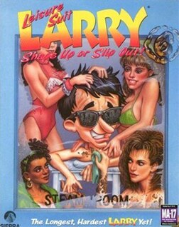

# Leisure Suit Larry 6: Shape Up or Slip Out!

Sierra SCI1.1

**Sierra On-Line, 1993.** Leisure Suit Larry 6: Shape Up or Slip Out! is the
fifth entry in the Leisure Suit Larry series of graphical adventure games
published by Sierra On-Line and is a sequel to the 1991 video game, Leisure
Suit Larry 5: Passionate Patti Does a Little Undercover Work. Originally
developed for MS-DOS in 1993, an enhanced CD-ROM version was published a year
later.

The plot continues the exploits of series protagonist Larry Laffer, who has won
a free trip to a luxurious health spa populated by women. It includes revamped
graphics in SVGA resolution and voice acting, a first for the series. The game
is followed by Leisure Suit Larry: Love for Sail! in 1996. The game was
re-released in 2017 on Steam with support for Windows.

## At a glance

|                |                            |
| -------------- | -------------------------- |
| **Developer**  | Sierra On-Line             |
| **Publisher**  | Sierra On-Line             |
| **Designer**   | Al Lowe                    |
| **Director**   | Al Lowe                    |
| **Programmer** | Carlos Escobar             |
| **Artist**     | Bill Skirvin               |
| **Writer**     | Al Lowe                    |
| **Composer**   | Dan Kehler                 |
| **Series**     | Leisure Suit Larry         |
| **Platforms**  | MS-DOS, Windows, Macintosh |
| **Released**   | December 1993              |
| **Genre**      | Adventure                  |
| **Modes**      | Single-player              |

## How it runs here

**A retail SCI game plays here now, and it is not this one.** King's Quest VII
boots, plays its Sierra logo, animates its title, takes a name, accepts a
chapter and reaches **the desert that is its first room**, drawn in the game's
own art with Rosella standing in it; 88 of its 108 rooms draw when entered by
number (`npm run rooms:sci -- <install> --fresh`). It is still not
`CONTEXT.md`'s **Completable** — no puzzle has been solved there and nothing
past that first room has been reached — and neither this title nor any other
SCI release has been played through here.

**Editing is further along than playing, and it is the whole family's, not one
game's.** A SCI install opens as a project: its Script resources as a class
graph with every method decompiled to instructions and every property word
named, its rooms drawn as places with the things on them draggable, its walk
polygons read out of the code that builds them, its Views stepped frame by
frame, its fonts and cursors edited pixel by pixel, and an unedited export that
is byte-identical to the install it came from.
[`docs/editor-parity.md`](../../docs/editor-parity.md) is the row-by-row
account against the SCUMM editor, including what is still a No and why.

Version identification is a measurement rather than a claim — over the 25
freely distributed Sierra demos this project can point at, every one identifies
its Version from its own bytes, 16 by probe and 9 narrowed only to a bucket,
and a bucket-only copy is refused for editing (ADR 0013).

**This title has not been run here.** Nothing above was measured against its
bytes: it is listed for the lineage, and nothing on this page is a claim that it
plays.

## Where it sits in this project

`docs/released-games.md` lists this title under **Sierra SCI1.1 — not supported
here**. That page is the scope statement for the whole catalogue and says, per
Engine family and per Version, what has actually been run rather than what is
implemented — **Completable** (`CONTEXT.md`) is claimed for no title on it.

## Elsewhere

- [Wikipedia: Leisure Suit Larry 6: Shape Up or Slip Out!](https://en.wikipedia.org/wiki/Leisure_Suit_Larry_6:_Shape_Up_or_Slip_Out!)
- [`docs/released-games.md`](../../docs/released-games.md) — the full scope list
- [ScummVM](https://www.scummvm.org/) — the reference implementation this project checks itself against
