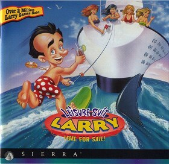

# Leisure Suit Larry 7: Love for Sail!

Sierra SCI2.1

**Sierra On-Line, 1996.** Leisure Suit Larry: Love for Sail! is an adventure
game originally developed and published by Sierra On-Line in 1996. It was the
sixth and final Leisure Suit Larry entry game written by series creator Al
Lowe, and the last to feature original protagonist Larry Laffer as the main
character until the release of Leisure Suit Larry: Wet Dreams Don't Dry in 2018. It followed the 1993 Leisure Suit Larry 6: Shape Up or Slip Out!.

After many of the Leisure Suit Larry games had gained a reputation for not
actually featuring all that much raunchy content when analysed, Love for Sail!
included more risqué elements compared to previous installments. It also
featured more fleshed-out, cartoon style graphics than its predecessors, as
well as full voice acting. A mobile game of the same title was also released by
Vivendi Games Mobile in 2007. The next game in the series to be released was
2004's Leisure Suit Larry: Magna Cum Laude.

_This title has no article of its own. The text above is transcribed from
**Leisure Suit Larry: Love for Sail!**, which covers it, and the link under
**Elsewhere** goes there rather than to a page about this game alone._

## At a glance

|                |                                                                                          |
| -------------- | ---------------------------------------------------------------------------------------- |
| **Developer**  | Sierra On-Line                                                                           |
| **Publisher**  | Sierra On-Line                                                                           |
| **Designer**   | Al Lowe                                                                                  |
| **Director**   | Al Lowe                                                                                  |
| **Producer**   | Mark Seibert                                                                             |
| **Programmer** | Steve Conrad                                                                             |
| **Writer**     | Al Lowe                                                                                  |
| **Composer**   | Frank Zottoli                                                                            |
| **Series**     | Leisure Suit Larry                                                                       |
| **Engine**     | SCI3                                                                                     |
| **Platforms**  | MS-DOS/Windows/Mac OS                                                                    |
| **Released**   | MS-DOS and Windows, NA, November 26, 1996, EU, 1996Apple Macintosh, NA, January 18, 1997 |
| **Genre**      | Adventure                                                                                |
| **Modes**      | Single-player                                                                            |

## How it runs here

**A retail SCI game plays here now, and it is not this one.** King's Quest VII
boots, plays its Sierra logo, animates its title, takes a name, accepts a
chapter and reaches **the desert that is its first room**, drawn in the game's
own art with Rosella standing in it; 88 of its 108 rooms draw when entered by
number (`npm run rooms:sci -- <install> --fresh`). It is still not
`CONTEXT.md`'s **Completable** — no puzzle has been solved there and nothing
past that first room has been reached — and neither this title nor any other
SCI release has been played through here.

**Editing is further along than playing, and it is the whole family's, not one
game's.** A SCI install opens as a project: its Script resources as a class
graph with every method decompiled to instructions and every property word
named, its rooms drawn as places with the things on them draggable, its walk
polygons read out of the code that builds them, its Views stepped frame by
frame, its fonts and cursors edited pixel by pixel, and an unedited export that
is byte-identical to the install it came from.
[`docs/editor-parity.md`](../../docs/editor-parity.md) is the row-by-row
account against the SCUMM editor, including what is still a No and why.

Version identification is a measurement rather than a claim — over the 25
freely distributed Sierra demos this project can point at, every one identifies
its Version from its own bytes, 16 by probe and 9 narrowed only to a bucket,
and a bucket-only copy is refused for editing (ADR 0013).

**This title has not been run here.** Nothing above was measured against its
bytes: it is listed for the lineage, and nothing on this page is a claim that it
plays.

## Where it sits in this project

`docs/released-games.md` lists this title under **Sierra SCI2.1 — not supported
here**. That page is the scope statement for the whole catalogue and says, per
Engine family and per Version, what has actually been run rather than what is
implemented — **Completable** (`CONTEXT.md`) is claimed for no title on it.

## Elsewhere

- [Wikipedia: Leisure Suit Larry: Love for Sail!](https://en.wikipedia.org/wiki/Leisure_Suit_Larry:_Love_for_Sail!)
- [`docs/released-games.md`](../../docs/released-games.md) — the full scope list
- [ScummVM](https://www.scummvm.org/) — the reference implementation this project checks itself against
