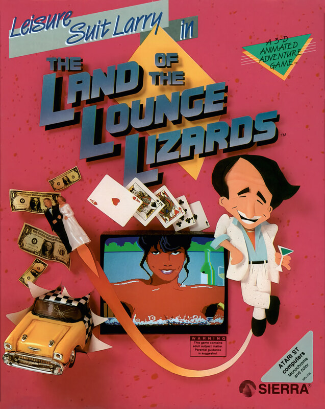

# Leisure Suit Larry in the Land of the Lounge Lizards

AGI v2

**Sierra On-Line, 1991.** Leisure Suit Larry in the Land of the Lounge Lizards
is a graphic adventure game for adults only (age 18+) developed by Sierra
On-Line, published in 1987. It was developed for MS-DOS and the Apple II and
later ported to the Amiga, Atari ST, Apple IIGS, Mac, and Tandy Color Computer 3. It uses the Adventure Game Interpreter (AGI) engine. In 1991, Sierra
released a remake titled Leisure Suit Larry 1: In the Land of the Lounge
Lizards for MS-DOS, Mac, and Amiga. This version used the Sierra's Creative
Interpreter (SCI) engine, featuring 256 colors and a point-and-click,
icon-driven (as opposed to the original's text-based) user interface.

The game's story follows its player character of a middle-aged male virgin
named Larry Laffer as he desperately tries to "get lucky" in the fictional
American city of Lost Wages. Land of the Lounge Lizards establishes several
elements which recur in the later Leisure Suit Larry games, including Larry's
campy attire, perpetual bad luck with women, and penchant for double-entendres.
The game's overall plot and basic structure follow that of Softporn Adventure,
Sierra's own 1981 Apple II text adventure that did not feature Larry.

Despite a lack of advertising, the game was a sleeper hit and a commercial and
critical success. It was followed by a long series of sequels and spin-offs
over decades, beginning with Leisure Suit Larry Goes Looking for Love (in
Several Wrong Places) in 1988. A second, high-definition remake, titled Leisure
Suit Larry: Reloaded, was developed by N-Fusion Interactive working with the
Larry series' creator Al Lowe and published by Replay Games in 2013. A version
for Sega CD was also announced but was never released.

## At a glance

|                |                                                                            |
| -------------- | -------------------------------------------------------------------------- |
| **Developer**  | Sierra On-Line                                                             |
| **Publisher**  | Sierra On-Line                                                             |
| **Designer**   | Al Lowe, Mark Crowe, Chuck Benton                                          |
| **Programmer** | Al Lowe, Ken Williams                                                      |
| **Artist**     | Mark Crowe                                                                 |
| **Writer**     | Al Lowe                                                                    |
| **Composer**   | Al Lowe                                                                    |
| **Series**     | Leisure Suit Larry                                                         |
| **Engine**     | AGI (original), SCI1 (remake)                                              |
| **Platforms**  | MS-DOS, Amiga, Apple II, Apple IIGS, Mac, Atari ST, Tandy Color Computer 3 |
| **Released**   | NA, June 1987NA, July 1991 (remake)                                        |
| **Genre**      | Adventure                                                                  |
| **Modes**      | Single-player                                                              |

## How it runs here

**AGI v2 is supported.** The resource layer, the vector Picture renderer with
both buffers and the priority bands, View cels, the Logic interpreter with all
183 action and 20 test commands, `WORDS.TOK` and the parser, `OBJECT` and
inventory, four-voice sound and saves all run.

**No AGI game has been played through here.** Everything above is tested
against the synthetic fixture in `tests/fixtureAgi.ts`, so this game is worth
trying rather than relied upon.

How the bytecode decodes depends on the build of Sierra's interpreter a copy
shipped against, not on the AGI major version. A copy carrying `AGIDATA.OVL` is
read rather than assumed; one that does not still plays, on a documented
default with the fallback logged, and is refused for editing (ADR 0013).

## Where it sits in this project

`docs/released-games.md` lists this title under **AGI v2**. That page is the
scope statement for the whole catalogue and says, per Engine family and per
Version, what has actually been run rather than what is implemented —
**Completable** (`CONTEXT.md`) is claimed for no title on it.

## Elsewhere

- [Wikipedia: Leisure Suit Larry in the Land of the Lounge Lizards](https://en.wikipedia.org/wiki/Leisure_Suit_Larry_in_the_Land_of_the_Lounge_Lizards)
- [`docs/released-games.md`](../../docs/released-games.md) — the full scope list
- [ScummVM](https://www.scummvm.org/) — the reference implementation this project checks itself against
