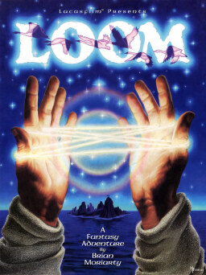

# Loom

SCUMM v4

Loom is a 1990 fantasy-themed graphic adventure game developed and published by
Lucasfilm Games for MS-DOS. The project was led by Brian Moriarty, a former
Infocom employee and author of classic text adventures Wishbringer (1985),
Trinity (1986), and Beyond Zork (1987). It was the fourth game to use the SCUMM
adventure game engine, and the first of those to avoid the verb–object
interface introduced in Maniac Mansion.

## At a glance

|                |                                                                                                                                                                                                                                    |
| -------------- | ---------------------------------------------------------------------------------------------------------------------------------------------------------------------------------------------------------------------------------- |
| **Developer**  | Lucasfilm Games, Realtime Associates (TG-CD)                                                                                                                                                                                       |
| **Publisher**  | Lucasfilm Games, Turbo Technologies (TG-CD)                                                                                                                                                                                        |
| **Designer**   | Brian Moriarty                                                                                                                                                                                                                     |
| **Director**   | Jennifer Sward                                                                                                                                                                                                                     |
| **Producer**   | Greg Hammond                                                                                                                                                                                                                       |
| **Programmer** | Peter Lincroft, /Kalani Streicher                                                                                                                                                                                                  |
| **Artist**     | Mark Ferrari, /Gary Winnick, /Steve Purcell, /Ken Macklin                                                                                                                                                                          |
| **Writer**     | Brian Moriarty, /Jennifer Sward, /Sara Reeder                                                                                                                                                                                      |
| **Composer**   | George Sanger, /Eric Hammond, /Themes:, /Pyotr Ilyich Tchaikovsky                                                                                                                                                                  |
| **Engine**     | SCUMM                                                                                                                                                                                                                              |
| **Platforms**  | MS-DOS, Amiga, Atari ST, Mac OS, FM Towns, TurboGrafx-CD                                                                                                                                                                           |
| **Released**   | title = January 1990, /MS-DOS, NA, January 1990, EU, 1990NA, 1992 (VGA), EU, 1992 (VGA), /Amiga/Atari ST, NA, March 1990, EU, 1990, /Mac OS, NA, 1990, /FM Towns, JP, April 1991, /TurboGrafx-CD, JP, September 25, 1992, NA, 1992 |
| **Genre**      | Graphic adventure                                                                                                                                                                                                                  |
| **Modes**      | Single-player                                                                                                                                                                                                                      |

## How it runs here

**SCUMM v4 has a real game behind it.** Loom's CD release has been played to
the distaff here and its drafts play. This title is a different install of the
same Version, so it is worth trying rather than relied upon, and
**Completable** (`CONTEXT.md`) is claimed for no title.

## Where it sits in this project

`docs/released-games.md` lists this title under **SCUMM v4**. That page is the
scope statement for the whole catalogue and says, per Engine family and per
Version, what has actually been run rather than what is implemented —
**Completable** (`CONTEXT.md`) is claimed for no title on it.

## Elsewhere

- [Wikipedia: Loom (video game)](<https://en.wikipedia.org/wiki/Loom_(video_game)>)
- [`docs/released-games.md`](../../docs/released-games.md) — the full scope list
- [ScummVM](https://www.scummvm.org/) — the reference implementation this project checks itself against
