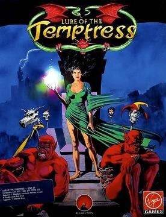

# Lure of the Temptress

Lure — Virtual Theatre v1

**Revolution Software, 1992.** Lure of the Temptress is a point-and-click
adventure game published by Virgin Interactive Entertainment in June 1992 for
Atari ST, MS-DOS, and Amiga. It was the first game developed by Revolution
Software and uses their proprietary Virtual Theatre engine. The player assumes
the role of Diermot, a young peasant who has to overthrow an evil sorceress.
The game was well-received and re-released as freeware on April 1, 2003.

## At a glance

|                |                                          |
| -------------- | ---------------------------------------- |
| **Developer**  | Revolution Software                      |
| **Publisher**  | Virgin Interactive Entertainment         |
| **Designer**   | Dave Cummins                             |
| **Director**   | Charles Cecil                            |
| **Producer**   | Daniel Marchant                          |
| **Programmer** | David Sykes, Tony Warriner               |
| **Artist**     | Stephen Oades, Adam Tween, Paul Docherty |
| **Composer**   | Richard Joseph                           |
| **Engine**     | Virtual Theatre                          |
| **Platforms**  | MS-DOS, Amiga, Atari ST                  |
| **Released**   | June 1992 (Amiga), October 1992 (MS-DOS) |
| **Genre**      | Adventure                                |
| **Modes**      | Single-player                            |

## How it runs here

**Nothing runs yet.** Lure is a fifth Engine family here — decided, designed
and not built (ADRs 0024–0026). No interpreter, no resource reader, no
object-table extractor, no editor surface; the game is still refused by name in
`src/engine/resource/engineSignatures.ts`, on `disk1.vga`.

Its object table is to be extracted from Revolution's own `Lure.exe`, with
ScummVM's `lure.dat` refused (ADR 0024), and its bytecode starts as Disassembly
rather than Decompilation until instruction boundaries are shown to be certain
(ADR 0025).

## Where it sits in this project

`docs/released-games.md` lists this title under **Lure — Virtual Theatre v1**.
That page is the scope statement for the whole catalogue and says, per Engine
family and per Version, what has actually been run rather than what is
implemented — **Completable** (`CONTEXT.md`) is claimed for no title on it.

## Elsewhere

- [Wikipedia: Lure of the Temptress](https://en.wikipedia.org/wiki/Lure_of_the_Temptress)
- [`docs/released-games.md`](../../docs/released-games.md) — the full scope list
- [ScummVM](https://www.scummvm.org/) — the reference implementation this project checks itself against
