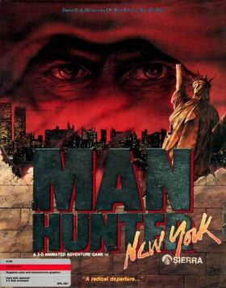

# Manhunter: New York

AGI v3

**Evryware, 1988.** Manhunter: New York is a post-apocalyptic adventure game
designed by Barry Murry, Dave Murry and Dee Dee Murry of Evryware and published
in 1988 by Sierra On-Line. A sequel, Manhunter 2: San Francisco, was released
in 1989.

## At a glance

|                |                                               |
| -------------- | --------------------------------------------- |
| **Developer**  | Evryware                                      |
| **Publisher**  | Sierra On-Line                                |
| **Designer**   | Barry Murry, Dave Murry                       |
| **Producer**   | Ken Williams                                  |
| **Programmer** | Barry Murry, Dave Murry                       |
| **Artist**     | Barry Murry, Dee Dee Murry                    |
| **Composer**   | Barry Murry                                   |
| **Engine**     | Adventure Game Interpreter                    |
| **Platforms**  | MS-DOS, Amiga, Atari ST, Apple II, Apple IIGS |
| **Released**   | September 1988                                |
| **Genre**      | Adventure game                                |
| **Modes**      | Single-player                                 |

## How it runs here

**AGI v3 is supported**, including its combined `<GAMEID>DIR` index and its
LZW-compressed volumes. Packaging only: v2 and v3 share an instruction encoding
outright, so one Logic interpreter covers every Target between them (ADR 0012).

**No AGI game has been played through here.** The claim rests on the synthetic
fixture in `tests/fixtureAgi.ts`. A copy carrying `AGIDATA.OVL` has its
interpreter version read rather than assumed; one that does not plays on a
documented default and is refused for editing (ADR 0013).

## Where it sits in this project

`docs/released-games.md` lists this title under **AGI v3**. That page is the
scope statement for the whole catalogue and says, per Engine family and per
Version, what has actually been run rather than what is implemented —
**Completable** (`CONTEXT.md`) is claimed for no title on it.

## Elsewhere

- [Wikipedia: Manhunter: New York](https://en.wikipedia.org/wiki/Manhunter:_New_York)
- [`docs/released-games.md`](../../docs/released-games.md) — the full scope list
- [ScummVM](https://www.scummvm.org/) — the reference implementation this project checks itself against
