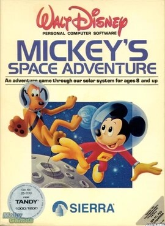

# Mickey's Space Adventure

AGI v2

**Sierra On-Line, 1984.** Mickey's Space Adventure is a graphic adventure game
for a number of platforms. It was designed by Roberta Williams and released by
Sierra On-Line in 1984. It features the Disney characters Mickey Mouse and
Pluto.

## At a glance

|               |                                                                  |
| ------------- | ---------------------------------------------------------------- |
| **Developer** | Sierra On-Line                                                   |
| **Publisher** | Sierra On-Line                                                   |
| **Designer**  | Roberta Williams                                                 |
| **Artist**    | Mark Crowe, Doug MacNeill, Jennifer Nelsen, Terry Pierce         |
| **Composer**  | Al Lowe                                                          |
| **Platforms** | MS-DOS, Macintosh, Apple II, Commodore 64, TRS-80 Color Computer |
| **Released**  | December 1984                                                    |
| **Genre**     | Adventure                                                        |
| **Modes**     | Single-player                                                    |

## How it runs here

**AGI v2 is supported.** The resource layer, the vector Picture renderer with
both buffers and the priority bands, View cels, the Logic interpreter with all
183 action and 20 test commands, `WORDS.TOK` and the parser, `OBJECT` and
inventory, four-voice sound and saves all run.

**No AGI game has been played through here.** Everything above is tested
against the synthetic fixture in `tests/fixtureAgi.ts`, so this game is worth
trying rather than relied upon.

How the bytecode decodes depends on the build of Sierra's interpreter a copy
shipped against, not on the AGI major version. A copy carrying `AGIDATA.OVL` is
read rather than assumed; one that does not still plays, on a documented
default with the fallback logged, and is refused for editing (ADR 0013).

## Where it sits in this project

`docs/released-games.md` lists this title under **AGI v2**. That page is the
scope statement for the whole catalogue and says, per Engine family and per
Version, what has actually been run rather than what is implemented —
**Completable** (`CONTEXT.md`) is claimed for no title on it.

## Elsewhere

- [Wikipedia: Mickey's Space Adventure](https://en.wikipedia.org/wiki/Mickey%27s_Space_Adventure)
- [`docs/released-games.md`](../../docs/released-games.md) — the full scope list
- [ScummVM](https://www.scummvm.org/) — the reference implementation this project checks itself against
