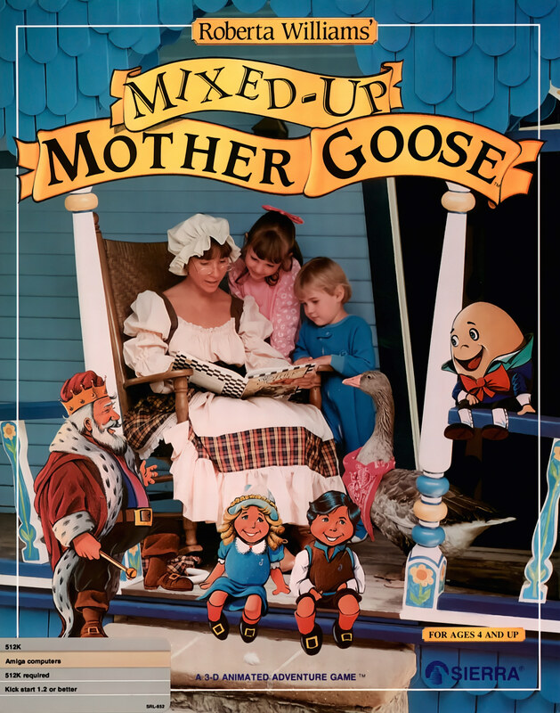

# Mixed-Up Mother Goose

AGI v2 — SCI1 VGA remake

Roberta Williams' Mixed-Up Mother Goose is an educational adventure game
released by Sierra On-Line in 1987. It was the first multimedia PC game
released on CD-ROM in 1991. A second game in the series, Mixed-Up Fairy Tales,
was released in 1991.

The storyline of the game is very simple, as is common in games for children.
One night, while preparing for bed, a child (which is the player's avatar) is
sent into the dreamlike world of Mother Goose, who desperately needs help. All
the nursery rhymes in the land have gotten mixed up, with none of the
inhabitants possessing the items necessary for their rhyme to exist. And so,
the child will find themselves helping Humpty Dumpty find a ladder to scramble
onto a wall, bringing the little lamb back to Mary and seeking out a pail for
Jack and Jill, among others.

## At a glance

|                |                                                                       |
| -------------- | --------------------------------------------------------------------- |
| **Developer**  | Sierra On-Line, Coktel Vision                                         |
| **Publisher**  | Sierra On-Line                                                        |
| **Designer**   | Roberta Williams                                                      |
| **Programmer** | David Slayback                                                        |
| **Artist**     | Gerald Moore                                                          |
| **Composer**   | Amenda Lombardo                                                       |
| **Engine**     | AGI (1987), SCI (1990/91/95)                                          |
| **Platforms**  | MS-DOS, Amiga, Apple II, Apple IIGS, Atari ST, Windows, Mac, FM Towns |
| **Released**   | November 1987                                                         |
| **Genre**      | Educational, Adventure                                                |
| **Modes**      | Single-player                                                         |

## How it runs here

**AGI v2 is supported.** The resource layer, the vector Picture renderer with
both buffers and the priority bands, View cels, the Logic interpreter with all
183 action and 20 test commands, `WORDS.TOK` and the parser, `OBJECT` and
inventory, four-voice sound and saves all run.

**No AGI game has been played through here.** Everything above is tested
against the synthetic fixture in `tests/fixtureAgi.ts`, so this game is worth
trying rather than relied upon.

How the bytecode decodes depends on the build of Sierra's interpreter a copy
shipped against, not on the AGI major version. A copy carrying `AGIDATA.OVL` is
read rather than assumed; one that does not still plays, on a documented
default with the fallback logged, and is refused for editing (ADR 0013).

## Where it sits in this project

`docs/released-games.md` lists this title under **AGI v2 — SCI1 VGA remake**.
That page is the scope statement for the whole catalogue and says, per Engine
family and per Version, what has actually been run rather than what is
implemented — **Completable** (`CONTEXT.md`) is claimed for no title on it.

## Elsewhere

- [Wikipedia: Mixed-Up Mother Goose](https://en.wikipedia.org/wiki/Mixed-Up_Mother_Goose)
- [`docs/released-games.md`](../../docs/released-games.md) — the full scope list
- [ScummVM](https://www.scummvm.org/) — the reference implementation this project checks itself against
