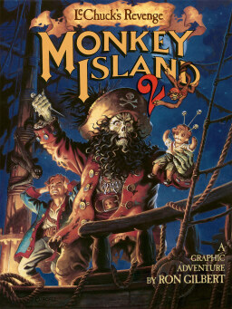

# Monkey Island 2: LeChuck's Revenge

SCUMM v5

**LucasArts, 1991.** Monkey Island 2: LeChuck's Revenge is an adventure game
developed and published by LucasArts in 1991. Players control the pirate
Guybrush Threepwood, who searches for the legendary treasure of Big Whoop and
faces the zombie pirate LeChuck.

Like The Secret of Monkey Island (1990), development was led by Ron Gilbert
with Tim Schafer and Dave Grossman. Monkey Island 2 was the sixth LucasArts
game to use the SCUMM engine and the first to use the iMUSE sound system.

Monkey Island 2 was a critical success, but a commercial disappointment. It was
followed by The Curse of Monkey Island in 1997. A remake was released in 2010,
following a similar remake of the first game. In 2022, Gilbert released Return
to Monkey Island, set after the cliffhanger of Monkey Island 2.

## At a glance

|                |                                                                                                                                |
| -------------- | ------------------------------------------------------------------------------------------------------------------------------ |
| **Developer**  | LucasArts                                                                                                                      |
| **Publisher**  | NA, LucasArts, EU, U.S. Gold                                                                                                   |
| **Designer**   | Ron Gilbert                                                                                                                    |
| **Director**   | Ron Gilbert                                                                                                                    |
| **Producer**   | Shelley Day                                                                                                                    |
| **Programmer** | Tim Schafer, Dave Grossman, Ron Gilbert, Bret Barrett, Tami Borowick                                                           |
| **Artist**     | Steve Purcell, Peter Chan, Sean Turner, Larry Ahern, James Alexander Dollar, Ken Macklin, Michael McLaughlin, Collette Michaud |
| **Writer**     | Tami Borowick, Dave Grossman, Bret Barrett, Tim Schafer, Ron Gilbert                                                           |
| **Composer**   | Michael Land, Peter McConnell, Clint Bajakian                                                                                  |
| **Series**     | Monkey Island                                                                                                                  |
| **Engine**     | SCUMM                                                                                                                          |
| **Platforms**  | Original version, Amiga, FM Towns, Mac OS, MS-DOS, Special edition, iOS, Windows, PlayStation 3, Xbox 360                      |
| **Released**   | Original version, December 1991, Special edition, 7 July 2010                                                                  |
| **Genre**      | Graphic adventure                                                                                                              |
| **Modes**      | Single-player                                                                                                                  |

## How it runs here

**SCUMM v5 is the Version this project has taken furthest** — Indiana Jones and
the Fate of Atlantis has been played through five rooms here, which makes v5
the place to look first when something seems wrong elsewhere. **Completable**
(`CONTEXT.md`) is still claimed for no title.

## Where it sits in this project

`docs/released-games.md` lists this title under **SCUMM v5**. That page is the
scope statement for the whole catalogue and says, per Engine family and per
Version, what has actually been run rather than what is implemented —
**Completable** (`CONTEXT.md`) is claimed for no title on it.

## Elsewhere

- [Wikipedia: Monkey Island 2: LeChuck's Revenge](https://en.wikipedia.org/wiki/Monkey_Island_2:_LeChuck%27s_Revenge)
- [`docs/released-games.md`](../../docs/released-games.md) — the full scope list
- [ScummVM](https://www.scummvm.org/) — the reference implementation this project checks itself against
