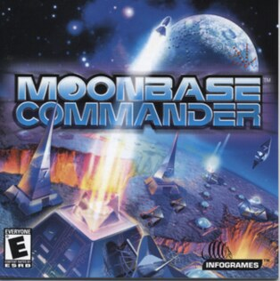

# Moonbase Commander

HE 100

**Humongous Entertainment, 2002.** MoonBase Commander is a strategy video game
released in 2002 by Humongous Entertainment. In the game, the player controls a
main hub, which can send out other hubs, attack enemy structures, create
defensive buildings, and collect energy for further expansion; this is
accomplished through launching buildings and/or weapons from a hub. Each
building is connected to its parent hub by a cord, which cannot overlap with
other cords. The game features both single-player and multiplayer formats. It
won the "Best of 2002: The Game No One Played" award from IGN.

## At a glance

|               |                            |
| ------------- | -------------------------- |
| **Developer** | Humongous Entertainment    |
| **Publisher** | Infogrames                 |
| **Designer**  | Rhett Mathis               |
| **Composer**  | Stuart Ellison             |
| **Engine**    | SCUMM                      |
| **Platforms** | Microsoft Windows          |
| **Released**  | NA, August 13, 2002        |
| **Genre**     | Turn-based strategy        |
| **Modes**     | Single-player, multiplayer |

## How it runs here

**Humongous titles are forks of SCUMM v6**, versioned separately as HE 60
through HE 100. v6 itself runs, draws and saves here; the HE extensions on top
of it are not separately verified, and the exact game-to-HE-number mapping in
`docs/released-games.md` is explicitly approximate. Worth trying, not relied
upon.

## Where it sits in this project

`docs/released-games.md` lists this title under **HE 100**. That page is the
scope statement for the whole catalogue and says, per Engine family and per
Version, what has actually been run rather than what is implemented —
**Completable** (`CONTEXT.md`) is claimed for no title on it.

## Elsewhere

- [Wikipedia: MoonBase Commander](https://en.wikipedia.org/wiki/MoonBase_Commander)
- [`docs/released-games.md`](../../docs/released-games.md) — the full scope list
- [ScummVM](https://www.scummvm.org/) — the reference implementation this project checks itself against
