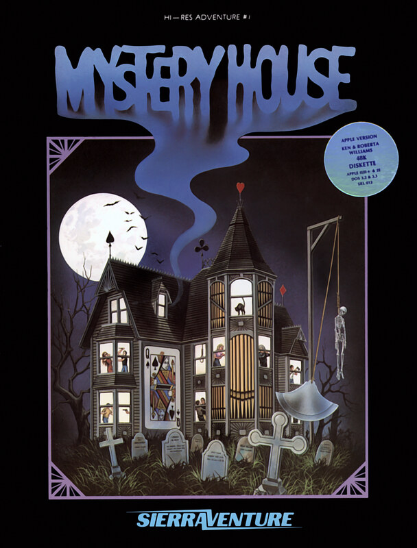

# Mystery House

Hi-Res Adventure — pre-AGI

**On-Line Systems, 1980.** Mystery House is an adventure game released by
On-Line Systems on May 5, 1980. It was designed, written and illustrated by
Roberta Williams, and programmed by Ken Williams for the Apple II. Mystery
House is the first graphical adventure game and the first game produced by
On-Line Systems, the company which would evolve into Sierra On-Line. It is one
of the earliest horror video games.

## At a glance

|                |                                                                                                                                        |
| -------------- | -------------------------------------------------------------------------------------------------------------------------------------- |
| **Developer**  | On-Line Systems                                                                                                                        |
| **Publisher**  | On-Line Systems                                                                                                                        |
| **Designer**   | Roberta Williams                                                                                                                       |
| **Programmer** | Ken Williams                                                                                                                           |
| **Series**     | Hi-Res Adventures                                                                                                                      |
| **Engine**     | ADL                                                                                                                                    |
| **Platforms**  | title=Apple II, /PC-88, /PC-98, /FM-7, /iOS                                                                                            |
| **Released**   | title = May 5, 1980, / Apple II, / US, May 5, 1980, / PC-88, PC-98, / JP, April, 1983, / FM-7, / JP, 1983, / iOS, / WW, March 10, 2009 |
| **Genre**      | Adventure                                                                                                                              |
| **Modes**      | Single-player                                                                                                                          |

## How it runs here

**Not implemented, and not planned.** Hi-Res Adventure predates AGI: Sierra's
first adventures ran before there was a reusable interpreter worth naming, so
there is no Engine family here for them to belong to. Listed in
`docs/released-games.md` for the lineage, not as a target.

## Where it sits in this project

`docs/released-games.md` lists this title under **Hi-Res Adventure — pre-AGI**.
That page is the scope statement for the whole catalogue and says, per Engine
family and per Version, what has actually been run rather than what is
implemented — **Completable** (`CONTEXT.md`) is claimed for no title on it.

## Elsewhere

- [Wikipedia: Mystery House](https://en.wikipedia.org/wiki/Mystery_House)
- [`docs/released-games.md`](../../docs/released-games.md) — the full scope list
- [ScummVM](https://www.scummvm.org/) — the reference implementation this project checks itself against
