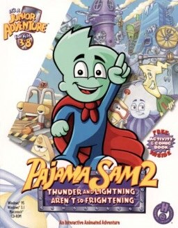

# Pajama Sam 2: Thunder and Lightning Aren't So Frightening

HE 98

**Humongous Entertainment, 1998.** Pajama Sam 2: Thunder and Lightning Aren't
so Frightening is a 1998 point-and-click adventure game developed and published
by Humongous Entertainment for Windows and Macintosh. This game was ported to
Android under the title Pajama Sam: Thunder and Lightning in April 2014. A
Nintendo Switch version was released in February 2022, followed by the
PlayStation 4 version on the PlayStation Store in November. The second game of
the Pajama Sam franchise, it features the title character entering the World
Wide Weather through his attic to stop a thunderstorm. The game was followed by
Pajama Sam 3: You Are What You Eat from Your Head to Your Feet in 2000.

## At a glance

|               |                                                                                                                                                                                              |
| ------------- | -------------------------------------------------------------------------------------------------------------------------------------------------------------------------------------------- |
| **Developer** | Humongous Entertainment                                                                                                                                                                      |
| **Publisher** | Humongous Entertainment                                                                                                                                                                      |
| **Designer**  | Matt Mahon, Rhonda Conley                                                                                                                                                                    |
| **Writer**    | Dave Grossman                                                                                                                                                                                |
| **Series**    | Pajama Sam                                                                                                                                                                                   |
| **Engine**    | SCUMM                                                                                                                                                                                        |
| **Platforms** | Android, iOS, Linux, Mac OS, OS X, Windows, Nintendo Switch, PlayStation 4                                                                                                                   |
| **Released**  | title=July 1, 1998/Windows, MacintoshNA, July 1, 1998 iOSWW, April 5, 2012 AndroidWW, April 3, 2014 Linux, OS XWW, May 1, 2014 SwitchWW, February 10, 2022 PlayStation 4WW, November 3, 2022 |
| **Genre**     | Adventure                                                                                                                                                                                    |
| **Modes**     | Single-player                                                                                                                                                                                |

## How it runs here

**Humongous titles are forks of SCUMM v6**, versioned separately as HE 60
through HE 100. v6 itself runs, draws and saves here; the HE extensions on top
of it are not separately verified, and the exact game-to-HE-number mapping in
`docs/released-games.md` is explicitly approximate. Worth trying, not relied
upon.

## Where it sits in this project

`docs/released-games.md` lists this title under **HE 98**. That page is the
scope statement for the whole catalogue and says, per Engine family and per
Version, what has actually been run rather than what is implemented —
**Completable** (`CONTEXT.md`) is claimed for no title on it.

## Elsewhere

- [Wikipedia: Pajama Sam 2: Thunder and Lightning Aren't so Frightening](https://en.wikipedia.org/wiki/Pajama_Sam_2:_Thunder_and_Lightning_Aren%27t_so_Frightening)
- [`docs/released-games.md`](../../docs/released-games.md) — the full scope list
- [ScummVM](https://www.scummvm.org/) — the reference implementation this project checks itself against
