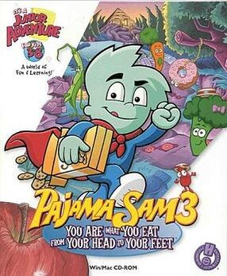

# Pajama Sam 3: You Are What You Eat From Your Head to Your Feet

HE 99

**Humongous Entertainment, 2000.** Pajama Sam 3: You Are What You Eat from Your
Head to Your Feet is a 2000 adventure game developed and published by Humongous
Entertainment for Microsoft Windows, Macintosh, PlayStation, and Linux
operating systems.

## At a glance

|               |                                                                                                                                                                                           |
| ------------- | ----------------------------------------------------------------------------------------------------------------------------------------------------------------------------------------- |
| **Developer** | Humongous Entertainment                                                                                                                                                                   |
| **Publisher** | Humongous Entertainment                                                                                                                                                                   |
| **Designer**  | Rhonda Conley, Eric Gross                                                                                                                                                                 |
| **Artist**    | John Michaud (animator)                                                                                                                                                                   |
| **Writer**    | Dave Grossman                                                                                                                                                                             |
| **Composer**  | George Alistair Sanger                                                                                                                                                                    |
| **Series**    | Pajama Sam                                                                                                                                                                                |
| **Engine**    | SCUMM                                                                                                                                                                                     |
| **Platforms** | Windows, Macintosh, PlayStation, iOS, Android, Nintendo Switch, PlayStation 4                                                                                                             |
| **Released**  | title=April 6, 2000/Windows, April 6, 2000, PlayStation, December 12, 2001, Macintosh, 2001, Linux, May 15, 2014, Android, iOS, August 13, 2015, Switch, PlayStation 4, December 21, 2023 |
| **Genre**     | Adventure game                                                                                                                                                                            |
| **Modes**     | Single-player                                                                                                                                                                             |

## How it runs here

**Humongous titles are forks of SCUMM v6**, versioned separately as HE 60
through HE 100. v6 itself runs, draws and saves here; the HE extensions on top
of it are not separately verified, and the exact game-to-HE-number mapping in
`docs/released-games.md` is explicitly approximate. Worth trying, not relied
upon.

## Where it sits in this project

`docs/released-games.md` lists this title under **HE 99**. That page is the
scope statement for the whole catalogue and says, per Engine family and per
Version, what has actually been run rather than what is implemented —
**Completable** (`CONTEXT.md`) is claimed for no title on it.

## Elsewhere

- [Wikipedia: Pajama Sam 3: You Are What You Eat from Your Head to Your Feet](https://en.wikipedia.org/wiki/Pajama_Sam_3:_You_Are_What_You_Eat_from_Your_Head_to_Your_Feet)
- [`docs/released-games.md`](../../docs/released-games.md) — the full scope list
- [ScummVM](https://www.scummvm.org/) — the reference implementation this project checks itself against
