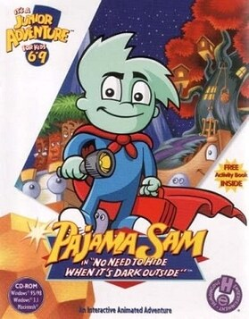

# Pajama Sam: No Need to Hide When It's Dark Outside

HE 90

**Humongous Entertainment, 1996.** Pajama Sam: No Need to Hide When It's Dark
Outside (also known as Pajama Sam 1) is a 1996 adventure game developed and
published by Humongous Entertainment for Microsoft Windows and Macintosh. The
first game of the Pajama Sam franchise, it sold nearly three million units and
won 50 awards.

The game was first released on October 18, 1996 and reissued on December 7, 1999. In August 2008, the game was re-released for the Wii by Majesco, renamed
as Pajama Sam: Don't Fear The Dark and only available for a limited amount of
time due to legal problems concerning the port's development. This game was
ported to iOS by Nimbus Games under the title Pajama Sam: No Need to Hide in
December 2012. A Nintendo Switch version was released in February 2022,
followed by the PlayStation 4 version on the PlayStation Store in November.

## At a glance

|               |                                                                                                                                                                                                                      |
| ------------- | -------------------------------------------------------------------------------------------------------------------------------------------------------------------------------------------------------------------- |
| **Developer** | Humongous Entertainment                                                                                                                                                                                              |
| **Publisher** | Humongous Entertainment                                                                                                                                                                                              |
| **Designer**  | Ron Gilbert/Richard Moe/Rhonda Conley                                                                                                                                                                                |
| **Producer**  | Ron Gilbert                                                                                                                                                                                                          |
| **Artist**    | Todd Lubsen                                                                                                                                                                                                          |
| **Writer**    | Dave Grossman                                                                                                                                                                                                        |
| **Composer**  | Rick Rhodes/Danny Pelfrey/Jeremy Soule                                                                                                                                                                               |
| **Series**    | Pajama Sam                                                                                                                                                                                                           |
| **Engine**    | SCUMM                                                                                                                                                                                                                |
| **Platforms** | Windows, Macintosh, Wii, iOS, Linux, Nintendo Switch, PlayStation 4                                                                                                                                                  |
| **Released**  | title=October 18, 1996/Windows, Macintosh, October 18, 1996, Wii, August 29, 2008, iOS, December 12, 2012, Android, April 3, 2014, Linux, April 17, 2014, Switch, February 10, 2022, PlayStation 4, November 3, 2022 |
| **Genre**     | Adventure                                                                                                                                                                                                            |
| **Modes**     | Single-player                                                                                                                                                                                                        |

## How it runs here

**Humongous titles are forks of SCUMM v6**, versioned separately as HE 60
through HE 100. v6 itself runs, draws and saves here; the HE extensions on top
of it are not separately verified, and the exact game-to-HE-number mapping in
`docs/released-games.md` is explicitly approximate. Worth trying, not relied
upon.

## Where it sits in this project

`docs/released-games.md` lists this title under **HE 90**. That page is the
scope statement for the whole catalogue and says, per Engine family and per
Version, what has actually been run rather than what is implemented —
**Completable** (`CONTEXT.md`) is claimed for no title on it.

## Elsewhere

- [Wikipedia: Pajama Sam: No Need to Hide When It's Dark Outside](https://en.wikipedia.org/wiki/Pajama_Sam:_No_Need_to_Hide_When_It%27s_Dark_Outside)
- [`docs/released-games.md`](../../docs/released-games.md) — the full scope list
- [ScummVM](https://www.scummvm.org/) — the reference implementation this project checks itself against
