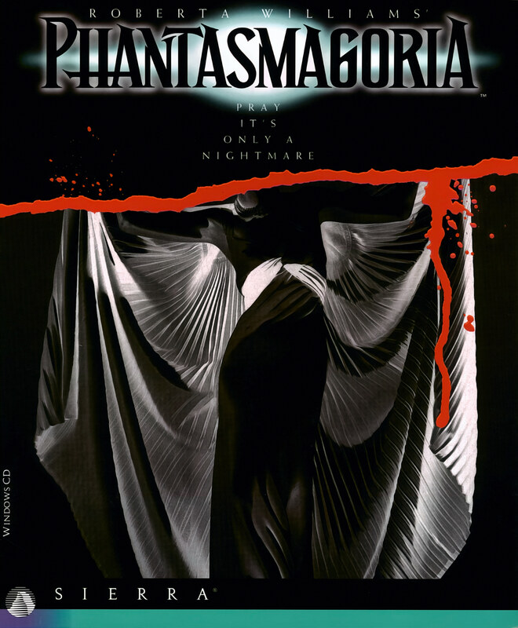

# Phantasmagoria

Sierra SCI2.1

**Sierra On-Line, 1995.** Phantasmagoria is a point-and-click adventure horror
video game designed by Roberta Williams for MS-DOS and Microsoft Windows and
released by Sierra On-Line on August 24, 1995. It tells the story of Adrienne
Delaney (Victoria Morsell), a writer who moves into a remote mansion and finds
herself terrorized by supernatural forces. It was made at the peak of
popularity for interactive movie games and features live-action actors and
footage, both during cinematic scenes and within the three-dimensionally
rendered environments of the game itself. It was noted for its violence and
sexual content.

Williams had long planned to design a horror game, but she waited eight years
for software technology to improve before doing so. More than 200 people were
involved in making Phantasmagoria, which was based on Williams's 550-page
script, about four times the length of an average Hollywood screenplay. It took
more than two years to develop and four months to film. The game was originally
budgeted for $800,000, but it ultimately cost $4.5 million to develop and was
filmed in a $1.5 million studio that Sierra built specifically for the game.

The game was directed by Peter Maris and features a cast of twenty-five actors,
all performing in front of a blue screen. Most games at the time featured 80 to
100 backgrounds, while Phantasmagoria includes more than 1,000. A professional
Hollywood special effects house worked on the game, and the musical score
includes a neo-Gregorian chant performed by a 135-voice choir. Sierra stressed
that it was intended for adult audiences, and the company willingly submitted
it to a ratings system and included a password-protected censoring option
within the game to tone down the graphic content.

Phantasmagoria was released on seven discs after multiple delays, but it was a
financial success, grossing $12 million in its opening weekend and becoming one
of the bestselling games of 1995. Sierra strongly promoted the game. It
received mixed reviews, earning praise for its graphics and suspenseful tone
while being criticized for its slow pacing and easy puzzles. The game also drew
controversy, particularly due to a rape scene. CompUSA and other retailers
declined to carry it, religious organizations and politicians condemned it, and
it was refused classification altogether in Australia. The sequel
Phantasmagoria: A Puzzle of Flesh was released in 1996, although Williams was
not involved.

## At a glance

|                |                                                                                                     |
| -------------- | --------------------------------------------------------------------------------------------------- |
| **Developer**  | Sierra On-Line                                                                                      |
| **Publisher**  | Sierra On-Line, Outrigger (Saturn)                                                                  |
| **Designer**   | Roberta Williams                                                                                    |
| **Director**   | Peter Maris                                                                                         |
| **Producer**   | Mark Seibert/J. Mark Hood/Roberta Williams                                                          |
| **Programmer** | Doug Oldfield                                                                                       |
| **Artist**     | Andy Hoyos                                                                                          |
| **Writer**     | Roberta Williams/Andy Hoyos                                                                         |
| **Composer**   | Jay Usher/Mark Seibert                                                                              |
| **Platforms**  | ubl                                                                                                 |
| **Released**   | title=August 24, 1995/MS-DOS, Microsoft Windows, NA, August 24, 1995Sega Saturn, JP, August 8, 1997 |
| **Genre**      | Interactive film, graphic adventure game                                                            |
| **Modes**      | Single-player                                                                                       |

## How it runs here

**A retail SCI game plays here now, and it is not this one.** King's Quest VII
boots, plays its Sierra logo, animates its title, takes a name, accepts a
chapter and reaches **the desert that is its first room**, drawn in the game's
own art with Rosella standing in it; 88 of its 108 rooms draw when entered by
number (`npm run rooms:sci -- <install> --fresh`). It is still not
`CONTEXT.md`'s **Completable** — no puzzle has been solved there and nothing
past that first room has been reached — and neither this title nor any other
SCI release has been played through here.

**Editing is further along than playing, and it is the whole family's, not one
game's.** A SCI install opens as a project: its Script resources as a class
graph with every method decompiled to instructions and every property word
named, its rooms drawn as places with the things on them draggable, its walk
polygons read out of the code that builds them, its Views stepped frame by
frame, its fonts and cursors edited pixel by pixel, and an unedited export that
is byte-identical to the install it came from.
[`docs/editor-parity.md`](../../docs/editor-parity.md) is the row-by-row
account against the SCUMM editor, including what is still a No and why.

Version identification is a measurement rather than a claim — over the 25
freely distributed Sierra demos this project can point at, every one identifies
its Version from its own bytes, 16 by probe and 9 narrowed only to a bucket,
and a bucket-only copy is refused for editing (ADR 0013).

**This title has not been run here.** Nothing above was measured against its
bytes: it is listed for the lineage, and nothing on this page is a claim that it
plays.

## Where it sits in this project

`docs/released-games.md` lists this title under **Sierra SCI2.1 — not supported
here**. That page is the scope statement for the whole catalogue and says, per
Engine family and per Version, what has actually been run rather than what is
implemented — **Completable** (`CONTEXT.md`) is claimed for no title on it.

## Elsewhere

- [Wikipedia: Phantasmagoria (video game)](<https://en.wikipedia.org/wiki/Phantasmagoria_(video_game)>)
- [`docs/released-games.md`](../../docs/released-games.md) — the full scope list
- [ScummVM](https://www.scummvm.org/) — the reference implementation this project checks itself against
