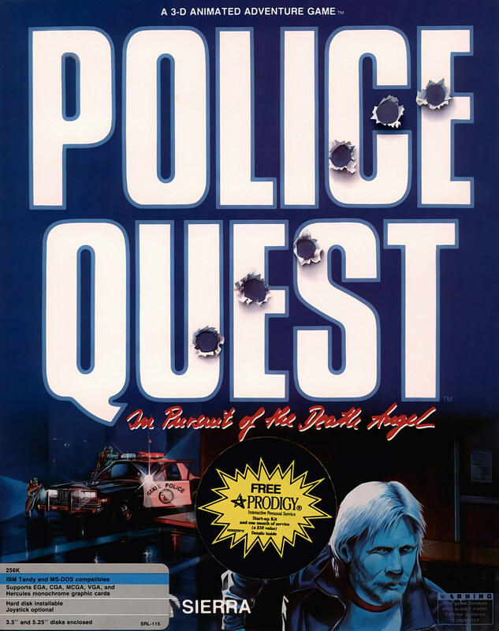

# Police Quest: In Pursuit of the Death Angel

AGI v2

**Sierra On-Line, 1987.** Police Quest: In Pursuit of the Death Angel (also
known as Police Quest I or simply Police Quest) is a 1987 police procedural
adventure video game developed and published by Jim Walls and Sierra On-Line.
Police Quest follows police officer Sonny Bonds as he investigates a drug
cartel in the town of Lytton, California.

First released in 1987 as a command-line interface game built on Sierra's AGI,
Police Quest was remade in 1992 using 256-color VGA graphics and the SCI engine
and used point-and-click gameplay. Designed to effectively be a police
simulator, Police Quest features relatively simple puzzles, but relies strongly
on strict adherence to proper police procedure, as detailed in the game's
manual.

Police Quest was a moderate critical and commercial success, spawning the
successful Police Quest series, which later evolved into the SWAT series of
shooter games. A direct sequel, Police Quest II: The Vengeance, was released in 1988.

## At a glance

|                |                                                    |
| -------------- | -------------------------------------------------- |
| **Developer**  | Sierra On-Line                                     |
| **Publisher**  | Sierra On-Line                                     |
| **Designer**   | Jim Walls                                          |
| **Programmer** | Al Lowe, Greg Rowland, Ken Williams, Scott Murphy  |
| **Artist**     | Mark Crowe, Gerald Moore                           |
| **Writer**     | Jim Walls                                          |
| **Composer**   | Margaret Lowe                                      |
| **Series**     | Police Quest                                       |
| **Engine**     | AGI / SCI1.1 (Remake)                              |
| **Platforms**  | Amiga, Atari ST, Apple II, Apple IIGS, MS-DOS, Mac |
| **Released**   | November 1987 (AGI), 1992 (SCI)                    |
| **Genre**      | Adventure, simulation                              |
| **Modes**      | Single-player                                      |

## How it runs here

**AGI v2 is supported.** The resource layer, the vector Picture renderer with
both buffers and the priority bands, View cels, the Logic interpreter with all
183 action and 20 test commands, `WORDS.TOK` and the parser, `OBJECT` and
inventory, four-voice sound and saves all run.

**No AGI game has been played through here.** Everything above is tested
against the synthetic fixture in `tests/fixtureAgi.ts`, so this game is worth
trying rather than relied upon.

How the bytecode decodes depends on the build of Sierra's interpreter a copy
shipped against, not on the AGI major version. A copy carrying `AGIDATA.OVL` is
read rather than assumed; one that does not still plays, on a documented
default with the fallback logged, and is refused for editing (ADR 0013).

## Where it sits in this project

`docs/released-games.md` lists this title under **AGI v2**. That page is the
scope statement for the whole catalogue and says, per Engine family and per
Version, what has actually been run rather than what is implemented —
**Completable** (`CONTEXT.md`) is claimed for no title on it.

## Elsewhere

- [Wikipedia: Police Quest: In Pursuit of the Death Angel](https://en.wikipedia.org/wiki/Police_Quest:_In_Pursuit_of_the_Death_Angel)
- [`docs/released-games.md`](../../docs/released-games.md) — the full scope list
- [ScummVM](https://www.scummvm.org/) — the reference implementation this project checks itself against
