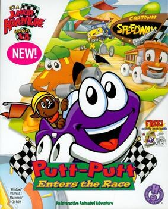

# Putt-Putt Enters the Race

HE 98

**Humongous Entertainment, 1999.** Putt-Putt Enters the Race is a 1999
children's point-and-click adventure game developed and published by Humongous
Entertainment. In the game, Putt-Putt must collect four pieces of equipment
needed to enter the Cartown 500 auto race.

The game is the fifth entry in the Putt-Putt series, being preceded by
Putt-Putt Travels Through Time in 1997 and followed by Putt-Putt Joins the
Circus in 2000. It is the first game in the series in which Putt-Putt is voiced
by Nancy Cartwright.

The game was released for Microsoft Windows and Macintosh OS on January 1, 1999. It has since been re-released on Steam and ported to Linux, Android, and
iOS.

## At a glance

|               |                                                            |
| ------------- | ---------------------------------------------------------- |
| **Developer** | Humongous Entertainment                                    |
| **Publisher** | Humongous Entertainment                                    |
| **Designer**  | Mark Peyser/Richard Moe                                    |
| **Writer**    | Laurie Bauman Arnold                                       |
| **Composer**  | Tom McGurk                                                 |
| **Series**    | Putt-Putt                                                  |
| **Engine**    | SCUMM                                                      |
| **Platforms** | Mac OS, Windows, Android, iOS                              |
| **Released**  | Mac OS, Windows/January 1, 1999/Android, iOS/June 27, 2014 |
| **Genre**     | Adventure                                                  |
| **Modes**     | Single-player                                              |

## How it runs here

**Humongous titles are forks of SCUMM v6**, versioned separately as HE 60
through HE 100. v6 itself runs, draws and saves here; the HE extensions on top
of it are not separately verified, and the exact game-to-HE-number mapping in
`docs/released-games.md` is explicitly approximate. Worth trying, not relied
upon.

## Where it sits in this project

`docs/released-games.md` lists this title under **HE 98**. That page is the
scope statement for the whole catalogue and says, per Engine family and per
Version, what has actually been run rather than what is implemented —
**Completable** (`CONTEXT.md`) is claimed for no title on it.

## Elsewhere

- [Wikipedia: Putt-Putt Enters the Race](https://en.wikipedia.org/wiki/Putt-Putt_Enters_the_Race)
- [`docs/released-games.md`](../../docs/released-games.md) — the full scope list
- [ScummVM](https://www.scummvm.org/) — the reference implementation this project checks itself against
