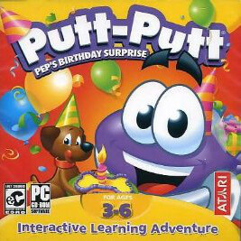

# Putt-Putt: Pep's Birthday Surprise

HE 100

**Humongous Entertainment, 2003.** Putt-Putt: Pep's Birthday Surprise is a 2003
point-and-click adventure game developed by Humongous Entertainment and
published by Atari. In the game, Putt-Putt must gather items to prepare a
surprise party for his dog, Pep. The game is the seventh and final installment
in the Putt-Putt series, preceded by Putt-Putt Joins the Circus (2000).

The game released for Microsoft Windows on August 19, 2003, the same day as
Pajama Sam: Life Is Rough When You Lose Your Stuff, making the two titles
Humongous Entertainment's last point-and-click games. Both games are also the
only Humongous adventure games to not be produced in the SCUMM engine, instead
using Atari's in-house YAGA engine.

The game received positive reviews from critics upon release, with praise for
its graphics and child-friendly puzzles. However, retrospective reviews view
the game as the weakest of the Putt-Putt series.

## At a glance

|               |                         |
| ------------- | ----------------------- |
| **Developer** | Humongous Entertainment |
| **Publisher** | Atari                   |
| **Designer**  | Eric Gross/Kelle Vozka  |
| **Producer**  | Jeff McCrory            |
| **Writer**    | James "Kibo" Parry      |
| **Composer**  | The Fat Man             |
| **Series**    | Putt-Putt               |
| **Platforms** | Windows                 |
| **Released**  | August 19, 2003         |
| **Genre**     | Adventure               |
| **Modes**     | Single-player           |

## How it runs here

**Humongous titles are forks of SCUMM v6**, versioned separately as HE 60
through HE 100. v6 itself runs, draws and saves here; the HE extensions on top
of it are not separately verified, and the exact game-to-HE-number mapping in
`docs/released-games.md` is explicitly approximate. Worth trying, not relied
upon.

## Where it sits in this project

`docs/released-games.md` lists this title under **HE 100**. That page is the
scope statement for the whole catalogue and says, per Engine family and per
Version, what has actually been run rather than what is implemented —
**Completable** (`CONTEXT.md`) is claimed for no title on it.

## Elsewhere

- [Wikipedia: Putt-Putt: Pep's Birthday Surprise](https://en.wikipedia.org/wiki/Putt-Putt:_Pep%27s_Birthday_Surprise)
- [`docs/released-games.md`](../../docs/released-games.md) — the full scope list
- [ScummVM](https://www.scummvm.org/) — the reference implementation this project checks itself against
