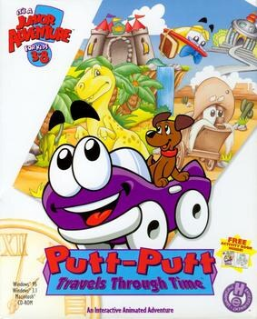

# Putt-Putt Travels Through Time

HE 85

**Humongous Entertainment, 1997.** Putt-Putt Travels Through Time is a 1997
children's point-and-click adventure game developed and published by Humongous
Entertainment under its Junior Adventures label. In the game, Putt-Putt must
recover four items, including his pet dog Pep, that were scattered across
history by a malfunctioning time portal.

The game is the fourth installment in the Putt-Putt series, being preceded by
Putt-Putt Saves the Zoo in 1995 and followed by Putt-Putt Enters the Race in 1999.

Originally released on June 1, 1997 for Microsoft Windows and Macintosh OS, the
game has been re-released and ported several times. In 2014, the PC version was
re-released on Steam, and the game was ported to Linux, iOS, and Android. In
January 2022, a port was released on the Nintendo Switch, followed by a
PlayStation 4 version in November.

## At a glance

|               |                                                                                                                                                                                    |
| ------------- | ---------------------------------------------------------------------------------------------------------------------------------------------------------------------------------- |
| **Developer** | Humongous Entertainment                                                                                                                                                            |
| **Publisher** | Humongous Entertainment                                                                                                                                                            |
| **Designer**  | Brad Carlton/Bret Barrett/Matthew Mahon/Nick Mirkovich                                                                                                                             |
| **Producer**  | Ron Gilbert                                                                                                                                                                        |
| **Writer**    | Laurie Rose Bauman                                                                                                                                                                 |
| **Composer**  | Jeremy Soule                                                                                                                                                                       |
| **Series**    | Putt-Putt                                                                                                                                                                          |
| **Engine**    | SCUMM                                                                                                                                                                              |
| **Platforms** | Android, Macintosh, Windows, iOS, Linux, Nintendo Switch, PlayStation 4                                                                                                            |
| **Released**  | title=June 1, 1997/Macintosh, Windows, June 1, 1997, iOS, August 14, 2012, Android, October 4, 2013, Linux, May 15, 2014, Switch, January 3, 2022, PlayStation 4, November 3, 2022 |
| **Genre**     | Adventure                                                                                                                                                                          |
| **Modes**     | Single-player                                                                                                                                                                      |

## How it runs here

**Humongous titles are forks of SCUMM v6**, versioned separately as HE 60
through HE 100. v6 itself runs, draws and saves here; the HE extensions on top
of it are not separately verified, and the exact game-to-HE-number mapping in
`docs/released-games.md` is explicitly approximate. Worth trying, not relied
upon.

## Where it sits in this project

`docs/released-games.md` lists this title under **HE 85**. That page is the
scope statement for the whole catalogue and says, per Engine family and per
Version, what has actually been run rather than what is implemented —
**Completable** (`CONTEXT.md`) is claimed for no title on it.

## Elsewhere

- [Wikipedia: Putt-Putt Travels Through Time](https://en.wikipedia.org/wiki/Putt-Putt_Travels_Through_Time)
- [`docs/released-games.md`](../../docs/released-games.md) — the full scope list
- [ScummVM](https://www.scummvm.org/) — the reference implementation this project checks itself against
