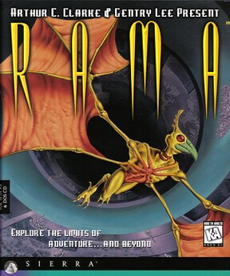

# RAMA

Sierra SCI3

**Dynamix, 1996.** Rama is a point and click adventure game developed by the
Dynamix subsidiary of publisher Sierra On-Line and released for MS-DOS and
Windows in 1996 and Classic Mac OS in 1997. A PlayStation version was released
in 1998 exclusively in Japan. The game is based upon Arthur C. Clarke's books
Rendezvous with Rama and Rama II, combining elements of their plots with a
story that sees the player assuming the role of a replacement crew member for
an expedition to investigate an interstellar ship and uncover its mysteries.

The game was praised for its music, story, and alien creatures. Critics
mentioned similarities to Myst. It is the second game that Clarke was involved
in, following the 1984 interactive fiction game Rendezvous with Rama by
Telarium. A sequel to Rama was planned, but not developed.

## At a glance

|                |                                                                                                  |
| -------------- | ------------------------------------------------------------------------------------------------ |
| **Developer**  | Dynamix                                                                                          |
| **Publisher**  | Sierra On-Line                                                                                   |
| **Designer**   | Gentry Lee                                                                                       |
| **Director**   | J. Mark Hood                                                                                     |
| **Producer**   | Kate Kloos                                                                                       |
| **Programmer** | Steven Hill, Derrick Carlin                                                                      |
| **Artist**     | Richard Hescox, Derrick Carlin                                                                   |
| **Writer**     | Gentry Lee                                                                                       |
| **Composer**   | Charles Barth                                                                                    |
| **Platforms**  | MS-DOS, Classic Mac OS, PlayStation (Japan), Windows                                             |
| **Released**   | MS-DOS, Windows, NA, November 1996, EU, 1996Mac, NA, January 1997, EU, 1997PlayStation, JP, 1998 |
| **Genre**      | Adventure                                                                                        |
| **Modes**      | Single-player                                                                                    |

## How it runs here

**A retail SCI game plays here now, and it is not this one.** King's Quest VII
boots, plays its Sierra logo, animates its title, takes a name, accepts a
chapter and reaches **the desert that is its first room**, drawn in the game's
own art with Rosella standing in it; 88 of its 108 rooms draw when entered by
number (`npm run rooms:sci -- <install> --fresh`). It is still not
`CONTEXT.md`'s **Completable** — no puzzle has been solved there and nothing
past that first room has been reached — and neither this title nor any other
SCI release has been played through here.

**Editing is further along than playing, and it is the whole family's, not one
game's.** A SCI install opens as a project: its Script resources as a class
graph with every method decompiled to instructions and every property word
named, its rooms drawn as places with the things on them draggable, its walk
polygons read out of the code that builds them, its Views stepped frame by
frame, its fonts and cursors edited pixel by pixel, and an unedited export that
is byte-identical to the install it came from.
[`docs/editor-parity.md`](../../docs/editor-parity.md) is the row-by-row
account against the SCUMM editor, including what is still a No and why.

Version identification is a measurement rather than a claim — over the 25
freely distributed Sierra demos this project can point at, every one identifies
its Version from its own bytes, 16 by probe and 9 narrowed only to a bucket,
and a bucket-only copy is refused for editing (ADR 0013).

**This title has not been run here.** Nothing above was measured against its
bytes: it is listed for the lineage, and nothing on this page is a claim that it
plays.

## Where it sits in this project

`docs/released-games.md` lists this title under **Sierra SCI3 — not supported
here**. That page is the scope statement for the whole catalogue and says, per
Engine family and per Version, what has actually been run rather than what is
implemented — **Completable** (`CONTEXT.md`) is claimed for no title on it.

## Elsewhere

- [Wikipedia: Rama (video game)](<https://en.wikipedia.org/wiki/Rama_(video_game)>)
- [`docs/released-games.md`](../../docs/released-games.md) — the full scope list
- [ScummVM](https://www.scummvm.org/) — the reference implementation this project checks itself against
