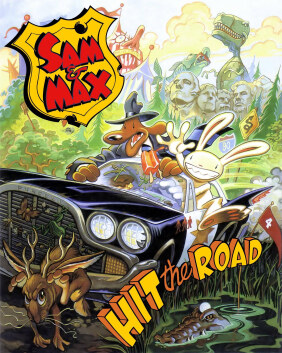

# Sam & Max Hit the Road

SCUMM v6

**LucasArts, 1993.** Sam & Max Hit the Road is a 1993 graphic adventure video
game released by LucasArts during the company's adventure games era. The game
was originally released for MS-DOS in 1993 and for Mac OS in 1995. A 2002
re-release included compatibility with Windows. The game is based on the comic
characters of Sam and Max, the "Freelance Police", an anthropomorphic dog and
"hyperkinetic rabbity thing". The characters, created by Steve Purcell,
originally debuted in a 1987 comic book series. Based on the 1989 Sam & Max
comic On the Road, the duo take the case of a missing bigfoot from a nearby
carnival, traveling to many American culture tourist sites to solve the
mystery.

LucasArts began development of the game in 1992 with the intention to use new
settings and characters after the success of the past Maniac Mansion and Monkey
Island adventure titles. Series creator Steve Purcell, then a LucasArts
employee, was one of the lead designers on the project. Sam & Max Hit the Road
is the ninth game to use the SCUMM adventure game engine, and also integrated
the iMUSE audio system developed by Michael Land and Peter McConnell. The game
was one of the first to incorporate full voice talent; the two title characters
were voiced by professional voice actors Bill Farmer and Nick Jameson while
additional voices were provided by Irwin Keyes, Marsha Clark, Denny Delk, Tony
Pope and Beth Wernick.

The game received critical acclaim on release, and was praised for its humor,
voice acting, graphics, music and gameplay. It is now regarded as a classic
point-and-click adventure game and is often considered one of the greatest
video games of all time. Several attempts to produce sequels were cancelled,
ultimately resulting in the franchise moving from LucasArts to Telltale Games.
Since October 2014, after the acquisition of LucasArts by Disney, the game is
being sold by GOG.com. The game was re-released on Steam by Disney Interactive
in November 2018.

## At a glance

|                |                                                                 |
| -------------- | --------------------------------------------------------------- |
| **Developer**  | LucasArts                                                       |
| **Publisher**  | LucasArts (original), Disney Interactive (re-releases)          |
| **Designer**   | Sean Clark / Collette Michaud / Steve Purcell / Michael Stemmle |
| **Director**   | Sean Clark / Mike Stemmle                                       |
| **Producer**   | Sean Clark / Mike Stemmle                                       |
| **Programmer** | Sean Clark / Michael Stemmle / Livia Macklin / Jonathan Ackley  |
| **Composer**   | Clint Bajakian / Peter McConnell / Michael Z. Land              |
| **Series**     | Sam & Max                                                       |
| **Engine**     | SCUMM (visual), iMUSE (audio)                                   |
| **Platforms**  | MS-DOS/Mac OS/Windows                                           |
| **Released**   | MS-DOS, 1993, 11, Mac OS, 1995, Windows, 2002                   |
| **Genre**      | Graphic adventure                                               |
| **Modes**      | Single-player                                                   |

## How it runs here

**SCUMM v6 runs, draws and saves.** Day of the Tentacle plays. v6 is where the
script engine became a stack machine, so a v6 fault usually looks different
from a v5 one; check the log before assuming the data.

## Where it sits in this project

`docs/released-games.md` lists this title under **SCUMM v6**. That page is the
scope statement for the whole catalogue and says, per Engine family and per
Version, what has actually been run rather than what is implemented —
**Completable** (`CONTEXT.md`) is claimed for no title on it.

## Elsewhere

- [Wikipedia: Sam & Max Hit the Road](https://en.wikipedia.org/wiki/Sam_%26_Max_Hit_the_Road)
- [`docs/released-games.md`](../../docs/released-games.md) — the full scope list
- [ScummVM](https://www.scummvm.org/) — the reference implementation this project checks itself against
