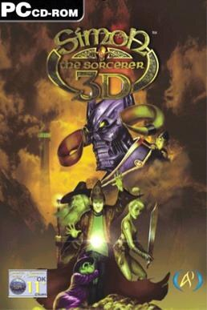

# Simon the Sorcerer 3D

Out of scope — a different engine

**Headfirst Productions, 2002.** Simon the Sorcerer 3D (also known as Simon
3D), is an adventure game released by Adventure Soft in April 2002 for Windows.
It is the third game in the Simon the Sorcerer series.

As indicated by the title, the game was the first in the series with 3D
graphics. The publisher's website claims that there are over 40 hours of
gameplay, and reviews stated that the game world includes over 10,000 pieces of
voiced dialogue. The sarcastic attitude and cruel humour of the series remain.
Brian Bowles returns as the voice of Simon.

## At a glance

|               |                                 |
| ------------- | ------------------------------- |
| **Developer** | Headfirst Productions           |
| **Publisher** | Adventure Soft                  |
| **Designer**  | Simon Woodroffe, Andrew Brazier |
| **Composer**  | Tony Flynn                      |
| **Series**    | Simon the Sorcerer              |
| **Engine**    | NetImmerse                      |
| **Platforms** | Windows                         |
| **Released**  | April 19, 2002                  |
| **Genre**     | Adventure                       |
| **Modes**     | Single-player                   |

## How it runs here

**Permanently out of scope.** A different, hardware-accelerated engine that
shares a name and a protagonist with the AGOS games and nothing else; ScummVM
does not implement it either. Recorded in `.out-of-scope/agos-simon-3d.md`
rather than deferred.

## Where it sits in this project

`docs/released-games.md` lists this title under **Out of scope — a different
engine**. That page is the scope statement for the whole catalogue and says,
per Engine family and per Version, what has actually been run rather than what
is implemented — **Completable** (`CONTEXT.md`) is claimed for no title on it.

## Elsewhere

- [Wikipedia: Simon the Sorcerer 3D](https://en.wikipedia.org/wiki/Simon_the_Sorcerer_3D)
- [`docs/released-games.md`](../../docs/released-games.md) — the full scope list
- [ScummVM](https://www.scummvm.org/) — the reference implementation this project checks itself against
