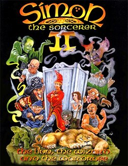

# Simon the Sorcerer II

AGOS Simon2

**Adventure Soft, 1995.** Simon the Sorcerer II: The Lion, the Wizard and the
Wardrobe is an adventure game developed by Adventure Soft and released in 1995
for MS-DOS. It is the second installment in the Simon the Sorcerer series of
games, and the sequel to 1993's Simon the Sorcerer. The game's story focuses on
a young teen named Simon, who is transported into a parallel universe of magic
and monsters that he visited before, via a magical wardrobe created by an evil
sorcerer he defeated in the last game. Players engage in a quest to help him
find more fuel for the wardrobe by searching a vast world, consisting of
parodies on popular fantasy novels and fairy tales.

The game received positive feedback from critics, and later spawned a sequel,
Simon the Sorcerer 3D, in 2002. The game was later re-released for Microsoft
Windows, via GOG.com in 2008, and was ported onto iOS the following year, until
being discontinued in 2015 due to lack of technical support. A 25th anniversary
edition of the game was developed by MojoTouch in 2018, and made available for
iOS, as well as on GOG.com, Google Play and Amazon Appstore, featuring several
improvements to the original game.

## At a glance

|               |                                   |
| ------------- | --------------------------------- |
| **Developer** | Adventure Soft                    |
| **Publisher** | Adventure Soft                    |
| **Designer**  | Simon Woodroffe                   |
| **Series**    | Simon the Sorcerer                |
| **Platforms** | Amiga, Macintosh, Windows, MS-DOS |
| **Released**  | 1995                              |
| **Genre**     | Adventure                         |
| **Modes**     | Single-player                     |

## How it runs here

**No AGOS game reaches a screen.** The readers do: `GAMEPC` end to end — the
item tree, the pooled strings and every Subroutine — the resource archive's
offset table, the Version probe, opcode and argument tables for all seven
Versions generated from ScummVM rather than transcribed, a disassembler,
byte-identical re-emission, saves, and an interpreter that runs the opcodes
common to every Version and reports the rest by name (ADRs 0027–0030).

**The renderer is what is missing.** Cel decoding exists as three tested
decoders and nothing composites them, so `render` paints an empty band layout
and the status line says why. Sound and the three interfaces are absent too.
None of it has been tested against a real game.

## Where it sits in this project

`docs/released-games.md` lists this title under **AGOS Simon2**. That page is
the scope statement for the whole catalogue and says, per Engine family and per
Version, what has actually been run rather than what is implemented —
**Completable** (`CONTEXT.md`) is claimed for no title on it.

## Elsewhere

- [Wikipedia: Simon the Sorcerer II: The Lion, the Wizard and the Wardrobe](https://en.wikipedia.org/wiki/Simon_the_Sorcerer_II:_The_Lion,_the_Wizard_and_the_Wardrobe)
- [`docs/released-games.md`](../../docs/released-games.md) — the full scope list
- [ScummVM](https://www.scummvm.org/) — the reference implementation this project checks itself against
