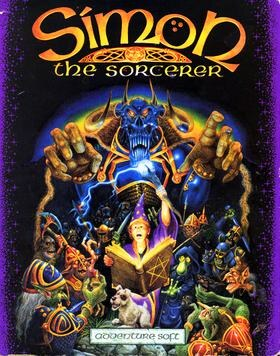

# Simon the Sorcerer

AGOS Simon1

**Adventure Soft, 1993.** Simon the Sorcerer is a 1993 point-and-click
adventure game developed and published by Adventure Soft, for Amiga and MS-DOS.
The story focuses on a boy named Simon who is transported into a parallel
universe of magic and monsters, where he embarks on a mission to become a
wizard and rescue another from an evil sorcerer. The setting was inspired by
the novels of the Discworld series, and incorporates parodies on fantasy novels
and fairy tales, such as The Lord of the Rings and Jack and the Beanstalk. The
lead character's design was inspired by that of the fictional British
television character Blackadder. The character was voiced by Chris Barrie in
the CD re-release.

The game was well received by critics, who praised the humour, graphics and
gameplay, with some minor criticism towards the plot. Simon the Sorcerer went
on to become a video game series, with a sequel in 1995, Simon the Sorcerer
II: The Lion, the Wizard and the Wardrobe. The game was later released for PC
in 2008 on GOG.com. A 20th Anniversary Edition was developed by MojoTouch and
released on Google Play in 2013.

## At a glance

|                |                                                           |
| -------------- | --------------------------------------------------------- |
| **Developer**  | Adventure Soft                                            |
| **Publisher**  | Adventure Soft                                            |
| **Designer**   | Simon Woodroffe                                           |
| **Director**   | Mike Woodroffe                                            |
| **Producer**   | Mike Woodroffe/Alan Bridgman                              |
| **Programmer** | Alan Bridgman                                             |
| **Artist**     | Paul Drummond                                             |
| **Writer**     | Simon Woodroffe                                           |
| **Series**     | Simon the Sorcerer                                        |
| **Platforms**  | Amiga, Amiga CD32, MS-DOS, RISC OS, iOS, Android, Windows |
| **Released**   | September 27, 1993                                        |
| **Genre**      | Point-and-click adventure                                 |
| **Modes**      | Single-player                                             |

## How it runs here

**This game draws its own opening and answers a click.** It is the first AGOS
title this project has been pointed at as a real release rather than a demo, and
what happens when you load it is:

- Subroutine 101 opens the game and Subroutine 1 is queued as its heartbeat —
  both out of `TABLES01`, which is beside `GAMEPC` rather than in it
- seven graphics zones load, and the wizard's study is drawn
- "Adventure Soft presents" appears over it, then the Simon the Sorcerer logo
- **the intro plays through**: a nested chain of eight Subroutines over sixteen
  thousand frames, each animation started and then waited for, and it hands
  control to the player in the wizard's study — fire lit, doorway to the
  outside, Simon standing in the middle
- the verb bar draws its twelve verbs out of the game's own strings, in the font
  read from the interpreter beside the data (ADR 0032)
- clicking a verb chooses it and clicking a thing issues the command — "Look at"
  on the object at (28, 98) answers _"That's not part of a balanced diet."_
- the game says its own words: "It's my little dog - Chippy.", "It must be
  Calypso's junk."
- music renders — thirty-four tracks — speech reads (3,623 lines), and sound
  effects read per scene

**It is editable, with `Unrecovered: 0`.** All 1,655 Subroutines across
`GAMEPC` and thirty table files decode, and the whole file re-emits byte for
byte — including the 7,909 bytes of development symbol table this release
appends, which ADR 0035 carries through unchanged as **Preserved bytes**.

**Simon walks, and the room answers.** Choose "Walk to", click the floor, and he
crosses the study — the click reaches variables 1 and 2, `os1_getPathPosn` picks
the nearest point on a route the drawing bytecode drew, and his walking sprite
carries him there. The study's six objects are clickable, from the boxes its own
script defines, and "Look at" on the writing desk answers _"A shallow drawer in
the Wizard's writing desk."_

**What is not.** **`Completable` is not claimed** and is not close: nobody has
played this game through, and that bar is a claim about its last screen.

He cannot be walked _out_ of the study. Every "Walk to" runs Subroutine 21,
whose lines 1 and 2 both call the room's own verb handler — one when variable 60
is 65535 and one when it is not — so exactly one always fires, and the handler
overwrites the click position with a fixed spot chosen from variable 84. Where
variable 60 is meant to become 65535 during play is not established: the only
script that writes it is Subroutine 100, and the reference runs that after
loading a save rather than at start. `docs/released-games.md` carries the same
note.

The numbered sound effects of the game's _first_ scene are absent because this
release ships none for `TABLES01`.

`npm run shot:agos -- <this folder>` writes what it drew, which is how every one
of those claims was checked.

## Where it sits in this project

`docs/released-games.md` lists this title under **AGOS Simon1**. That page is
the scope statement for the whole catalogue and says, per Engine family and per
Version, what has actually been run rather than what is implemented —
**Completable** (`CONTEXT.md`) is claimed for no title on it.

## Elsewhere

- [Wikipedia: Simon the Sorcerer](https://en.wikipedia.org/wiki/Simon_the_Sorcerer)
- [`docs/released-games.md`](../../docs/released-games.md) — the full scope list
- [ScummVM](https://www.scummvm.org/) — the reference implementation this project checks itself against
