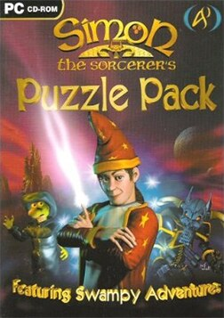

# Simon the Sorcerer's Puzzle Pack

AGOS PuzzlePack

Simon the Sorcerer is a series of point-and-click adventure games created by
British developer Adventure Soft. The series follows the adventures of an
unwilling hero of the same name and has a strong fantasy setting similar to
Sierra's King's Quest and Westwood's The Legend of Kyrandia series. The game
varies in style, however, as it is more poised to be a parody of the fantasy
genre than a member of the genre itself, with many renowned folklore characters
appearing differently from what they are generally presumed to be.

The first two games are often compared with the Monkey Island series in terms
of style and humour, and the Terry Pratchett Discworld novels and derivative
games.

Unlike many older adventure games, several of the titles in the series are
still available for purchase. The first and second games in the series are also
playable using ScummVM.

_This title has no article of its own. The text above is transcribed from
**Simon the Sorcerer (series)**, which covers it, and the link under
**Elsewhere** goes there rather than to a page about this game alone._

## How it runs here

**No AGOS game reaches a screen.** The readers do: `GAMEPC` end to end — the
item tree, the pooled strings and every Subroutine — the resource archive's
offset table, the Version probe, opcode and argument tables for all seven
Versions generated from ScummVM rather than transcribed, a disassembler,
byte-identical re-emission, saves, and an interpreter that runs the opcodes
common to every Version and reports the rest by name (ADRs 0027–0030).

**The renderer is what is missing.** Cel decoding exists as three tested
decoders and nothing composites them, so `render` paints an empty band layout
and the status line says why. Sound and the three interfaces are absent too.
None of it has been tested against a real game.

## Where it sits in this project

`docs/released-games.md` lists this title under **AGOS PuzzlePack**. That page
is the scope statement for the whole catalogue and says, per Engine family and
per Version, what has actually been run rather than what is implemented —
**Completable** (`CONTEXT.md`) is claimed for no title on it.

## Elsewhere

- [Wikipedia: Simon the Sorcerer (series)](<https://en.wikipedia.org/wiki/Simon_the_Sorcerer_(series)>)
- [`docs/released-games.md`](../../docs/released-games.md) — the full scope list
- [ScummVM](https://www.scummvm.org/) — the reference implementation this project checks itself against
