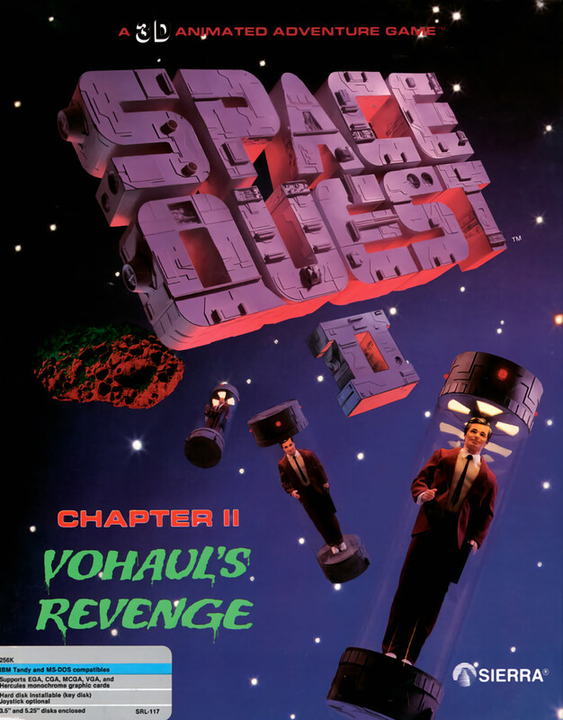

# Space Quest II: Vohaul's Revenge

AGI v2

**Sierra On-Line, 1987.** Space Quest II: Chapter II – Vohaul's Revenge
(commonly known as Space Quest II: Vohaul's Revenge) is a graphic adventure
game released on November 14, 1987 by Sierra On-Line. It is the sequel to Space
Quest I, again using Sierra's AGI game engine, and sees players assume the role
of Roger Wilco, a simple janitor who is soon drawn into a new adventure
involving thwarting the culprit behind the events of the last game.

The game was a commercial success from launch, receiving significant praise by
critics from more improved puzzles and a greater scope, but with some criticism
over some problematic elements. The game was followed on by a sequel, Space
Quest III, in 1989. In 2011, a fan remake of Space Quest II was launched,
featuring improvements in graphics and gameplay, while including new animation
sequences and a full voice cast for characters.

_This title has no article of its own. The text above is transcribed from
**Space Quest II**, which covers it, and the link under **Elsewhere** goes
there rather than to a page about this game alone._

## At a glance

|                |                                                       |
| -------------- | ----------------------------------------------------- |
| **Developer**  | Sierra On-Line                                        |
| **Publisher**  | Sierra On-Line                                        |
| **Designer**   | Scott Murphy, Mark Crowe                              |
| **Programmer** | Scott Murphy                                          |
| **Artist**     | Mark Crowe                                            |
| **Series**     | Space Quest                                           |
| **Engine**     | AGI                                                   |
| **Platforms**  | DOS, Macintosh, Apple II, Apple IIGS, Amiga, Atari ST |
| **Released**   | November 14, 1987                                     |
| **Genre**      | Adventure                                             |
| **Modes**      | Single-player                                         |

## How it runs here

**AGI v2 is supported.** The resource layer, the vector Picture renderer with
both buffers and the priority bands, View cels, the Logic interpreter with all
183 action and 20 test commands, `WORDS.TOK` and the parser, `OBJECT` and
inventory, four-voice sound and saves all run.

**No AGI game has been played through here.** Everything above is tested
against the synthetic fixture in `tests/fixtureAgi.ts`, so this game is worth
trying rather than relied upon.

How the bytecode decodes depends on the build of Sierra's interpreter a copy
shipped against, not on the AGI major version. A copy carrying `AGIDATA.OVL` is
read rather than assumed; one that does not still plays, on a documented
default with the fallback logged, and is refused for editing (ADR 0013).

## Where it sits in this project

`docs/released-games.md` lists this title under **AGI v2**. That page is the
scope statement for the whole catalogue and says, per Engine family and per
Version, what has actually been run rather than what is implemented —
**Completable** (`CONTEXT.md`) is claimed for no title on it.

## Elsewhere

- [Wikipedia: Space Quest II](https://en.wikipedia.org/wiki/Space_Quest_II)
- [`docs/released-games.md`](../../docs/released-games.md) — the full scope list
- [ScummVM](https://www.scummvm.org/) — the reference implementation this project checks itself against
