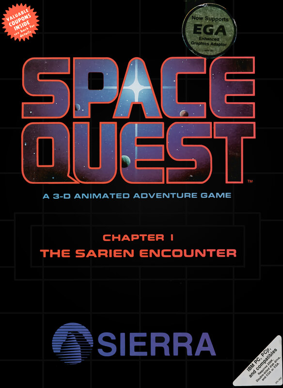

# Space Quest: The Sarien Encounter

AGI v2

**Sierra On-Line, 1986.** Space Quest: Chapter I – The Sarien Encounter
(commonly known as Space Quest I) is a graphic adventure game, created by Scott
Murphy and Mark Crowe, and released in October 1986 by Sierra On-Line. It is
the first game in the Space Quest series, and sees players assume the role of a
lowly janitor on a research ship, who becomes involved in stopping an alien
race using a new form of technology for evil purposes.

The game was the first to be created by Murphy and Crowe, after working on
other Sierra titles at the time, such as King's Quest II. Part of their
proposal included moving away from the serious, medieval settings of other
titles, in favor of making a "fun, silly game", utilizing Sierra's AGI engine.
Space Quest I became an instant hit, selling in excess of 100,000 copies and
spawning several sequels, beginning with Space Quest II in 1987.

A remake of the game by Sierra was released in 1991, featuring updated
graphics, gameplay, and sound. In 1992, Adventure Comics created a three-issue
comic based on the game's plot.

_This title has no article of its own. The text above is transcribed from
**Space Quest I**, which covers it, and the link under **Elsewhere** goes there
rather than to a page about this game alone._

## At a glance

|                |                                                       |
| -------------- | ----------------------------------------------------- |
| **Developer**  | Sierra On-Line                                        |
| **Publisher**  | Sierra On-Line                                        |
| **Designer**   | Mark Crowe, Scott Murphy                              |
| **Programmer** | Scott Murphy, Ken Williams, Sol Ackerman              |
| **Artist**     | Mark Crowe                                            |
| **Composer**   | Mark Crowe                                            |
| **Series**     | Space Quest                                           |
| **Engine**     | AGI                                                   |
| **Platforms**  | DOS, Macintosh, Apple II, Apple IIGS, Amiga, Atari ST |
| **Released**   | September–October 1986                                |
| **Genre**      | Adventure                                             |
| **Modes**      | Single-player                                         |

## How it runs here

**AGI v2 is supported.** The resource layer, the vector Picture renderer with
both buffers and the priority bands, View cels, the Logic interpreter with all
183 action and 20 test commands, `WORDS.TOK` and the parser, `OBJECT` and
inventory, four-voice sound and saves all run.

**No AGI game has been played through here.** Everything above is tested
against the synthetic fixture in `tests/fixtureAgi.ts`, so this game is worth
trying rather than relied upon.

How the bytecode decodes depends on the build of Sierra's interpreter a copy
shipped against, not on the AGI major version. A copy carrying `AGIDATA.OVL` is
read rather than assumed; one that does not still plays, on a documented
default with the fallback logged, and is refused for editing (ADR 0013).

## Where it sits in this project

`docs/released-games.md` lists this title under **AGI v2**. That page is the
scope statement for the whole catalogue and says, per Engine family and per
Version, what has actually been run rather than what is implemented —
**Completable** (`CONTEXT.md`) is claimed for no title on it.

## Elsewhere

- [Wikipedia: Space Quest I](https://en.wikipedia.org/wiki/Space_Quest_I)
- [`docs/released-games.md`](../../docs/released-games.md) — the full scope list
- [ScummVM](https://www.scummvm.org/) — the reference implementation this project checks itself against
