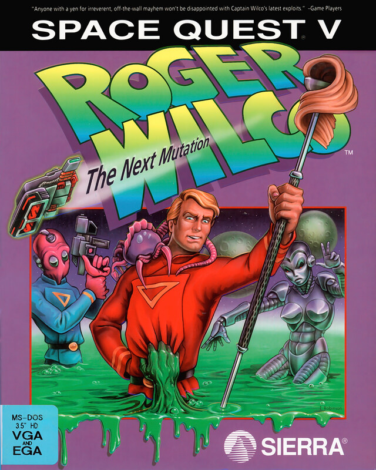

# Space Quest V: The Next Mutation

Sierra SCI1.1

**Dynamix, 1993.** Space Quest V: Roger Wilco – The Next Mutation is a graphic
adventure game developed by Dynamix and released by Sierra On-Line for MS-DOS
on February 5, 1993. The game is the fifth entry in the Space Quest series, and
the first game to be only designed by Mark Crowe. The story, set within a spoof
of the Star Trek franchise, focuses on players taking control of Roger Wilco,
who achieves his dreams of becoming a star captain but winds up involved in
saving the galaxy from a deadly threat posed by a man-made virus.

The game was welcomed by critics as a fun addition to the series, although did
not feature a voice-cast version as with Space Quest IV. A sequel, Space Quest
6, was released in 1995.

_This title has no article of its own. The text above is transcribed from
**Space Quest V**, which covers it, and the link under **Elsewhere** goes there
rather than to a page about this game alone._

## At a glance

|                |                                            |
| -------------- | ------------------------------------------ |
| **Developer**  | Dynamix                                    |
| **Publisher**  | Sierra On-Line                             |
| **Designer**   | Mark Crowe                                 |
| **Director**   | Mark Crowe, David Selle                    |
| **Producer**   | Mark Crowe                                 |
| **Programmer** | David Sandgathe                            |
| **Artist**     | Shawn Sharp                                |
| **Composer**   | Timothy Steven Clarke, Christopher Stevens |
| **Series**     | Space Quest                                |
| **Engine**     | SCI                                        |
| **Platforms**  | MS-DOS                                     |
| **Released**   | NA, March 1, 1993, EU, 1993                |
| **Genre**      | Adventure                                  |
| **Modes**      | Single-player                              |

## How it runs here

**A retail SCI game plays here now, and it is not this one.** King's Quest VII
boots, plays its Sierra logo, animates its title, takes a name, accepts a
chapter and reaches **the desert that is its first room**, drawn in the game's
own art with Rosella standing in it; 88 of its 108 rooms draw when entered by
number (`npm run rooms:sci -- <install> --fresh`). It is still not
`CONTEXT.md`'s **Completable** — no puzzle has been solved there and nothing
past that first room has been reached — and neither this title nor any other
SCI release has been played through here.

**Editing is further along than playing, and it is the whole family's, not one
game's.** A SCI install opens as a project: its Script resources as a class
graph with every method decompiled to instructions and every property word
named, its rooms drawn as places with the things on them draggable, its walk
polygons read out of the code that builds them, its Views stepped frame by
frame, its fonts and cursors edited pixel by pixel, and an unedited export that
is byte-identical to the install it came from.
[`docs/editor-parity.md`](../../docs/editor-parity.md) is the row-by-row
account against the SCUMM editor, including what is still a No and why.

Version identification is a measurement rather than a claim — over the 25
freely distributed Sierra demos this project can point at, every one identifies
its Version from its own bytes, 16 by probe and 9 narrowed only to a bucket,
and a bucket-only copy is refused for editing (ADR 0013).

**This title has not been run here.** Nothing above was measured against its
bytes: it is listed for the lineage, and nothing on this page is a claim that it
plays.

## Where it sits in this project

`docs/released-games.md` lists this title under **Sierra SCI1.1 — not supported
here**. That page is the scope statement for the whole catalogue and says, per
Engine family and per Version, what has actually been run rather than what is
implemented — **Completable** (`CONTEXT.md`) is claimed for no title on it.

## Elsewhere

- [Wikipedia: Space Quest V](https://en.wikipedia.org/wiki/Space_Quest_V)
- [`docs/released-games.md`](../../docs/released-games.md) — the full scope list
- [ScummVM](https://www.scummvm.org/) — the reference implementation this project checks itself against
